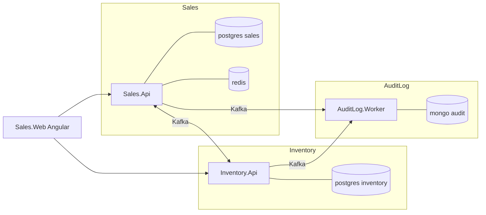

# 1. Tổng quan dự án

## Mục đích

Một hệ thống quản lý bán hàng greenfield trên .NET 10, xây dựng như một dự án thực hành DDD / Clean Architecture. Nó được cố ý "over-engineer" so với số lượng tính năng: mục tiêu là minh họa bounded context, CQRS, messaging tin cậy, auditing và observability phối hợp với nhau từ đầu đến cuối.

Đọc tài liệu này trước, rồi sang [02-solution-structure.md](02-solution-structure.md).

## Nghiệp vụ, gói gọn trong một đoạn

Người vận hành duy trì một catalog (category → product → variant, trong đó variant là tổ hợp màu/size với SKU và giá riêng) cùng danh sách khách hàng. Họ tạo một đơn hàng nháp cho khách, thêm dòng hàng, rồi confirm. Việc confirm không diễn ra tức thì: Sales yêu cầu Inventory giữ (reserve) hàng, và đơn nằm ở trạng thái `PendingInventory` cho tới khi Inventory trả lời. Nếu mọi dòng hàng đều còn hàng, đơn chuyển sang `Confirmed`; nếu có bất kỳ dòng nào thiếu hàng thì toàn bộ yêu cầu bị từ chối. Một đơn đã confirm có thể được hoàn tác, khi đó tồn kho được giải phóng. Đơn để quá lâu không xử lý sẽ bị hủy tự động. Mọi thay đổi đều được ghi audit vào MongoDB.

## Ba bounded context



| Context | Sở hữu | Không sở hữu |
|---|---|---|
| **Sales** | catalog, khách hàng, đơn hàng, identity | mức tồn kho |
| **Inventory** | tồn kho theo variant, reservation | giá, khách hàng, trạng thái đơn |
| **AuditLog** | audit trail bền vững | mọi quyết định nghiệp vụ |

Chúng **không** dùng chung database và **không** tham chiếu project lẫn nhau. Liên kết duy nhất là `BuildingBlocks.Contracts` — tập các record đi qua Kafka.

## Vì sao lại thiết kế như vậy

| Quyết định | Lý do |
|---|---|
| Tách context | tồn kho và bán hàng thay đổi vì lý do khác nhau và với tốc độ khác nhau; tách ra buộc phần tích hợp phải tường minh |
| Messaging bất đồng bộ thay vì gọi HTTP | confirm đơn hàng không được phép fail chỉ vì Inventory đang restart |
| Transactional outbox | một lệnh publish Kafka không thể tham gia transaction database; nhưng ghi event vào cùng transaction thì được |
| Inbox ở phía consumer | at-least-once delivery nghĩa là trùng lặp là chuyện bình thường, không phải ngoại lệ |
| Chốt chặn chống event cũ theo version | confirm và undo đi qua hai topic khác nhau nên event có thể đến sai thứ tự |
| CQRS | phía read cần join, projection và phân trang; phía write cần nguyên aggregate và các invariant |
| ETag / If-Match | hai người vận hành cùng sửa một đơn không được ghi đè lên nhau một cách âm thầm |
| Auditing lai (hybrid) | phần lớn thay đổi chỉ là diff trường dữ liệu (`ChangeTracker`); một số ít cần ý nghĩa nghiệp vụ (enricher) |

## Công nghệ

| Lớp | Lựa chọn |
|---|---|
| Runtime | .NET 10, C# 14 |
| API | ASP.NET Core controllers |
| Messaging | Apache Kafka 4.1 qua KafkaFlow 4.2 |
| Cơ sở dữ liệu quan hệ | PostgreSQL 17 + EF Core 10 (Npgsql) |
| Kho audit | MongoDB 8 |
| Cache / lock | Redis 8 |
| Job | Hangfire 1.8 (lưu trên PostgreSQL) |
| Mediation | MediatR 12 |
| Validation | FluentValidation 12 |
| Mapping | Mapster 7 |
| Realtime | SignalR |
| Logging | Serilog → Console + Seq + OTLP |
| Telemetry | OpenTelemetry → Collector → APM Server → Elasticsearch → Kibana |
| Client | Angular 18 + ng-zorro-antd |
| Test | xUnit, NetArchTest, Jasmine/Karma, Playwright |

## Chạy thử

```bash
sudo docker compose -f docker/docker-compose.yml up -d --build
sudo docker compose -f docker/docker-compose.yml ps
sudo docker compose -f docker/docker-compose.yml down

sudo docker compose -f docker/docker-compose.yml stop kibana apm-server elasticsearch otel-collector
sudo docker compose -f docker/docker-compose.yml up kibana apm-server elasticsearch otel-collector -d --build
```

| Cái gì | Ở đâu |
|---|---|
| Sales Swagger (gộp cả Inventory) | http://localhost:5000/swagger |
| Inventory OpenAPI | http://localhost:5001/openapi/v1.json |
| Seq | http://localhost:8081 |
| Kibana | http://localhost:5601 |
| Hangfire | http://localhost:5000/hangfire (chỉ loopback) |
| Angular client | http://localhost:4200 (`npm start`) |

Đăng nhập bằng `admin` / `Admin123!` — chỉ dùng cho môi trường development.

## Đi thử một flow

1. `POST /api/auth/login` → access token.
2. `GET /api/common/colors`, `/sizes`, `GET /api/categories` → lấy các id sẽ submit.
3. `POST /api/products` với một variant đã published.
4. `POST /api/inventory/{variantId}/adjust` trên Inventory API để nhập tồn kho.
5. `POST /api/customers`.
6. `POST /api/orders` → một đơn `Draft` kèm `ETag`.
7. `POST /api/orders/{id}/confirm` với header `If-Match: "<etag>"`.
8. `GET /api/orders/{id}` sau một giây → `Confirmed`, hoặc `InventoryRejected` kèm lý do.
9. Tìm lại toàn bộ luồng trong Seq theo `CorrelationId`, và trong Kibana dưới dạng một trace duy nhất.

## Đi tiếp đâu

| Bạn muốn | Đọc |
|---|---|
| Bố cục project | [02-solution-structure.md](02-solution-structure.md) |
| Chuyện gì xảy ra trong một request | [03-request-lifecycle.md](03-request-lifecycle.md) |
| Phía write được mô hình hóa thế nào | [05-cqrs-and-mediatr.md](05-cqrs-and-mediatr.md), [06-ddd-in-this-project.md](06-ddd-in-this-project.md) |
| Hai service nói chuyện với nhau ra sao | [07-domain-events-and-outbox.md](07-domain-events-and-outbox.md), [08-integration-events-and-inbox.md](08-integration-events-and-inbox.md) |
| Quy tắc nghiệp vụ chính xác | [../tech/business/](../tech/business/) |
| Quy tắc viết code ở đây | [../project/backend/](../project/backend/) |
