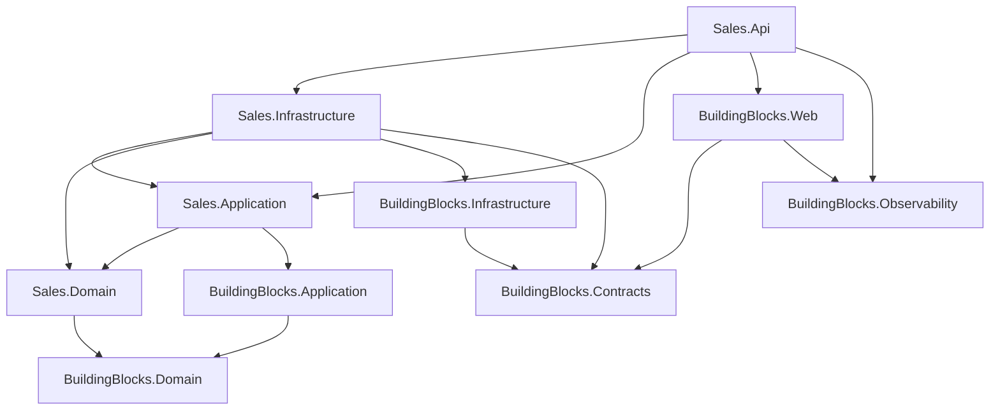

# 2. Cấu trúc solution

## Mục đích

Giải thích từng project trong 16 project dùng để làm gì, vì sao lại chia như vậy, và cách quyết định một file mới nên nằm ở đâu.

## Quy tắc phụ thuộc

```
Api / Worker  ->  Infrastructure  ->  Application  ->  Domain
```

Mũi tên hướng *vào trong*, về phía phần code có ít phụ thuộc nhất. Domain không biết gì về EF Core, Kafka, Redis, HTTP hay MediatR. Application biết Domain và khai báo các *port* (interface) cho những gì nó cần. Infrastructure hiện thực các port đó. API host ráp mọi thứ lại với nhau.

Đây không phải sở thích về phong cách — `tests/Sales.Architecture.Tests/DependencyRulesTests.cs` sẽ làm fail build khi quy tắc bị vi phạm.



## Vì sao mỗi service có bốn lớp

Mỗi lớp trả lời một câu hỏi:

| Lớp | Câu hỏi | Thay đổi khi |
|---|---|---|
| Domain | *Điều gì luôn luôn đúng?* | quy tắc nghiệp vụ thay đổi |
| Application | *Người dùng có thể làm gì?* | có thêm use case |
| Infrastructure | *Dữ liệu được lưu và vận chuyển thế nào?* | đổi công nghệ |
| Api | *Nó được phơi ra ngoài thế nào?* | giao thức truyền tải thay đổi |

Lợi ích thu được là khả năng test: `Sales.Domain.Tests` không cần database, và `Sales.Application.Tests` không cần Kafka.

## Các service

### Sales — modular monolith

| Project | Chứa gì |
|---|---|
| `Sales.Domain` | aggregate `Order`, `Product`, `Customer`, `Category`; entity `OrderLine`, `ProductVariant`, `Color`, `Size`; value object `Money`, `ProductSnapshot`, `CustomerSnapshot`; domain event; contract của repository; specification; `ProductCodeRules` |
| `Sales.Application` | command/query/handler/validator theo hướng feature-first, DTO, Mapster register, port |
| `Sales.Infrastructure` | `SalesDbContext`, cấu hình EF, migration, read service, repository, Redis cache, Kafka mapper/consumer/publisher, Hangfire job, adapter audit, bộ sinh mã |
| `Sales.Api` | controller, request/response model, helper ETag, SignalR hub, filter cho Hangfire dashboard, composition root |

Sales sở hữu identity: các bảng của ASP.NET Core Identity nằm trong `SalesDbContext`, và `AuthController` phát hành JWT mà cả hai API đều chấp nhận.

### Inventory — service giữ hàng

| Project | Chứa gì |
|---|---|
| `Inventory.Domain` | aggregate `Reservation`, entity `InventoryItem`, `ReservationLine`, `ReservationStatus`, contract của repository |
| `Inventory.Application` | `ReserveStockCommand`, `ReleaseStockCommand`, `AdjustInventoryCommand`, query, `InventoryTransactionBehavior`, port |
| `Inventory.Infrastructure` | `InventoryDbContext`, configuration, migration, repository, read service, inbox, event outbox, transaction manager, adapter Kafka, maintenance |
| `Inventory.Api` | một controller, health, CORS cho Swagger, composition root |

Chú ý những gì Inventory **không** có: không Redis, không Hangfire, không identity, không SignalR. Mỗi service chỉ lấy đúng hạ tầng nó cần.

### AuditLog — nhật ký

| Project | Chứa gì |
|---|---|
| `AuditLog.Infrastructure` | `AuditDocument`, `MongoAuditWriter`, `AuditEventHandler`, `MongoOptions` |
| `AuditLog.Worker` | Generic Host, đăng ký Kafka consumer, kiểm tra sẵn sàng của Mongo lúc khởi động |

Không có `AuditLog.Domain` hay `AuditLog.Application` — worker này không có quy tắc nghiệp vụ, nó chỉ biến đổi và lưu trữ. Bịa ra các lớp rỗng cho "đối xứng" chỉ là cargo cult.

## Các building block dùng chung

Sáu project, chia theo tiêu chí *ai được phép phụ thuộc vào chúng*:

| Project | Mục đích | Trần phụ thuộc |
|---|---|---|
| `BuildingBlocks.Domain` | `AggregateRoot<TId>`, `Entity<TId>`, `IDomainEvent`, `DomainException` | chỉ BCL |
| `BuildingBlocks.Application` | marker CQRS, MediatR behavior, `IUnitOfWork`, `IClock`, `PagedResult<T>`, đăng ký Mapster | không Infrastructure, không Web, không EF |
| `BuildingBlocks.Contracts` | integration event, `EventEnvelope`, `AuditLogEvent`, topic, group, header, mã lỗi | không gì cả — kể cả BuildingBlocks khác |
| `BuildingBlocks.Infrastructure` | outbox/inbox, `KafkaOutboxPublisher`, EF audit interceptor, `RetryBackoff`, helper Hangfire, metric dùng chung | không service, không Web, không ASP.NET Core |
| `BuildingBlocks.Observability` | chính sách sink của Serilog, pipeline OpenTelemetry nền | không có tên service |
| `BuildingBlocks.Web` | `AddBuildingBlocksWeb`, xử lý exception, model API, Swagger, JWT, middleware request | không service, không Domain/Infrastructure |

Việc chia tách này tồn tại để `BuildingBlocks.Contracts` có thể được tham chiếu từ bất cứ đâu mà không kéo theo EF Core, và để `BuildingBlocks.Domain` vẫn test được với zero package.

### Những gì cố ý *không* gộp chung

Hai cặp class gần trùng nhau được giữ nguyên có chủ đích:

- `SalesOutboxPublisher` / `InventoryOutboxPublisher` — base class được dùng chung, nhưng mỗi service giữ subclass riêng. Gộp các hosted service lại bị đánh giá là quá nhạy cảm về độ tin cậy so với lợi ích thu được.
- Các *processor* của Kafka consumer — `SalesInventoryEventProcessor` và `InventoryIntegrationEventProcessor` trông giống nhau nhưng chứa logic nghiệp vụ thực sự khác nhau.

Biết cái gì được cố ý để yên cũng hữu ích ngang biết cái gì đã được dùng chung.

## File của tôi nên đặt ở đâu?

| Tôi đang viết | Project | Thư mục |
|---|---|---|
| một quy tắc luôn phải đúng | `<Service>.Domain` | `Aggregates/` hoặc `Entities/` |
| một use case mới | `<Service>.Application` | `Features/<Aggregate>/Commands/` |
| một truy vấn đọc cho màn hình | `<Service>.Application` + `.Infrastructure` | `Features/<Aggregate>/Queries/` + `Persistence/ReadServices/` |
| một mapping EF | `<Service>.Infrastructure` | `Persistence/Configurations/` |
| một contract Kafka | `BuildingBlocks.Contracts` | `IntegrationEvents/<Context>/` |
| một endpoint HTTP | `<Service>.Api` | `Controllers/` |
| thứ gì đó thực sự tái sử dụng được và không dính nghiệp vụ | `BuildingBlocks.*` | chọn theo trần phụ thuộc |

## Thiết lập chung cho toàn solution

`Directory.Build.props` đặt `net10.0`, nullable reference types, implicit usings và `AnalysisLevel=latest` cho mọi project. Đừng override riêng từng project.

## Liên quan

- [../project/backend/architecture.md](../project/backend/architecture.md) — cùng nội dung nhưng ở dạng quy tắc
- [../project/backend/folder-structure.md](../project/backend/folder-structure.md)
- [../tech/dependency-injection-map.md](../tech/dependency-injection-map.md)
- [../tech/code-map.md](../tech/code-map.md)
