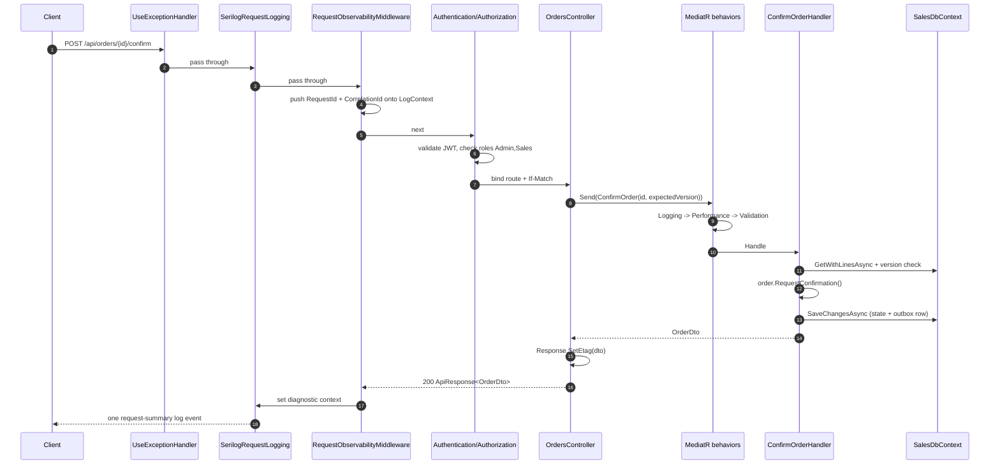

# 3. Vòng đời request

## Mục đích

Theo dấu một HTTP request từ socket xuống database rồi quay ngược ra, gọi tên mọi thành phần nó đi qua. Khi bạn đã trace được `POST /api/orders/{id}/confirm` thì bạn trace được mọi thứ trong codebase này.

## Pipeline



## Từng bước

### 1. Xử lý exception — ngoài cùng

`app.UseExceptionHandler()` bọc mọi thứ. Khi bất kỳ tầng nào bên dưới ném exception, `ApiExceptionHandler` chuyển nó thành `ApiErrorResponse`, log đúng một lần ở mức mà bảng ánh xạ khai báo, và gắn nó vào trace span hiện tại. Chính vì nó nằm ngoài cùng nên controller không chứa `try`/`catch` nào.

Lưu ý một điểm tinh tế về thứ tự: đến lúc `UseExceptionHandler` gọi handler thì exception đã unwind ra khỏi scope `LogContext` được push ở bước 3. Vì vậy `ApiExceptionHandler` đọc các giá trị correlation trực tiếp từ `HttpContext` thay vì dựa vào các log property ngầm.

### 2. Log request

`UseSerilogRequestLogging` ghi đúng **một** event tổng kết cho mỗi request. `RequestLoggingDefaults.Configure` hạ `/health` và `/hangfire` xuống `Debug`, và nâng exception cùng 5xx lên `Error`.

### 3. Làm giàu thông tin observability

`RequestObservabilityMiddleware` là phần thú vị. Nó:

- xác định `TraceId` (`Activity.Current.TraceId`) và `CorrelationId` (header `X-Correlation-Id`, nếu không có thì lấy trace id),
- push `RequestId` và `CorrelationId` vào `LogContext` của Serilog, để mọi log lồng bên trong đều kế thừa,
- sau khi request xong, set `RequestId`, `CorrelationId`, `TraceId`, `UserId`, `ClientIp`, `Url`, `Route`, `UserAgent` lên `IDiagnosticContext` — đây chính là dữ liệu mà event tổng kết ở bước 2 đọc,
- khi bật `Debug`, ghi lại body của request/response với các header nhạy cảm và trường JSON đã được che (mask).

Hai sink, một định nghĩa: `TraceId` mà client nhìn thấy trong response lỗi chính là chuỗi bạn dán vào Seq hoặc Kibana.

### 4. CORS, authentication, authorization

Sales áp dụng policy CORS `SalesWeb` (liệt kê origin tường minh + cho phép credentials, vì SignalR cần), rồi kiểm tra JWT, rồi đánh giá `[Authorize(Roles = "Admin,Sales")]`.

### 5. Model binding và controller

Route value được bind (`{id:guid}`), body bind vào request model hoặc thẳng vào command, và `Request.RequireVersion()` parse header `If-Match` — ném `BadHttpRequestException(428)` nếu thiếu hoặc không phải số.

Sau đó controller làm đúng việc duy nhất mà controller nên làm: dựng object request và gọi `_sender.Send(...)`.

### 6. Pipeline MediatR

Ba behavior bọc mọi request, kể từ ngoài vào:

| Behavior | Làm gì |
|---|---|
| `LoggingBehavior` | ghi breadcrumb mức `Debug` trước và sau; khi lỗi thì log request đã destructure ở mức `Debug` mà thôi |
| `PerformanceBehavior` | cảnh báo khi request mất ≥ 500 ms |
| `ValidationBehavior` | chạy song song mọi `IValidator<TRequest>` đã đăng ký; ném `ValidationException` nếu có cái nào fail |

Inventory bổ sung behavior thứ tư, `InventoryTransactionBehavior`, đăng ký *sau* ba behavior dùng chung để validation vẫn chạy trước khi mở transaction.

`LoggingBehavior` cố ý không log lỗi ở mức cao hơn `Debug`. Mỗi đường xử lý đều đã tự log lỗi của mình đúng một lần tại boundary của nó — log lại ở đây sẽ nhân đôi mọi lỗi trong Seq.

### 7. Handler

```csharp
var order = await orderRepository.LoadAndCheck(request.Id, request.ExpectedVersion, ct);
await productRepository.EnsureOrderLinesCanStillBeOrdered(order.Lines, ct);
order.RequestConfirmation();
await unitOfWork.SaveChangesAsync(ct);
return mapper.Map<OrderDto>(order);
```

Load → kiểm tra version → validate lại trạng thái hiện thời → gọi hành vi domain → commit → map. Handler chỉ điều phối; nó không tự quyết định gì. `RequestConfirmation()` mới là nơi chứa quy tắc "chỉ đơn nháp mới được confirm".

### 8. Lưu dữ liệu

`SalesDbContext.SaveChangesAsync` làm ba việc trong một transaction:

1. map từng domain event đang đệm qua `DomainEventMapper` và thêm một `OutboxMessage`,
2. gọi `base.SaveChangesAsync` — việc này kích hoạt `AuditSaveChangesInterceptor`, thêm cả các dòng audit outbox,
3. xóa domain event khỏi các aggregate và báo hiệu cho outbox publisher.

Thay đổi trạng thái, integration event và audit event giờ là nguyên tử với nhau. Chưa có gì chạm tới Kafka cả.

### 9. Response

Controller set `ETag` từ version mới và bọc DTO trong `ApiResponse<T>`. Stack middleware unwind, event log tổng kết được ghi, và client nhận:

```json
{ "success": true, "message": null, "correlationId": "…",
  "data": { "id": "…", "status": "PendingInventory", "version": 4, … } }
```

kèm `ETag: "4"`.

### 10. Sau đó

Vài mili giây sau, bên ngoài request, `SalesOutboxPublisher` thức dậy nhờ tín hiệu, chiếm dòng dữ liệu, publish lên Kafka và đánh dấu đã xử lý. Câu chuyện đó tiếp tục ở [07-domain-events-and-outbox.md](07-domain-events-and-outbox.md).

## Đường đi khi lỗi

`POST /confirm` trên một đơn đã confirm rồi:

1. `Order.RequestConfirmation` → `EnsureDraft` → `DomainException("Only a draft order can be edited.")`
2. unwind qua handler và các behavior — `LoggingBehavior` log ở mức `Debug` rồi ném lại
3. `ApiExceptionHandler` tìm thấy mapping `DomainException` mà Sales đăng ký → `400`, mã `invalid_operation`, `LogLevel.Information`
4. log một lần, gắn exception vào span nhưng vẫn để trạng thái span là OK (4xx không phải lỗi server)
5. ghi `ApiErrorResponse` kèm trace id và correlation id

## Lỗi thường gặp

| Sai lầm | Vì sao hỏng |
|---|---|
| `try`/`catch` trong controller | log bị trùng và trả về body lỗi không đúng chuẩn |
| logic nghiệp vụ trong controller | không test được nếu không có HTTP, và domain test không nhìn thấy |
| log lỗi trong handler *rồi* vẫn để nó bubble lên | hai event Error cho một lỗi |
| quên `Response.SetEtag` | client không thể thực hiện thao tác thay đổi tiếp theo |
| quên truyền `CancellationToken` | client đã ngắt kết nối mà công việc vẫn chạy tiếp |
| gọi `SaveChangesAsync` hai lần trong một handler | hai transaction, và dòng outbox có thể commit mà thay đổi trạng thái thì không |

## Liên quan

- [05-cqrs-and-mediatr.md](05-cqrs-and-mediatr.md)
- [12-validation-and-error-handling.md](12-validation-and-error-handling.md)
- [13-observability.md](13-observability.md)
- [../tech/api-conventions.md](../tech/api-conventions.md)
