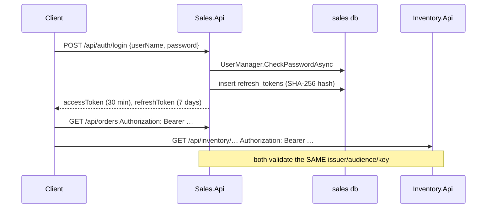

# 4. Xác thực & phân quyền

## Mục đích

Giải thích cách một bên gọi chứng minh danh tính của mình, danh tính đó di chuyển giữa hai API và một WebSocket ra sao, và các kiểm tra role nằm ở đâu.

## Hình dạng tổng thể



Sales là bên duy nhất phát hành token. Inventory chỉ kiểm tra chứ không bao giờ phát hành. Đó là lý do cả hai file `appsettings.json` đều có phần `Jwt` giống hệt nhau.

## Vì sao dùng JWT chứ không dùng session

Hai API là hai tiến trình riêng với database riêng. Một session phía server dùng chung sẽ cần một kho lưu trữ chung và một lượt tra cứu cho mỗi request. Token đã ký mang sẵn danh tính và role bên trong, nên Inventory có thể phân quyền mà không cần hỏi Sales điều gì.

Cái giá phải trả là khả năng thu hồi: access token vẫn hợp lệ cho tới khi hết hạn. Vì vậy access token có thời hạn ngắn (30 phút) còn refresh token mới là thứ có thể thu hồi.

## Phát hành token

`Sales.Api/Controllers/AuthController.cs`:

```csharp
var claims = new List<Claim>
{
    new(JwtRegisteredClaimNames.Sub, user.Id.ToString()),
    new(JwtRegisteredClaimNames.UniqueName, user.UserName!)
};
foreach (var role in await _users.GetRolesAsync(user))
    claims.Add(new Claim(ClaimTypes.Role, role));
```

Ký bằng HMAC-SHA256 với `Jwt:Key`, hiệu lực 30 phút.

Refresh token là 48 byte ngẫu nhiên, mã hóa base64. Chỉ chuỗi hex SHA-256 của nó được lưu:

```csharp
_db.RefreshTokens.Add(new RefreshToken
{
    UserId = user.Id,
    TokenHash = Hash(refresh),
    ExpiresAt = now.AddDays(7)
});
```

Do đó rò rỉ database không đồng nghĩa với việc trao ra các refresh token dùng được.

## Xoay vòng refresh token

`POST /api/auth/refresh` tìm dòng có hash khớp, `RevokedAt` là null và `ExpiresAt` còn ở tương lai. Nó đóng dấu `RevokedAt` lên dòng đó rồi phát hành một cặp token mới. Refresh token là loại dùng-một-lần: đưa lại đúng token đó lần thứ hai sẽ thất bại.

## Vì sao `AuthController` không đi theo CQRS

Nó dùng thẳng `UserManager<ApplicationUser>` và `SalesDbContext`, không command, không handler, không aggregate. Điều đó là có chủ đích và được ghi rõ trong class: xác thực không phải là một use case nghiệp vụ của Sales, và bọc Identity trong một domain model chỉ thêm nghi thức chứ không thêm quy tắc nào. Đừng sao chép cách làm này cho các endpoint nghiệp vụ.

## Kiểm tra token

`BuildingBlocks.Web/Authentication/JwtAuthenticationExtensions.cs`, được gọi từ `AddBuildingBlocksWeb`:

```csharp
ValidateIssuer = true, ValidateAudience = true,
ValidateLifetime = true, ValidateIssuerSigningKey = true
```

Đừng bao giờ tắt bất kỳ mục nào trong số này. Sales đặt thêm `ClockSkew = 30s`; mặc định của ASP.NET Core là năm phút, khiến các test về hết hạn trở nên khó hiểu.

## SignalR

Trình duyệt không thể đặt header `Authorization` khi bắt tay WebSocket. Vì vậy `RealtimeServiceCollectionExtensions.ConfigureJwtBearerForSignalR` đọc token từ query string:

```csharp
var accessToken = context.Request.Query["access_token"];
var path = context.HttpContext.Request.Path;
if (!string.IsNullOrEmpty(accessToken) && path.StartsWithSegments("/hubs/orders"))
    context.Token = accessToken;
```

Hai chốt chặn quan trọng: nó chỉ áp dụng khi chưa có bearer token nào được cung cấp, và chỉ áp dụng cho `/hubs/orders`. Token nằm trong query string sẽ lọt vào access log, nên phần kiểm tra path phải giữ thật hẹp.

## Phân quyền

Dựa trên role, không dùng policy. Role được seed lúc khởi động bởi `IdentitySeeder`, kèm một user `admin` cho môi trường development.

| Role | Ý nghĩa |
|---|---|
| `Admin` | toàn quyền, bao gồm cả đổi trạng thái catalog và khách hàng |
| `Sales` | công việc hằng ngày với đơn hàng và khách hàng |
| `Warehouse` | điều chỉnh tồn kho |

Việc kiểm tra được đặt bằng attribute trên controller hoặc action:

```csharp
[Authorize(Roles = "Admin,Sales")]          // OrdersController, CustomersController
[Authorize(Roles = "Admin")]                 // catalog writes, customer status
[Authorize(Roles = "Admin,Warehouse")]       // POST /api/inventory/{id}/adjust
[Authorize]                                  // reads: categories, common, products, inventory
[AllowAnonymous]                             // AuthController, HealthController
```

Đừng bao giờ kiểm tra lại role bên trong handler. Attribute chính là hợp đồng, và `CategoriesControllerAuthorizationTests` khẳng định điều đó.

## Ai đã làm việc đó?

Phân quyền quyết định *có được phép hay không*; audit trail ghi lại *ai đã làm*. `HttpExecutionContext` đọc `ClaimTypes.NameIdentifier` từ principal hiện tại:

```csharp
public string Actor => accessor.HttpContext?.User.FindFirstValue(ClaimTypes.NameIdentifier) ?? "system";
```

`SalesAuditContextAccessor` chuyển tiếp giá trị đó vào pipeline audit, nên mọi audit event và mọi outbox envelope đều mang theo actor. Công việc chạy nền không có principal nên báo `"system"` — hoàn toàn đúng.

## Lỗi thường gặp

| Sai lầm | Hậu quả |
|---|---|
| Kiểm tra role bên trong handler | quy tắc trở nên vô hình với Swagger và với các test phân quyền |
| Nới rộng phần kiểm tra path cho query-string của SignalR | token lọt vào log của các endpoint thông thường |
| Thêm `AllowAnyOrigin` cùng với `AllowCredentials` | trình duyệt từ chối; SignalR ngừng hoạt động |
| Lưu refresh token dạng thô | rò rỉ database trở thành chiếm đoạt tài khoản |
| Để nguyên `Jwt:Key` như giá trị đã commit | ai cũng có thể tự tạo token hợp lệ |

## Liên quan

- [../tech/security.md](../tech/security.md)
- [../project/backend/security-rule.md](../project/backend/security-rule.md)
- [../tech/api-endpoints.md](../tech/api-endpoints.md)
