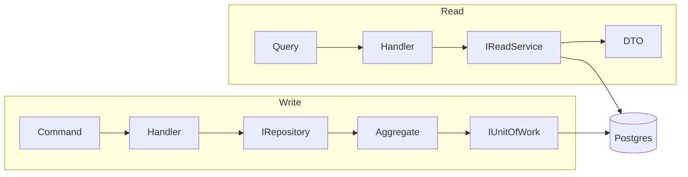
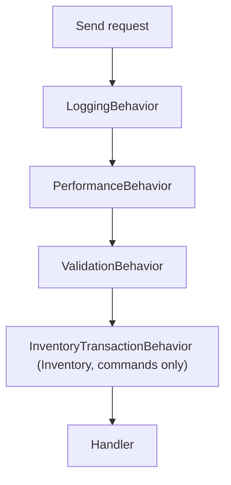

# 5. CQRS & pipeline MediatR

## Mục đích

Giải thích vì sao ở đây read và write được mô hình hóa khác nhau, và pipeline MediatR biến điều đó thành code như thế nào.

## Vấn đề mà CQRS giải quyết

Một thao tác ghi cần nguyên cả aggregate: load `Order` cùng các dòng của nó, gọi một method, để nó tự áp quy tắc, rồi lưu. Một thao tác đọc thì ngược lại: join product với category với variant, chiếu ra vài cột, phân trang, sắp xếp, đếm. Ép cả hai đi qua một model duy nhất sẽ cho bạn hoặc là repository làm rò rỉ `IQueryable`, hoặc là aggregate được load lên chỉ để rồi map đi.

Nên hai phía được tách ra:



Cùng một database, hai đường đi. Đây là CQRS-lite: không có kho đọc riêng, không có eventual consistency giữa hai phía.

## Các marker

```csharp
public interface ICommand : IRequest;
public interface ICommand<TResponse> : IRequest<TResponse>;
public interface IQuery<TResponse> : IRequest<TResponse>;
```

Ba dòng trong `BuildingBlocks.Application`, và chúng xứng đáng tồn tại: một behavior có thể ràng buộc `TRequest : ICommand<TResponse>` để không bao giờ bọc lấy một query. `InventoryTransactionBehavior` dùng đúng cơ chế đó để tránh mở transaction serializable cho một thao tác đọc.

## Một command, từ đầu tới cuối

```csharp
// ConfirmOrder.cs
public sealed record ConfirmOrder(Guid Id, long ExpectedVersion) : ICommand<OrderDto>;

// ConfirmOrderHandler.cs
public sealed class ConfirmOrderHandler(
    IOrderRepository orderRepository,
    IProductRepository productRepository,
    IUnitOfWork unitOfWork,
    ILogger<ConfirmOrderHandler> logger,
    IMapper mapper) : IRequestHandler<ConfirmOrder, OrderDto>
{
    public async Task<OrderDto> Handle(ConfirmOrder request, CancellationToken ct)
    {
        var order = await orderRepository.LoadAndCheck(request.Id, request.ExpectedVersion, ct);
        await productRepository.EnsureOrderLinesCanStillBeOrdered(order.Lines, ct);
        order.RequestConfirmation();
        await unitOfWork.SaveChangesAsync(ct);
        return mapper.Map<OrderDto>(order);
    }
}
```

Sáu bước, luôn theo thứ tự này: **load → kiểm tra version → validate lại → gọi domain → commit → map**. Handler không đưa ra quyết định nào — `RequestConfirmation()` mới sở hữu quy tắc.

Command và handler nằm ở hai file riêng. Nhìn có vẻ dài dòng, cho tới khi bạn quét thư mục `Features/Orders/Commands/` để tìm "một đơn hàng có thể xảy ra chuyện gì".

## Một query, từ đầu tới cuối

```csharp
public sealed record SearchOrders(DateTimeOffset? From, DateTimeOffset? To, string? Customer,
    OrderStatus? Status = null, int Page = 1, int PageSize = 20) : IQuery<PagedResult<OrderDto>>;

public sealed class SearchOrdersHandler(IOrderReadService readService)
    : IRequestHandler<SearchOrders, PagedResult<OrderDto>>
{
    public async Task<PagedResult<OrderDto>> Handle(SearchOrders request, CancellationToken ct) =>
        await readService.SearchAsync(request.From, request.To, request.Customer,
                                      request.Status, request.Page, request.PageSize, ct);
}
```

Handler chỉ có một dòng — điều đó là cố ý. Toàn bộ công việc nằm trong `OrderReadService`, nơi dùng `AsNoTracking`, ghép các specification, phân trang và đếm. Một query handler mà chạm vào repository hay `DbContext` là một bug.

## Logic dùng chung giữa các command

Khi nhiều command cần cùng một đoạn điều phối, nó trở thành một class extension `internal static`, không phải base class và cũng không phải một command khác:

```csharp
// OrderCommandSupport.cs
public static async Task<Order> LoadAndCheck(this IOrderRepository repo, Guid id, long expected, CancellationToken ct)
{
    var order = await repo.GetWithLinesAsync(id, ct) ?? throw new NotFoundException(nameof(Order), id);
    if (order.Version != expected) throw new ConflictException(order.Version);
    return order;
}
```

`Materialize` (chuyển các `OrderLineInput` thành `ProductSnapshot` đã được kiểm tra) và `EnsureOrderLinesCanStillBeOrdered` nằm ngay cạnh. `CategoryCommandSupport` làm điều tương tự cho category.

## Pipeline



Thứ tự đăng ký quyết định thứ tự bọc:

```csharp
services.AddScoped(typeof(IPipelineBehavior<,>), typeof(LoggingBehavior<,>));
services.AddScoped(typeof(IPipelineBehavior<,>), typeof(PerformanceBehavior<,>));
services.AddScoped(typeof(IPipelineBehavior<,>), typeof(ValidationBehavior<,>));
```

Inventory đăng ký transaction behavior của nó **sau** khi gọi `AddApplicationBuildingBlocks()`, nhờ đó validation vẫn chạy trước khi transaction mở ra. Sai thứ tự này đồng nghĩa với việc giữ một transaction serializable trong lúc đang validate.

### Từng behavior làm gì

**`LoggingBehavior`** — breadcrumb mức `Debug` kèm thời gian trôi qua. Khi lỗi, nó log request đã destructure, vẫn ở mức `Debug`, rồi ném lại. Comment dài trong file đó giải thích vì sao nó tuyệt đối không được log ở mức Warning hay Error: mỗi đường xử lý đều đã log lỗi của mình đúng một lần tại boundary của nó, và log lại ở đây sẽ nhân đôi mọi lỗi trong Seq cũng như làm hỏng việc đếm tỉ lệ lỗi.

**`PerformanceBehavior`** — cảnh báo khi ≥ 500 ms. Không làm gì khác; nó không bao giờ thay đổi hành vi.

**`ValidationBehavior`** — chạy song song mọi `IValidator<TRequest>` và ném `ValidationException` gộp tất cả lỗi. Nó thoát sớm khi không có validator nào được đăng ký, nên query không phải trả giá gì.

**`InventoryTransactionBehavior`** — xem [15-concurrency-and-idempotency.md](15-concurrency-and-idempotency.md). Đây là lý do các handler của Inventory không bao giờ gọi `SaveChangesAsync`.

## Đăng ký

```csharp
services.AddMediatR(cfg => cfg.RegisterServicesFromAssembly(assembly));
services.AddValidatorsFromAssembly(assembly);
services.AddApplicationMapping(assembly);
services.AddApplicationBuildingBlocks();
```

Mọi thứ đều được quét theo assembly. Thêm một command nghĩa là thêm hai file; không cần sửa chỗ đăng ký.

## Lỗi thường gặp

| Sai lầm | Vì sao gây hại |
|---|---|
| Hiện thực trực tiếp `IRequest<T>` | các behavior ràng buộc theo `ICommand<T>` sẽ âm thầm bỏ qua nó |
| Query handler chạm vào repository | load và track một aggregate chỉ để vứt đi |
| Command handler gửi đi một command khác | che giấu ranh giới transaction; hãy tách thành một support method |
| Quy tắc nghiệp vụ nằm trong handler | domain test không thấy, và lần sau lại bị lặp lại |
| Đăng ký behavior của service trước `AddApplicationBuildingBlocks()` | validation chạy bên trong transaction của bạn |
| Hai lần gọi `SaveChangesAsync` trong một handler | dòng outbox có thể commit mà thay đổi trạng thái thì không |

## Liên quan

- [06-ddd-in-this-project.md](06-ddd-in-this-project.md)
- [12-validation-and-error-handling.md](12-validation-and-error-handling.md)
- [../project/backend/cqrs-rule.md](../project/backend/cqrs-rule.md)
