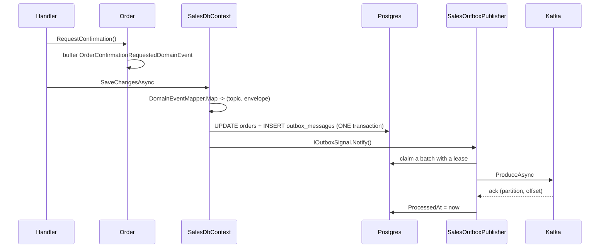

# 7. Domain Event & Transactional Outbox

## Mục đích

Giải thích làm sao một sự kiện phát sinh bên trong aggregate trở thành một message trên Kafka mà không bao giờ có nguy cơ hai bên lệch nhau.

## Vấn đề

Bạn muốn hai việc sau là nguyên tử:

1. đơn hàng chuyển sang `PendingInventory`
2. Inventory được yêu cầu giữ hàng

Nhưng transaction database và lệnh publish Kafka không thể gộp làm một. Publish trước thì lệnh ghi database có thể fail — Inventory giữ hàng cho một đơn không tồn tại. Lưu trước thì lệnh publish có thể fail — đơn hàng chờ mãi câu trả lời mà chẳng ai được hỏi.

## Lời giải

Ghi *ý định publish* vào cùng transaction với thay đổi trạng thái, rồi publish riêng sau đó.



Nếu tiến trình chết ở bất kỳ đâu sau khi commit, dòng dữ liệu vẫn còn đó và chu kỳ kế tiếp sẽ publish nó. Tệ nhất là bị trùng — và inbox của consumer xử lý được chuyện đó.

## Bước 1: aggregate phát sự kiện

```csharp
public void RequestConfirmation()
{
    EnsureDraft();
    Status = OrderStatus.PendingInventory;
    Touch();
    Raise(new OrderConfirmationRequestedDomainEvent(Id,
        _lines.Select(x => new OrderLineReservation(x.ProductVariantId, x.Sku, x.Quantity)).ToArray()));
}
```

`AggregateRoot` đệm nó vào một list private. Chưa có gì rời khỏi aggregate cả.

## Bước 2: DbContext rút bộ đệm

```csharp
public override async Task<int> SaveChangesAsync(CancellationToken ct = default)
{
    var aggregates = ChangeTracker.Entries<AggregateRoot<Guid>>()
        .Select(x => x.Entity)
        .Where(x => x.GetDomainEvents().Count > 0)
        .ToArray();

    foreach (var aggregate in aggregates)
        foreach (var domainEvent in aggregate.GetDomainEvents())
            if (DomainEventMapper.Map(aggregate, domainEvent, executionContext) is { } mapped)
                OutboxMessages.Add(OutboxMessage.From(mapped.Envelope, mapped.Topic));

    var result = await base.SaveChangesAsync(ct);
    foreach (var aggregate in aggregates) aggregate.ClearDomainEvents();
    if (aggregates.Length > 0) outboxSignal?.Notify();
    return result;
}
```

Ba điểm cần để ý:

- các event được gom **trước** `base.SaveChangesAsync`, nên các dòng outbox thuộc cùng transaction;
- bộ đệm được xóa **sau** khi lưu thành công, nên nếu lưu thất bại thì event vẫn còn để thử lại;
- tín hiệu được phát **sau** khi commit, nên publisher không bao giờ nhìn thấy dòng chưa commit.

## Bước 3: mapping

```csharp
private static (string Topic, object Payload)? MapToPayload(IDomainEvent domainEvent) => domainEvent switch
{
    OrderConfirmationRequestedDomainEvent e => MapOrderConfirmationRequested(e),
    OrderUndoComfirmedDomainEvent e         => MapOrderUndoConfirmed(e),
    _ => null
};
```

Trả về `null` nghĩa là "chỉ dùng nội bộ". Hiện tại chỉ 2 trong 7 domain event của Sales vượt qua ranh giới; số còn lại tới được audit trail qua `ChangeTracker`. **Một domain event không có mapping không phải là bug.**

Mapper cũng chuyển domain event thành kiểu *contract*. `OrderConfirmationRequestedDomainEvent` (từ vựng của domain) trở thành `OrderConfirmationRequested` (từ vựng của contract) để domain có thể được refactor mà không làm hỏng các consumer.

Sau đó `EventEnvelopeFactory.Create` bọc payload lại:

| Trường | Nguồn |
|---|---|
| `EventId` | GUID mới — khóa khử trùng lặp của inbox |
| `EventType` | tên kiểu runtime của payload |
| `AggregateId` | id của aggregate — **chính là partition key của Kafka** |
| `Version` | version của aggregate — dùng để kiểm tra dữ liệu cũ |
| `CorrelationId` | `IExecutionContext.CorrelationId` |
| `Actor` | `IExecutionContext.Actor` |
| `Data` | payload, serialize theo kiểu *runtime* |

Dùng `AggregateId` làm key chính là thứ đảm bảo hai event của cùng một đơn hàng không bao giờ đến sai thứ tự.

## Bước 4: publish

`OutboxPublisherService<TDbContext>` chạy một vòng lặp:

1. thức dậy khi có tín hiệu, hoặc sau khoảng poll (mặc định 2 s, 1 s trong compose);
2. chọn tối đa 100 dòng chưa xử lý, chưa dead-letter, đã đến hạn và chưa bị lease, ưu tiên `OccurredAt` cũ nhất;
3. chiếm chúng bằng một lệnh `ExecuteUpdateAsync` đặt `LockId` và `LockedUntil = now + 30s`;
4. nạp lại chỉ những dòng mang `LockId` của chu kỳ này và publish từng dòng;
5. thành công thì `ProcessedAt = now`; thất bại thì tăng `Attempts`, lưu lỗi, nhả lease, và đặt `NextAttemptAt` theo `RetryBackoff`;
6. đến lần thử thứ 10 thì đóng dấu `DeadLetteredAt` và ngừng thử lại;
7. cập nhật lại các gauge về backlog và dead-letter.

Lease chính là toàn bộ câu chuyện đồng thời. Hai instance API có thể chạy vòng lặp cùng lúc; mỗi bên chiếm những dòng rời nhau, và các dòng của một instance bị crash sẽ có thể bị chiếm lại sau 30 giây.

`KafkaOutboxPublisher` thực hiện việc produce thực sự, mở một span `kafka.publish <topic>` và ghi `traceparent`/`tracestate` để consumer tiếp tục cùng một trace.

## Đảm bảo về thứ tự

Các dòng được chiếm và publish theo thứ tự `OccurredAt`, và key theo `AggregateId`, nên mọi event của một đơn hàng đều rơi vào cùng một partition theo đúng thứ tự chúng xảy ra. Event của các aggregate *khác nhau* thì không có đảm bảo thứ tự — và cũng không được phép cần đến điều đó.

## Audit event đi chung đường ray

`AuditSaveChangesInterceptor` chạy bên trong `base.SaveChangesAsync` và thêm *nhiều* dòng outbox nữa — mỗi aggregate thay đổi một `AuditLogEvent`, đích đến là `sales.audit.v1`. Trạng thái nghiệp vụ, integration event và bản ghi audit đều commit cùng nhau.

## Lỗi thường gặp

| Sai lầm | Hậu quả |
|---|---|
| Publish thẳng lên Kafka từ handler | phá vỡ tính nguyên tử — đúng thứ mà outbox sinh ra để giữ |
| Gọi `SaveChangesAsync` hai lần trong một handler | dòng outbox có thể commit mà thay đổi trạng thái thì không |
| Phát domain event trước khi thay đổi trạng thái | event mô tả trạng thái chưa từng được lưu |
| Đánh dấu dòng đã xử lý trước khi nhận ack | message bị mất mà không có gì thử lại |
| Dùng key Kafka ngẫu nhiên | phá hủy thứ tự theo từng aggregate |
| Xóa dòng outbox sau khi publish | mất audit trail, mất khả năng replay |

## Liên quan

- [08-integration-events-and-inbox.md](08-integration-events-and-inbox.md)
- [../tech/outbox-inbox-schema.md](../tech/outbox-inbox-schema.md)
- [../guides/kafka-usage-guide.md](kafka-usage-guide.md)
