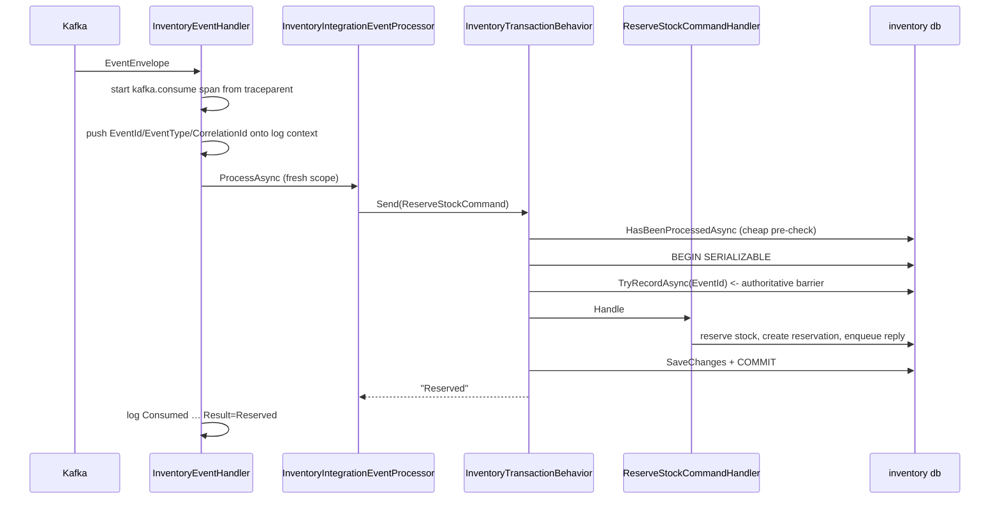

# 8. Integration Event, Inbox & Retry

## Mục đích

Nửa còn lại của [07-domain-events-and-outbox.md](07-domain-events-and-outbox.md): chuyện gì xảy ra khi một message *đến nơi*, và vì sao phía tiêu thụ cần bộ máy phức tạp không kém phía phát.

## Ba vấn đề ở phía consumer

1. **Trùng lặp.** At-least-once delivery nghĩa là cùng một event có thể đến hai lần. Giữ hàng hai lần là một bug thật sự.
2. **Thất bại.** KafkaFlow commit offset bất kể handler của bạn thành công hay không — nên ném exception là *mất* message.
3. **Đến sai thứ tự.** Confirm và undo đi trên hai topic khác nhau, nên lệnh giải phóng có thể vượt mặt lệnh giữ hàng.

Mỗi vấn đề có cơ chế riêng: inbox, dịch vụ re-drive, và chốt chặn theo version.

## Đường đi khi tiêu thụ



## Base class của handler

```csharp
public abstract class IntegrationEventHandler<THandler>(
    IServiceScopeFactory scopes, ILogger<THandler> logger,
    ActivitySource activitySource, IMessageLogContext messageLogContext)
    : IMessageHandler<EventEnvelope>
```

`SalesIntegrationEventHandler` và `InventoryEventHandler` kế thừa nó và chẳng thêm gì ngoài tên kiểu của mình. Mọi việc cắt ngang — tracing, log context, log tiêu thụ có cấu trúc, phân giải processor theo scope, ghi nhận thất bại — chỉ nằm một chỗ trong base class.

### Quy tắc khiến ai cũng bất ngờ

```csharp
catch (Exception ex)
{
    var failure = await RecordFailure(context, envelope, ex);
    logger.LogError(ex, "Consume failed …");

    if (failure is null) throw;   // nowhere to persist it -> fail loudly

    // Do NOT rethrow: KafkaFlow commits the offset regardless, so a throw would
    // drop the event rather than retry it.
}
```

Nuốt exception thường là che giấu bug. Ở đây nó lại là hành vi đúng, vì thất bại đã được ghi bền vững vào inbox trước đó. Ném lại sẽ vừa commit offset *vừa* mất event. Trường hợp duy nhất có ném lại là khi không có `IInboxFailureRecorder` nào được đăng ký — khi đó không có chỗ nào để lưu, nên mất mát được báo động thật to.

## Inbox

Khóa chính của `inbox_messages` **chính là** cơ chế idempotency. Một lần insert trùng sẽ gây lỗi unique violation của Postgres, được nhận diện bởi `PostgresExceptions.IsUniqueViolation`.

Hai service hiện thực nó khác nhau, và đều có lý do chính đáng.

**Sales** mở một transaction tường minh để dòng inbox và bước chuyển trạng thái đơn hàng commit cùng nhau:

```csharp
await using var transaction = await db.Database.BeginTransactionAsync();
var inbox = await db.InboxMessages.SingleOrDefaultAsync(x => x.EventId == envelope.EventId);
if (inbox is null)
{
    db.InboxMessages.Add(InboxMessage.Create(envelope.EventId, clock.UtcNow, consumer: "sales-v1"));
    await db.SaveChangesAsync();
}
else if (inbox.Status is Processed or DeadLettered)
{
    SalesMetrics.InboxDuplicate.Add(1);
    await transaction.RollbackAsync();
    return "Duplicate";
}
```

**Inventory** đặt nó vào một pipeline behavior, với hai tầng kiểm tra:

```csharp
// Stage 1 — cheap, non-transactional. Lets a duplicate skip the transaction entirely.
if (request is IIdempotentCommand<TResponse> preChecked
    && await inbox.HasBeenProcessedAsync(preChecked.EventId, ct))
    return preChecked.DuplicateResponse;

await using var transaction = await transactions.BeginSerializableTransactionAsync(ct);
// Stage 2 — authoritative. The pre-check can race; this cannot.
if (request is IIdempotentCommand<TResponse> idempotent
    && !await inbox.TryRecordAsync(idempotent.EventId, ct))
{
    await transaction.RollbackAsync(ct);
    return idempotent.DuplicateResponse;
}
```

Bước kiểm tra sơ bộ tốn một truy vấn nhẹ cho mỗi lần giao *đầu tiên*, và tiết kiệm nguyên một transaction serializable cho mỗi lần *trùng*. Nó là một tối ưu, không phải rào chắn — comment trong file nói rõ như vậy.

## Event không có handler vẫn được coi là đã xử lý

`SalesInventoryEventProcessor` lưu và commit vô điều kiện, kể cả khi loại event không khớp với gì cả:

> Một event mà Sales không có handler vẫn được coi là xử lý thành công, nên dòng Inbox của nó phải được lưu ở trạng thái Processed ngay tại đây — một dòng bị re-drive mà kẹt ở trạng thái Failed sẽ bị `InboxRedriveService` chọn lại mỗi chu kỳ, mãi mãi.

Tương tự với một event mồ côi mà đơn hàng của nó không tồn tại: dòng inbox vẫn được commit và trả về `order_not_found`, nên việc giao lại rất rẻ.

## Re-drive: cơ chế retry thực sự

Kafka sẽ không bao giờ giao lại một message mà offset của nó đã được commit. Nên các event thất bại được phát lại từ inbox, với envelope được lưu kèm:

```csharp
row.Payload = JsonSerializer.Serialize(envelope);  // EfInboxFailureRecorder
```

Rồi cứ mỗi 15 giây, `InboxRedriveService`:

- chọn tối đa 50 dòng có `Status = Failed`, có payload, và `NextAttemptAt` đã đến hạn;
- deserialize và phát lại từng dòng qua `IIntegrationEventProcessor` **trong scope riêng của nó**, để các thay đổi được track của lần thử thất bại không rò rỉ sang scope ghi nhận thất bại;
- khi thành công thì đếm `inbox.retried` — chính processor mới là bên đánh dấu dòng là `Processed`;
- khi thất bại thì ghi thêm một lần thử với backoff lũy thừa, dead-letter ở lần thứ 5.

Cả hai pipeline dùng chung `RetryBackoff.ForAttempt(n) = min(300s, 2^min(n,8))`.

## Event đến sai thứ tự

Thứ tự được đảm bảo trong phạm vi một partition, nhưng confirm và undo lại ở hai topic khác nhau. `Reservation.LastOrderVersion` chính là chốt chặn:

```csharp
public bool IsStale(long orderVersion) => orderVersion <= LastOrderVersion;
```

Mọi bước chuyển có mang version đều tham chiếu nó, và bên gọi cũng tham chiếu đúng method đó trước khi thay đổi inventory item — nên hai bên không bao giờ bất đồng.

Trường hợp khó là **giải phóng đến trước khi giữ hàng**. Nếu lệnh undo vượt mặt lệnh confirm thì chẳng có reservation nào để giải phóng. Không tạo gì cả sẽ khiến lệnh giữ hàng đến muộn giữ tồn kho cho một đơn đã bị hủy. Vì vậy một tombstone được ghi lại:

```csharp
reservationRepository.Add(Reservation.CreateReleasedTombstone(request.OrderId, request.OrderVersion));
return "ReleasedBeforeReserve";
```

Một reservation `Released` không có dòng nào, mang theo version. Lệnh giữ hàng cũ đến muộn giờ trở thành lỗi thời và bị bỏ qua; còn một lệnh confirm thực sự mới hơn vẫn có thể `Reactivate`.

## Chuỗi kết quả (outcome string)

Processor trả về một chuỗi ngắn, được ghi vào log tiêu thụ và được các test khẳng định: `Reserved`, `ReservedAcknowledged`, `AlreadyReserved`, `Rejected`, `Released`, `AlreadyReleased`, `StaleRelease`, `ReleasedBeforeReserve`, `Duplicate`, `Ignored`. Đổi tên một trong số đó là một breaking change.

## Lỗi thường gặp

| Sai lầm | Hậu quả |
|---|---|
| Ném lại exception từ handler của consumer | offset đã được commit và event bị mất |
| Kiểm tra inbox mà không có transaction | race giữa hai consumer khiến event bị xử lý hai lần |
| Không lưu dòng inbox cho event không có handler | dịch vụ re-drive chọn lại nó mãi mãi |
| So sánh timestamp thay vì version | lệch đồng hồ quyết định kết quả nghiệp vụ của bạn |
| Không lưu envelope khi thất bại | không có gì để phát lại — Kafka sẽ không gửi lại nữa |
| Tưởng rằng Kafka sẽ thử lại một handler thất bại | nó không làm vậy; inbox mới làm |

## Liên quan

- [07-domain-events-and-outbox.md](07-domain-events-and-outbox.md)
- [15-concurrency-and-idempotency.md](15-concurrency-and-idempotency.md)
- [../tech/retry-and-dead-letter.md](../tech/retry-and-dead-letter.md)
- [kafka-playwright-debug-guide.md](kafka-playwright-debug-guide.md)
