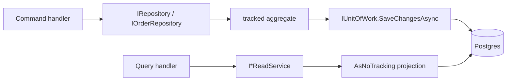

# 9. Repository & Unit of Work

## Mục đích

Giải thích hai đường lưu trữ — repository cho ghi, read service cho đọc — và vì sao việc giữ chúng tách biệt mới làm cho sự phân chia CQRS trở nên có thật.

## Hai đường đi



| Nhu cầu | Dùng |
|---|---|
| Load một aggregate để thay đổi nó | repository |
| Trả dữ liệu về cho client | read service |
| Gộp, join, phân trang, sắp xếp để hiển thị | read service |

Load một aggregate qua repository chỉ để map thành DTO chính là sai lầm mà sự phân chia này sinh ra để ngăn chặn.

## Hợp đồng của repository

```csharp
public interface IRepository<T> where T : AggregateRoot<Guid>
{
    Task<T?> GetByIdAsync(Guid id, CancellationToken ct = default);
    Task<IReadOnlyList<T>> GetByIdsAsync(IEnumerable<Guid> ids, CancellationToken ct = default);
    Task AddAsync(T aggregate, CancellationToken ct = default);
    void Update(T aggregate);
    void Delete(T aggregate);
}
```

Năm thành viên, tất cả đều nói bằng ngôn ngữ aggregate. Không có `Find(Expression<...>)`, không `IQueryable`, không `Where`. Đó chính là mấu chốt: một repository trả về `IQueryable` không phải là trừu tượng hóa, nó chỉ là `DbSet` với vài bước thừa, và logic truy vấn rốt cuộc bị rải khắp các handler.

`Sales.Architecture.Tests.Domain_repositories_do_not_expose_queryables` bắt buộc điều đó.

## Repository chuyên biệt

```csharp
public interface IOrderRepository : IRepository<Order>
{
    Task<IReadOnlyCollection<Guid>> FindExpiredCancellableOrderIdsAsync(DateTimeOffset before, int batchSize, CancellationToken ct = default);
    Task<Order?> GetWithLinesAsync(Guid id, CancellationToken ct = default);
}
```

`GetWithLinesAsync` tồn tại vì `GetByIdAsync` không `Include` các dòng hàng. Một handler gọi `order.ReplaceLines(...)` trên một đơn chưa nạp dòng hàng sẽ âm thầm xóa sạch chúng — nên bất kỳ handler nào chạm tới entity con **buộc phải** dùng method có include.

`IProductRepository` dùng một mẹo khác: nhiều thành viên có hiện thực mặc định ngay trên interface, trả về giá trị rỗng an toàn, và được `ProductRepository` override bằng truy vấn thật. Interface có thể mở rộng mà không làm hỏng mọi test double.

## Phần hiện thực

```csharp
public class Repository<T>(SalesDbContext db) : IRepository<T> where T : AggregateRoot<Guid>
{
    protected readonly SalesDbContext Db = db;

    public Task<T?> GetByIdAsync(Guid id, CancellationToken ct = default) =>
        Db.Set<T>().SingleOrDefaultAsync(x => x.Id == id, ct);
    …
}
```

Ba thói quen đáng học theo:

- dùng `SingleOrDefaultAsync` trên khóa duy nhất, không bao giờ `FirstOrDefault` — nếu có hai dòng thì bạn cần biết;
- các lệnh load hàng loạt loại bỏ id trùng và dùng một truy vấn `Contains` thay vì N lượt đi về;
- **không có `SaveChangesAsync`**. Repository chuẩn bị thay đổi; nó không bao giờ commit.

`IgnoreQueryFilters()` xuất hiện đúng ở hai chỗ (`GetBySkuAsync`, `GetByProductCodeAsync`), nơi việc tra cứu phải nhìn thấy cả dòng đã soft-delete. Nó không phải cửa thoát hiểm dùng chung — nó cũng bỏ qua luôn các filtered unique index.

## Unit of Work

```csharp
public interface IUnitOfWork
{
    Task<int> SaveChangesAsync(CancellationToken cancellationToken = default);
}
```

Một thành viên duy nhất. Tầng Application phụ thuộc vào cái này thay vì `DbContext`, và đó chính là thứ giữ EF Core ở ngoài tầng Application — architecture test kiểm tra điều đó.

`SalesDbContext` hiện thực `IUnitOfWork` trực tiếp, còn `UnitOfWork` là một lớp bọc mỏng để handler inject cái port hẹp thay vì toàn bộ bề mặt của context.

### Ranh giới transaction

Ở Sales, **một `SaveChangesAsync` cho mỗi command** *chính là* transaction. Lời gọi duy nhất đó:

1. map các domain event đang đệm thành dòng outbox,
2. kích hoạt `AuditSaveChangesInterceptor`, bên này thêm các dòng audit outbox,
3. commit mọi thứ một cách nguyên tử,
4. xóa các domain event và báo hiệu cho outbox publisher.

Gọi nó hai lần trong một handler tạo ra hai transaction — và cái thứ hai có thể fail sau khi cái thứ nhất đã commit, để lại một dòng outbox mà không có thay đổi trạng thái đi kèm.

Inventory làm ngược lại: handler không bao giờ gọi `SaveChangesAsync`. `InventoryTransactionBehavior` sở hữu transaction serializable và commit sau khi handler trả về.

## Read service

```csharp
public sealed class OrderReadService(SalesDbContext db, IMapper mapper) : IOrderReadService
{
    public async Task<PagedResult<OrderDto>> SearchAsync(…)
    {
        (page, pageSize) = Paging.Normalize(page, pageSize);
        var query = db.Orders.Include(x => x.Lines).AsNoTracking();

        Specification<Order>? spec = null;
        if (from is not null) spec = Compose(spec, new OrderCreatedFromSpecification(from.Value));
        …
        if (spec is not null) query = query.Where(spec.ToExpression());

        var total = await query.LongCountAsync(ct);
        var orders = await query.OrderByDescending(x => x.CreatedAt)
                                .Skip((page - 1) * pageSize).Take(pageSize).ToListAsync(ct);
        return new(mapper.Map<OrderDto[]>(orders), page, pageSize, total);
    }
}
```

Luôn `AsNoTracking`. Luôn `Paging.Normalize`. Luôn đếm trên truy vấn *đã lọc*, trước khi phân trang.

`ProductReadService` còn đi xa hơn: nó dựng DTO bằng tay thay vì map, vì cần join qua variant, màu và size cộng thêm tính giá min/max. Nó load toàn bộ variant cho cả trang trong **một** truy vấn rồi gom nhóm trong bộ nhớ — chính vấn đề N+1 mà một chuỗi `Include` ngây thơ sẽ tạo ra là thứ mà tầng read service sinh ra để bạn né được.

## Trang trí (decorate) một read service

```csharp
services.AddScoped<ProductReadService>();
services.AddScoped<IProductReadService>(sp => new CachedProductReadService(
    sp.GetRequiredService<ProductReadService>(),
    sp.GetRequiredService<IProductCache>()));
```

Kiểu cụ thể được đăng ký, rồi interface phân giải sang một decorator bọc lấy nó. Handler chẳng biết gì về cache. Xem [11-caching.md](11-caching.md).

## Lỗi thường gặp

| Sai lầm | Hậu quả |
|---|---|
| Trả `IQueryable` từ repository | logic truy vấn rò rỉ vào handler; trừu tượng hóa chỉ là giả |
| `GetByIdAsync` rồi thay đổi entity con | entity con chưa được load — chúng bị xóa khi lưu |
| Gọi `SaveChangesAsync` bên trong repository | handler mất quyền kiểm soát transaction |
| Load một aggregate để đọc | tốn chi phí tracking mà không có projection |
| Entity được track trong read service | vô tình ghi dữ liệu ở lần lưu kế tiếp |
| Đếm sau `Skip/Take` | `total` báo ra đúng bằng kích thước trang |
| Lặp gọi `GetByIdAsync` | N+1 |

## Liên quan

- [05-cqrs-and-mediatr.md](05-cqrs-and-mediatr.md)
- [10-database-and-migrations.md](10-database-and-migrations.md)
- [../project/backend/repository-rule.md](../project/backend/repository-rule.md)
