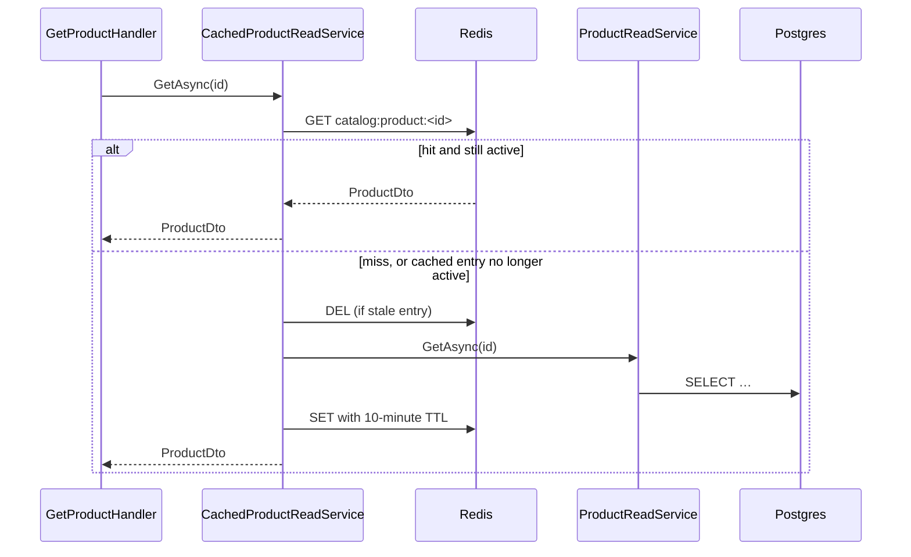

# 11. Caching với Redis

## Mục đích

Giải thích về cache duy nhất trong hệ thống này, vì sao nó là một decorator chứ không phải lời gọi trong handler, và vì sao invalidation mới là nửa khó.

## Cái gì được cache

Đúng một thứ: `ProductDto` cho `GET /api/products/{id}`, chỉ ở Sales. Redis còn giữ một distributed lock cho job dọn dẹp.

Đó là một phạm vi cố ý giữ nhỏ. Cache là một bản sao thứ hai của dữ liệu, và mỗi bản sao là một cơ hội để sai.

## Cache-aside



Cache là bản sao của một lần đọc database, không phải nguồn sự thật. Cache nguội chỉ khiến chậm hơn, không bao giờ khiến sai.

## Decorator

```csharp
services.AddScoped<ProductReadService>();
services.AddScoped<IProductReadService>(sp => new CachedProductReadService(
    sp.GetRequiredService<ProductReadService>(),
    sp.GetRequiredService<IProductCache>()));
```

`GetProductHandler` inject `IProductReadService` và chẳng biết là có cache tồn tại. Bỏ cache đi chỉ là sửa một dòng đăng ký. So sánh với việc rải `if (cached != null) return cached;` khắp các handler.

## Cái gì *không* được cache, và vì sao

```csharp
/// <remarks>
/// Deliberately uncached: the cache only holds published products, and this read exists to
/// return a product a command just wrote, whatever status it landed in.
/// </remarks>
public Task<ProductDto?> GetForWriteResultAsync(Guid id, CancellationToken ct = default)
    => inner.GetForWriteResultAsync(id, ct);
```

Đây là phần tinh tế nhất của thiết kế. `GetAsync` chỉ trả về sản phẩm đã published. Một command tạo ra sản phẩm ở trạng thái `Draft` rồi đọc lại qua `GetAsync` sẽ nhận `null` và báo "không tìm thấy" cho thứ nó vừa tạo. Vì vậy việc đọc lại kết quả ghi dùng một method riêng, không cache.

`SearchAsync` cũng không được cache — kết quả phân trang, nhiều bộ lọc có quá nhiều tổ hợp key và trở nên cũ ngay khi có bất kỳ sản phẩm nào thay đổi.

## Base class dùng chung

```csharp
public abstract class CacheService<T> : ICacheService<T>
{
    protected virtual TimeSpan Ttl => TimeSpan.FromMinutes(10);
    protected abstract string KeyPrefix { get; }
    protected abstract Guid GetId(T value);
    protected virtual string Key(Guid id) => $"{KeyPrefix}:{id:N}";
    // GetAsync / SetAsync / RemoveAsync over IDistributedCache with System.Text.Json
}
```

`ProductCache` cung cấp `"catalog:product"` và `value => value.Id`. Một cache mới chỉ tốn khoảng mười dòng.

Port (`ICacheService<T>` → `IProductCache`) nằm ở tầng Application; chỉ phần hiện thực mới biết về Redis. Application không bao giờ nhìn thấy `IDistributedCache`.

## Invalidation

Mọi đường ghi làm thay đổi hình dạng đang được cache đều xóa entry — **sau** khi lưu:

```csharp
product.UpdateVariant(request.VariantId, color, size, request.Price, status);
await unitOfWork.SaveChangesAsync(cancellationToken);
await productCache.RemoveAsync(product.Id, cancellationToken);
```

Thứ tự rất quan trọng. Invalidate *trước* khi commit thì một lượt đọc đồng thời có thể nạp lại cache từ trạng thái trước commit — để lại một entry cũ mà chẳng gì xóa trong suốt mười phút.

Hãy xóa, đừng cập nhật. Ghi giá trị mới vào cache nghĩa là có hai đường code cùng tạo ra DTO, và chúng sẽ trôi lệch nhau.

Hiện tại được invalidate bởi: tạo product (qua lượt đọc lại), cập nhật product, xóa product, thêm/cập nhật/vô hiệu hóa/xóa variant.

### Lưới an toàn

```csharp
var cached = await cache.GetAsync(id, cancellationToken);
if (cached is not null)
{
    if (IsActive(cached)) return cached;
    await cache.RemoveAsync(id, cancellationToken);
}
```

Nếu lỡ bỏ sót một lần invalidate, entry cache của một sản phẩm nay đã unpublish hoặc bị xóa sẽ bị loại bỏ ngay lúc đọc thay vì được phục vụ. Cẩn tắc vô áy náy, vì quên một lời gọi invalidate là sai lầm dễ mắc nhất ở đây.

## TTL như một chốt chặn cuối

10 phút tuyệt đối. Đó không phải con số về hiệu năng — nó là khoảng thời gian tối đa mà một lần invalidate *bị bỏ sót* có thể phục vụ dữ liệu cũ. Đủ dài để hữu ích, đủ ngắn để một bug vẫn sống sót được.

## Distributed lock

Đây là một cách dùng Redis hoàn toàn khác. `MaintenanceCleanupJob` chạy hằng ngày và không được phép chạy hai lần cùng lúc trên nhiều instance:

```csharp
var lockAcquired = await cache.StringSetAsync(CleanupLockKey, lockToken, CleanupLockDuration, When.NotExists);
if (!lockAcquired) return;
try { /* delete old inbox/outbox rows */ }
finally { await cache.ScriptEvaluateAsync(ReleaseLockScript, [CleanupLockKey], [lockToken]); }
```

Việc nhả khóa là một lệnh Lua compare-and-delete:

```lua
if redis.call('get', KEYS[1]) == ARGV[1] then return redis.call('del', KEYS[1]) else return 0 end
```

Không có nó, một instance chậm mà khóa đã hết hạn sẽ đi xóa mất khóa mà một instance *khác* đang giữ. Đây chính là cái bẫy kinh điển của Redlock.

Chú ý cách đặt vấn đề: khóa này là một tối ưu. Việc dọn dẹp xóa các dòng khớp một điều kiện, nên chạy hai lần cũng vô hại. **Đừng bao giờ để một khóa Redis là thứ duy nhất bảo vệ tính đúng đắn** — Inventory thể hiện cùng ý này theo cách khác bằng việc dùng advisory lock của Postgres ngay trong transaction, giữ Redis hoàn toàn ra ngoài context đó.

## Lỗi thường gặp

| Sai lầm | Hậu quả |
|---|---|
| Cache trong handler thay vì dùng decorator | mọi bên gọi đều phải nhớ; bỏ cache đi thì phải sửa mọi handler |
| Invalidate trước khi lưu | một lượt đọc đồng thời nạp lại giá trị cũ |
| Cập nhật cache thay vì xóa | hai đường code cùng dựng DTO; chúng trôi lệch nhau |
| Cache kết quả tìm kiếm | bùng nổ số lượng key và cũ đi ngay lập tức |
| Cache một aggregate | ngữ nghĩa entity được track không sống sót qua serialization |
| Đọc kết quả ghi qua đường có cache | sản phẩm Draft trả về `null` |
| Nhả khóa bằng lệnh `DEL` trần | bạn xóa mất khóa của người khác |

## Liên quan

- [Redis-cache-usage-guide.md](Redis-cache-usage-guide.md) — deep dive (tiếng Việt)
- [../tech/cache-conventions.md](../tech/cache-conventions.md)
- [../project/backend/redis-rule.md](../project/backend/redis-rule.md)
