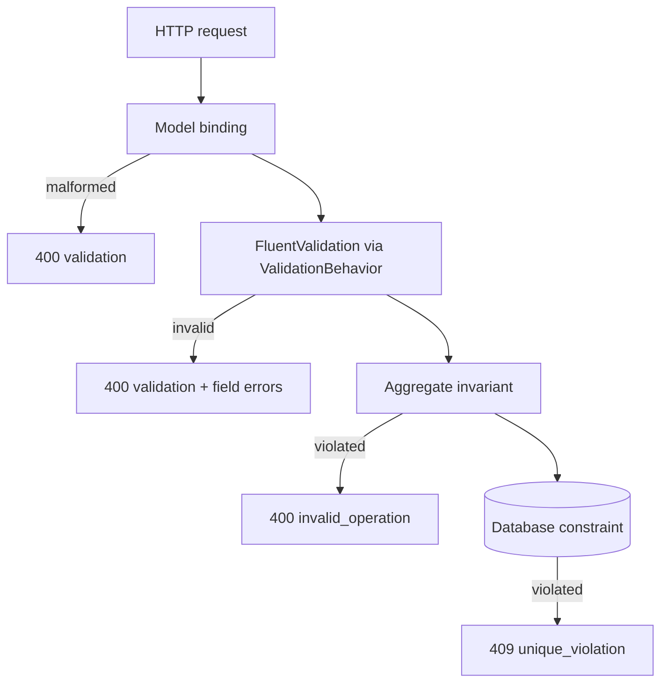

# 12. Validation & xử lý lỗi

## Mục đích

Giải thích ba lớp validation, vì sao cùng một quy tắc đôi khi xuất hiện hai lần một cách có chủ đích, và cách mọi exception trở thành một HTTP response nhất quán.

## Ba lớp, ba nhiệm vụ



| Lớp | Trả lời câu hỏi | Khi thất bại |
|---|---|---|
| Model binding | JSON này có đúng định dạng và đúng kiểu không? | `400 validation` |
| FluentValidation | request này có hợp lý không, trước khi chạm vào domain? | `400 validation` + lỗi theo trường |
| Aggregate | thao tác này có hợp lệ với entity này ngay lúc này không? | `400 invalid_operation` |
| Database | dữ liệu có nhất quán trên toàn cục không? | `409 unique_violation` |

## Vì sao sự trùng lặp là có chủ đích

`ValidPhone()` kiểm tra 9–15 chữ số. `Customer.NormalizePhone` cũng vậy. Đó không phải dư thừa:

- **validator** cho bên gọi một thông báo tốt kèm tên trường, trước khi có bất kỳ công việc nào diễn ra;
- **aggregate** mới là sự đảm bảo. Nó vẫn đúng khi một command được gửi từ một job Hangfire, một Kafka consumer, hay một bài test — không cái nào trong số đó đi qua validator.

Quy tắc: validator cải thiện *thông báo*; aggregate cung cấp *sự đảm bảo*. Đừng bao giờ chuyển một invariant ra khỏi aggregate chỉ vì validator đã kiểm tra rồi.

## FluentValidation

Mỗi command một validator, quét theo assembly:

```csharp
public sealed class CreateOrderValidator : AbstractValidator<CreateOrder>
{
    public CreateOrderValidator()
    {
        RuleFor(x => x.CustomerId).ValidAggregateId();
        RuleFor(x => x.Lines).NotEmpty();
        RuleForEach(x => x.Lines).SetValidator(new OrderLineInputValidator());
        RuleFor(x => x.Lines).HaveUniqueProducts();
    }
}
```

Các quy tắc tái sử dụng được trở thành extension method thay vì copy-paste — `ValidAggregateId()`, `ValidExpectedVersion()` (dùng chung nhiều feature), `ValidPhone()`, `ValidCustomerName()`, `HaveUniqueProducts()` (giới hạn trong một feature).

`ValidationBehavior` chạy song song mọi validator của một request và ném một lần duy nhất với tất cả lỗi gộp lại. Query không có validator; việc phân trang được `Paging.Normalize` *kẹp lại* chứ không bị từ chối — yêu cầu trang 0 hay 500 phần tử không phải là lỗi, đó chỉ là một yêu cầu cần được xử lý cho hợp lý.

## Trạng thái ở dạng chuỗi

Command nhận trạng thái dưới dạng `string`, không phải enum:

```csharp
private static EProductStatus ParseProductStatus(string status)
{
    if (Enum.TryParse<EProductStatus>(status, ignoreCase: true, out var productStatus))
        return productStatus;
    throw new DomainException("Product status is invalid.");
}
```

Validator chỉ kiểm tra sự hiện diện và độ dài; việc parse và quy tắc chuyển trạng thái nằm ở handler và aggregate. Tham số truy vấn thì ngược lại — `OrderStatus? status` bind theo tên, nên `?status=Nonsense` bị từ chối ngay tại biên với mã `400` thay vì bị âm thầm bỏ qua.

## Cây phân cấp exception

| Exception | Ý nghĩa | HTTP | Mã |
|---|---|---|---|
| `DomainException` | vi phạm invariant | 400 | `invalid_operation` |
| `NotFoundException` | không tìm thấy tài nguyên | 404 | `not_found` |
| `ConflictException` | lệch version | 409 | `concurrency_conflict` |
| `ValidationException` | request không hợp lệ | 400 | `validation` |
| `UnauthorizedAccessException` | thông tin xác thực bị từ chối | 401 | `unauthorized` |
| `BadHttpRequestException` | request/header sai định dạng | tùy trường hợp | `invalid_request` |
| `OperationCanceledException` | client ngắt kết nối | 499 | `operation_cancelled` |
| bất kỳ thứ gì khác | bug | 500 | `internal_server_error` |

Bốn kiểu là đủ cho toàn bộ ứng dụng. Không có `OrderNotFoundException`, không có `ProductInvalidStateException` — một cây phân cấp phản chiếu domain chỉ thêm class chứ không thêm thông tin.

## Mã lỗi

Được khai báo một lần trong `ErrorCodes` với mô tả mặc định trong `ErrorCatalog`:

```csharp
public const string ConcurrencyConflict = "concurrency_conflict";
public static readonly ErrorDefinition ConcurrencyConflict =
    new(ErrorCodes.ConcurrencyConflict, "The resource was modified by another request.");
```

Các service không tự định nghĩa mã riêng; chúng ghi đè *câu chữ* thông qua `IErrorMessageProvider`:

```csharp
ErrorCodes.NotFound => "The requested sales resource was not found.",
```

Nhờ đó client có thể rẽ nhánh theo một mã ổn định do máy đọc, còn con người thì đọc một câu phù hợp với service. `ErrorCatalogTests` sẽ fail nếu một mã được khai báo mà không được đăng ký.

## Ánh xạ sang HTTP

`ApiExceptionHandler` là nơi duy nhất mà ranh giới HTTP dịch và log một lỗi. Thứ tự quan trọng:

1. các mapping do service đăng ký,
2. phân loại lỗi tầng lưu trữ,
3. các kiểu exception có sẵn,
4. rơi về 500.

Sales đăng ký ba mapping trong host của nó:

```csharp
options.Map<ConflictException>((exception, errorCatalog) =>
{
    var error = errorCatalog.Get(ErrorCodes.ConcurrencyConflict);
    var errors = new[] { new ApiError("current_version", exception.CurrentVersion.ToString()) };
    return new ApiExceptionMapping(409, error.Code, error.Description, errors, LogLevel: LogLevel.Warning);
});
```

Chú ý là version hiện tại được trả về cho client để nó thử lại với ETag đúng.

### Log level là một phần của mapping

```csharp
LogLevel LogLevel = LogLevel.Error   // the default
```

`Information` cho lỗi do client gây ra, `Warning` cho xung đột và tranh chấp, `Error` cho những thứ cần đến kỹ sư. Mặc định là `Error` **để một mapping quên phân loại chính nó sẽ ồn ào chứ không im lặng** — một mặc định tốt cho thuộc tính an toàn.

### Lỗi tầng lưu trữ

Exception của EF và Npgsql không bao giờ đến tầng web dưới dạng nguyên bản. `PostgresPersistenceExceptionClassifier` dịch chúng:

| Exception | HTTP | Mã | `retryable` |
|---|---|---|---|
| `DbUpdateConcurrencyException` | 409 | `concurrency_conflict` | `False` |
| Postgres unique violation | 409 | `unique_violation` | `False` |
| serialization failure / deadlock | 409 | `concurrency_conflict` | `True` |

Một architecture test cấm `Microsoft.EntityFrameworkCore` và `Npgsql` bên trong `BuildingBlocks.Web.ExceptionHandling`, nên không thể đi vòng qua port này. Cờ `retryable` cho client biết việc phát lại đúng request đó có an toàn hay không.

### Handler còn làm gì nữa

```csharp
activity.AddException(exception);
activity.SetTag("error.code", mapping.ErrorCode);
if (mapping.StatusCode >= 500) activity.SetStatus(ActivityStatusCode.Error, mapping.ErrorCode);
```

`UseExceptionHandler` chặn exception lại trước khi phần instrumentation của ASP.NET Core nhìn thấy nó, nên chính handler phải ghi nó lên span. Và chỉ 5xx mới đặt trạng thái span là `Error` — nếu không thì mọi lỗi validation sẽ bị tính vào tỉ lệ lỗi trace của service và dashboard trở nên vô dụng.

## Response

```json
{ "status": 409, "errorCode": "concurrency_conflict",
  "message": "The sales resource was changed by another request.",
  "traceId": "4bf92f3577b34da6a3ce929d0e0e4736",
  "correlationId": "4bf92f3577b34da6a3ce929d0e0e4736",
  "errors": [ { "code": "current_version", "message": "5" } ],
  "validationErrors": [] }
```

Lỗi model-binding cũng có đúng hình dạng này nhờ `AddSharedApiModelResponses`. Một khuôn dạng lỗi duy nhất, dù có chuyện gì xảy ra. `traceId` dán thẳng được vào Seq hoặc Kibana.

## Lỗi thường gặp

| Sai lầm | Hậu quả |
|---|---|
| Chuyển một invariant vào validator | nó ngừng áp dụng cho job, consumer và test |
| Một kiểu exception mới cho mỗi quy tắc nghiệp vụ | bùng nổ số class mà không thêm thông tin |
| Định nghĩa mã lỗi cục bộ cho service | client không thể rẽ nhánh theo mã một cách đáng tin |
| `try`/`catch` trong controller | log trùng, body không đúng chuẩn |
| Quên `LogLevel` trong một mapping | nó mặc định về `Error` — an toàn, nhưng ồn |
| Đánh dấu span 4xx là `Error` | lỗi validation thổi phồng tỉ lệ lỗi |
| Trả về thông báo exception của EF | rò rỉ chi tiết schema ra client |

## Liên quan

- [../tech/exception-and-error-catalog.md](../tech/exception-and-error-catalog.md)
- [../tech/business/validation-rules.md](../tech/business/validation-rules.md)
- [../project/backend/validation-rule.md](../project/backend/validation-rule.md), [exception-rule.md](../project/backend/exception-rule.md)
