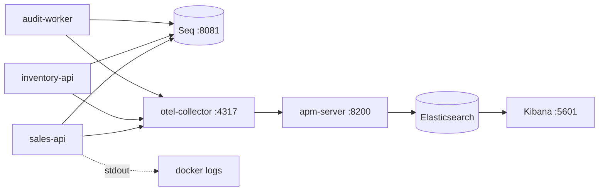

# 13. Observability

## Mục đích

Giải thích cách trả lời câu hỏi "chuyện gì đã xảy ra với đơn hàng X?" bằng log, trace và metric được thiết kế để tương quan với nhau chứ không phải chỉ để thu thập.

## Pipeline



Hai đích đến với hai mục đích khác nhau: **Seq** để phân loại nhanh bằng văn bản trong lúc phát triển, **Kibana/APM** cho trace và metric xuyên các service. Log đi tới cả hai, nên một dòng log tìm được trong Seq có thể được chuyển tiếp sang trace của nó trong Kibana.

## Một chính sách, ba service

```csharp
public static LoggerConfiguration ConfigureSharedSinks(this LoggerConfiguration config,
    IConfiguration configuration, string defaultServiceName) =>
    config.ReadFrom.Configuration(configuration)
        .Enrich.FromLogContext()
        .Enrich.WithProperty("Service", serviceName)
        .Enrich.WithProperty("Environment", environment)
        .WriteTo.Console()
        .WriteTo.Seq(configuration["Seq:Url"] ?? "http://seq:5341")
        .WriteTo.OpenTelemetry(...);
```

Mỗi host gọi một lần `builder.AddBuildingBlocksLogging("sales-api")`. Không service nào tự cấu hình sink riêng — đó là cách để cả ba service vẫn truy vấn được bằng một saved search duy nhất.

## Hai id, hai mục đích

Đây là phân biệt quan trọng nhất trong chương này.

| | `TraceId` | `CorrelationId` |
|---|---|---|
| Là gì | định danh trace theo chuẩn W3C | định danh luồng nghiệp vụ |
| Phạm vi | một thao tác kỹ thuật | toàn bộ luồng mà người dùng thấy |
| Nguồn | `Activity.Current.TraceId` | header `X-Correlation-Id`, nếu không có thì lấy trace id |
| Thay đổi | mỗi chặng một lần | không bao giờ |
| Đi theo | header `traceparent` | nằm trong `EventEnvelope` |

Cả hai được định nghĩa đúng một lần, trong `ApiModelExtensions`:

```csharp
public static string GetTraceId(this HttpContext context) =>
    Activity.Current?.TraceId.ToHexString() ?? context.TraceIdentifier;

public static string GetCorrelationId(this HttpContext context) =>
    context.Request.Headers.TryGetValue("X-Correlation-Id", out var v) && !string.IsNullOrWhiteSpace(v)
        ? v.ToString() : context.GetTraceId();
```

Giá trị trả về trong response lỗi, giá trị được push vào log scope, và giá trị đóng dấu lên bản tổng kết request là *cùng một chuỗi*. Người dùng dán trace id từ thông báo lỗi vào là tìm ra request của mình. `TraceCorrelationContractTests` chốt điều này lại.

## Log request

`RequestObservabilityMiddleware` làm phần việc này:

- push `RequestId` và `CorrelationId` vào `LogContext` của Serilog, nên mọi log lồng bên trong — kể cả các lượt publish Kafka do request kích hoạt — đều kế thừa;
- sau khi request xong, set `RequestId`, `CorrelationId`, `TraceId`, `UserId`, `ClientIp`, `Url`, `Route`, `UserAgent` lên `IDiagnosticContext`, đây là dữ liệu mà event tổng kết duy nhất của `UseSerilogRequestLogging` đọc.

Hai cơ chế vì chúng phục vụ hai việc khác nhau: `LogContext` cho các log lồng bên trong, `IDiagnosticContext` cho event tổng kết duy nhất được ghi sau khi pipeline unwind.

Body chỉ được ghi lại ở mức `Debug`, giới hạn 8 KB, với các header `Authorization`/`Cookie` và các trường JSON đã cấu hình bị che thành `***`. `RequestLoggingDefaults` hạ `/health` và `/hangfire` xuống `Debug` — poll kiểm tra uptime không phải là sự cố.

## Một lỗi, một dòng log

Đọc comment của `LoggingBehavior`; nó gói cả thiết kế trong một đoạn:

> Chỗ này cố ý không log lỗi ở mức Warning hay Error. Mọi đường thực thi có dispatch MediatR đều đã log lỗi của mình đúng một lần, tại boundary của nó và với ngữ cảnh mà chỉ boundary đó có […] Log lại cùng exception ở đây sẽ nhân đôi mọi lỗi trong Seq và làm hỏng việc đếm tỉ lệ lỗi.

| Đường xử lý | Nơi log | Ngữ cảnh riêng có |
|---|---|---|
| HTTP | `ApiExceptionHandler` | mã lỗi, status, path |
| Kafka | `IntegrationEventHandler` | topic, partition, offset |
| Outbox / inbox | các service chạy chu kỳ | số lần thử, trạng thái dead-letter |
| Job | chính class job | số lượng trong batch |

Nếu bạn bắt một exception, log nó, rồi ném lại, bạn đã khiến mọi lỗi xuất hiện hai lần.

## Tracing xuyên Kafka

Phần khó của distributed tracing ở đây là request kết thúc trước khi công việc kết thúc. Lúc publish:

```csharp
using var activity = activitySource.StartActivity($"kafka.publish {message.Topic}", ActivityKind.Producer);
var traceParent = activity?.Id ?? Activity.Current?.Id;
if (traceParent is not null) headers.SetString(ContractHeaders.TraceParent, traceParent);
```

Lúc consume:

```csharp
var parentContext = TraceContextParser.Parse(
    context.Headers.GetString(ContractHeaders.TraceParent),
    context.Headers.GetString(ContractHeaders.TraceState));
var activity = source.StartActivity($"kafka.consume {topic}", ActivityKind.Consumer, parentContext);
```

Span consume trở thành con của span publish, nên một trace duy nhất trong Kibana trải dài **Sales HTTP → Kafka → Inventory → Kafka → Sales → Mongo**, xuyên ba tiến trình.

`IMessageLogContext.Push(EventEnvelopeLogContext.From(envelope, activity))` thêm `EventId`, `EventType`, `CorrelationId`, `TraceId` vào mọi log được ghi trong lúc message đó được xử lý.

## Instrumentation

| Host | ActivitySource | Meter | Auto-instrumentation |
|---|---|---|---|
| sales-api | `Sales.Infrastructure.Kafka` | `Sales.Infrastructure` | ASP.NET Core, HttpClient, EF Core, runtime |
| inventory-api | `Inventory.Infrastructure.Kafka` | `Inventory.Infrastructure` | như trên |
| audit-worker | `AuditLog.Infrastructure.Kafka` | — | runtime |

Tên service lấy từ `OTEL_SERVICE_NAME` cho cả OpenTelemetry lẫn Serilog, nên hai bên khớp nhau.

## Những metric quan trọng

| Metric | Cần để ý |
|---|---|
| `<svc>.outbox.backlog` | phải có xu hướng về 0; tăng liên tục nghĩa là publisher bị kẹt |
| `<svc>.outbox.deadletters` | bất kỳ giá trị khác 0 nào cũng cần người vận hành xử lý |
| `<svc>.inbox.duplicate` | bình thường và lành mạnh — at-least-once delivery đang hoạt động |
| `<svc>.inbox.dead_lettered` | có message độc |
| `inventory.reservation.rejected` | tăng = thiếu hàng, không nhất thiết là bug |
| `sales.orders.expiration.cancelled` | giỏ hàng bị bỏ dở |
| `sales.orders.expiration.failed` | job đang gặp lỗi |

Số liệu backlog và dead-letter là **observable gauge** được làm mới mỗi chu kỳ publish, nên chúng là sự thật tại thời điểm đó chứ không phải suy ra từ counter.

## Debug một câu hỏi thực tế

*"Đơn 7f3a… bị kẹt ở PendingInventory."*

1. **Seq**: `OrderId = '7f3a…'` → tìm request confirm, ghi lại `CorrelationId` của nó.
2. **Seq**: `CorrelationId = '…'` → toàn bộ luồng. Có dòng `Published sales.order-confirmation-requested.v1` không? Nếu không, outbox bị kẹt — kiểm tra `sales.outbox.backlog` và `LastError` trên dòng đó.
3. Nếu đã publish, tìm `Consumed` trong log của Inventory. Không có gì? Kiểm tra consumer group còn sống không và `AutoOffsetReset` có phải `Earliest` không.
4. Đã consume với `Result=Rejected`? Vậy phản hồi có tồn tại — kiểm tra xem Sales đã consume `inventory.stock-rejected.v1` chưa.
5. Thấy `Consume failed`? Xem `Attempts` và `DeadLettered` trong cùng event đó; dòng inbox giữ `LastError`.
6. **Kibana**: tìm theo trace id để xem thác nước end-to-end và độ trễ của từng chặng.

## Lỗi thường gặp

| Sai lầm | Hậu quả |
|---|---|
| Log rồi ném lại | mọi lỗi xuất hiện hai lần |
| Nội suy chuỗi trong thông điệp log | không có structured property; không truy vấn được |
| Đặt tên khác cho `OrderId` | log của bạn không nối được với các log khác |
| Log body ở mức `Information` | dữ liệu cá nhân lọt vào log production |
| Thêm sink riêng cho một service | log của service đó không còn khớp với các service khác |
| Đánh dấu span 4xx là `Error` | dashboard tỉ lệ lỗi trở nên vô nghĩa |
| Không truyền tiếp `traceparent` | trace dừng lại ở ranh giới tiến trình |

## Liên quan

- [Seqlog-usage-guide.md](Seqlog-usage-guide.md), [open-telemetry-usage-guide.md](open-telemetry-usage-guide.md), [Elastic-usage-guide.md](Elastic-usage-guide.md) — deep dive (tiếng Việt)
- [../tech/logging-and-observability-strategy.md](../tech/logging-and-observability-strategy.md)
- [../tech/monitoring-demo.md](../tech/monitoring-demo.md)
