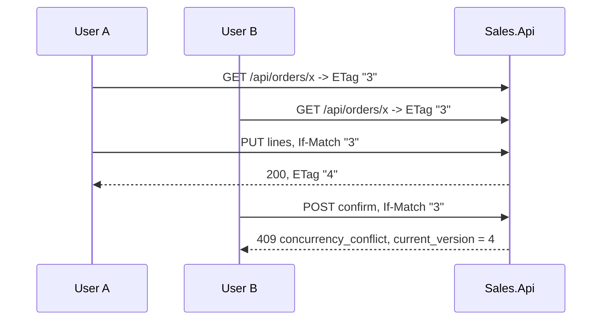

# 15. Concurrency & Idempotency

## Mục đích

Có bốn bài toán nhất quán khác nhau xuất hiện trong hệ thống này, và mỗi bài toán có một lời giải riêng. Nhầm lẫn giữa chúng là cách nhanh nhất để tạo ra một bug tinh vi.

| Bài toán | Cơ chế |
|---|---|
| Hai người dùng cùng sửa một đơn | optimistic concurrency (`Version` / ETag) |
| Hai reservation tranh cùng một lượng hàng | transaction serializable |
| Một event được giao hai lần | khử trùng lặp bằng inbox |
| Hai event đến sai thứ tự | chốt chặn theo version của aggregate |

## 1. Optimistic concurrency



`AggregateRoot.Version` bắt đầu từ 1 và tăng lên trong `Touch()` ở mỗi lần thay đổi:

```csharp
protected void Touch()
{
    Version++;
    UpdatedAt = DateTimeOffset.UtcNow;
}
```

API phơi nó ra dưới dạng `ETag`, yêu cầu nhận lại qua `If-Match`, và `LoadAndCheck` so sánh:

```csharp
var order = await orderRepository.GetWithLinesAsync(orderId, ct) ?? throw new NotFoundException(nameof(Order), orderId);
if (order.Version != expectedVersion) throw new ConflictException(order.Version);
```

Lỗi 409 mang theo version hiện tại để client có thể lấy lại dữ liệu và thử lại.

Còn có tuyến phòng thủ thứ hai. `Version` đồng thời là concurrency token của EF, nên ngay cả một request bỏ qua bước kiểm tra cũng sẽ gặp `DbUpdateConcurrencyException` nếu một transaction khác đã đổi dòng đó trước. Thắt lưng ở tầng API, dây đeo quần ở tầng database.

Thiếu `If-Match` hoặc `If-Match` không phải số sẽ cho `428 Precondition Required` — nghĩa là "bạn phải nói cho tôi biết bạn đã thấy version nào", chứ không phải "version của bạn sai".

> Hiện chỉ áp dụng trên bốn endpoint thay đổi **đơn hàng**. Các thao tác ghi product, customer và category vẫn nhận DTO có mang ETag nhưng không bắt buộc `If-Match`; chỉ có token của EF bảo vệ chúng. Xem [../tech/discrepancies.md](../tech/discrepancies.md).

## 2. Transaction serializable

Optimistic concurrency phát hiện xung đột trên *một dòng bạn đã đọc*. Giữ hàng thì khác: bạn đọc nhiều mặt hàng, quyết định dựa trên tất cả, rồi mới ghi. Một transaction khác có thể đổi một trong số đó giữa lúc bạn đọc và lúc bạn ghi.

Vì vậy mọi command của Inventory chạy ở `IsolationLevel.Serializable`:

```csharp
await using var transaction = await transactions.BeginSerializableTransactionAsync(cancellationToken);
try
{
    var response = await next(cancellationToken);
    await unitOfWork.SaveChangesAsync(cancellationToken);
    await transaction.CommitAsync(cancellationToken);
    return response;
}
catch { await transaction.RollbackAsync(cancellationToken); throw; }
```

Postgres phát hiện xung đột và hủy bên thua với một serialization failure, được phân loại thành `409 concurrency_conflict` với `retryable=True` — chính request đó phát lại sẽ thấy trạng thái đã commit và có thể thành công. Cờ đó là lý do việc phân loại phân biệt xung đột retry được và không retry được.

Chú ý những gì behavior này sở hữu: transaction, lệnh insert vào inbox, `SaveChangesAsync`, và lệnh commit. Handler không làm cái nào cả. Đó là một ràng buộc thật sự, và là lý do `ValidationBehavior` dùng chung phải được đăng ký *trước* nó.

## 3. Khử trùng lặp bằng inbox

At-least-once delivery nghĩa là trùng lặp là bình thường. Giữ hàng hai lần thì không.

Khóa chính của `inbox_messages` **chính là** cơ chế: một lần insert trùng sẽ gây unique violation.

```csharp
catch (DbUpdateException ex) when (PostgresExceptions.IsUniqueViolation(ex))
{
    SalesMetrics.InboxDuplicate.Add(1);
    await transaction.RollbackAsync();
    return "Duplicate";
}
```

Thuộc tính then chốt là lệnh insert vào inbox và thay đổi nghiệp vụ nằm trong **cùng một transaction**. Nếu không:

- insert trước, crash trước khi đổi dữ liệu nghiệp vụ → event bị đánh dấu đã xử lý mà chẳng có gì xảy ra;
- đổi dữ liệu trước, crash trước khi insert → lần giao lại sẽ áp dụng nó hai lần.

Inventory thêm một bước kiểm tra sơ bộ rẻ tiền trước khi mở transaction, và comment nói rõ rằng đó không phải rào chắn:

> Cái này chủ yếu hữu ích khi Kafka retry/giao lại nhiều. Nó có thể bị race với một bên ghi đồng thời, nên lệnh insert `TryRecordAsync` trong transaction bên dưới vẫn là rào chắn có thẩm quyền.

Việc ghi audit dùng cơ chế idempotency hoàn toàn khác — một lệnh upsert của MongoDB khóa theo `AuditId` duy nhất.

## 4. Event đến sai thứ tự

Kafka đảm bảo thứ tự *trong phạm vi một partition*. Confirm và undo đi trên **hai topic khác nhau**, nên lệnh giải phóng có thể vượt mặt lệnh giữ hàng.

Chốt chặn là so sánh version — không bao giờ là timestamp:

```csharp
public bool IsStale(long orderVersion) => orderVersion <= LastOrderVersion;
```

`LastOrderVersion` giữ version *đơn hàng phía Sales* cao nhất đã được áp lên reservation này. Mọi bước chuyển có mang version đều tham chiếu nó, và bên gọi cũng tham chiếu đúng method đó trước khi thay đổi inventory item, nên hai bên không bao giờ bất đồng.

### Trường hợp khó: giải phóng đến trước khi giữ hàng

Một lệnh undo đến cho một đơn chưa có reservation. Nếu không làm gì, một lệnh giữ hàng đến muộn sau đó sẽ giữ tồn kho cho một đơn đã hủy. Vì vậy một tombstone được ghi:

```csharp
reservationRepository.Add(Reservation.CreateReleasedTombstone(request.OrderId, request.OrderVersion));
return "ReleasedBeforeReserve";
```

Một reservation `Released` không có dòng nào, mang theo version của lệnh giải phóng. Giờ thì:

- lệnh giữ hàng *cũ hơn* đến muộn là lỗi thời → bị bỏ qua, không giữ hàng nào;
- một lệnh confirm thực sự *mới hơn* thì không lỗi thời → `Reactivate` hoạt động.

Không có hàng nào bị giữ khi tombstone tồn tại, vì tombstone không có dòng nào. Điều này được kiểm chứng bởi cả một test in-memory lẫn một test độ tin cậy chạy trên Postgres thật.

## Phối hợp phân tán

| Nhu cầu | Cơ chế | Vẫn an toàn nếu khóa hỏng? |
|---|---|---|
| Một publisher cho mỗi dòng outbox | `LockId` + `LockedUntil` (30 s) | có — publish trùng được inbox khử |
| Một lần chạy dọn dẹp Sales | Redis `SET NX PX` + Lua để nhả | có — xóa theo điều kiện |
| Một lần chạy dọn dẹp Inventory | `pg_try_advisory_xact_lock` | có — như trên |
| Mã nghiệp vụ duy nhất | `nextval` của Postgres | cái này *chính là* sự đảm bảo |

Quy tắc: distributed lock là một tối ưu. Thao tác nằm dưới nó phải idempotent, vì lease hết hạn giữa chừng.

## Correlation và causation

| Id | Trả lời |
|---|---|
| `TraceId` | thao tác kỹ thuật nào? |
| `CorrelationId` | luồng nghiệp vụ nào? |
| `CausationId` | event nào đã gây ra event này? |
| `EventId` | đây là message nào? |

Các phản hồi của Inventory đặt `CausationId = request.EventId`, nên bạn có thể lần theo chuỗi nhân quả: HTTP request → `CorrelationId` → event confirm → event phản hồi có `CausationId` bằng `EventId` của event confirm.

## Realtime không phải là tính nhất quán

Thông báo SignalR chỉ là best-effort và luôn được gửi **sau** khi commit:

```csharp
await db.SaveChangesAsync();
await transaction.CommitAsync();
await NotifyOrderStatusChangedAfterCommit(order, previousStatus, currentStatus);
```

Bộ phát thông báo tự bắt exception của mình và ghi warning. Một thông báo thất bại không bao giờ được làm hỏng một thao tác nghiệp vụ đã commit. Client coi thông báo là gợi ý để đọc lại, không bao giờ coi nó là dữ liệu.

## Lỗi thường gặp

| Sai lầm | Hậu quả |
|---|---|
| So sánh timestamp để xác định dữ liệu cũ | lệch đồng hồ quyết định kết quả nghiệp vụ của bạn |
| Insert vào inbox ngoài transaction nghiệp vụ | event bị mất hoặc bị áp dụng hai lần |
| Tin vào một bước kiểm tra sơ bộ không có transaction | hai consumer cùng xử lý một event |
| Tự động retry lỗi 409 với đúng ETag cũ | vòng lặp vô tận |
| Dựa vào khóa để đảm bảo tính đúng đắn | lease hết hạn giữa chừng thao tác |
| Thông báo trước khi commit | client thấy trạng thái rồi bị rollback |
| Quên `Touch()` | ETag không đổi, nên lượt ghi với dữ liệu cũ vẫn được chấp nhận |

## Liên quan

- [08-integration-events-and-inbox.md](08-integration-events-and-inbox.md)
- [../tech/concurrency-and-idempotency.md](../tech/concurrency-and-idempotency.md)
- [../tech/reliability-tests.md](../tech/reliability-tests.md)
