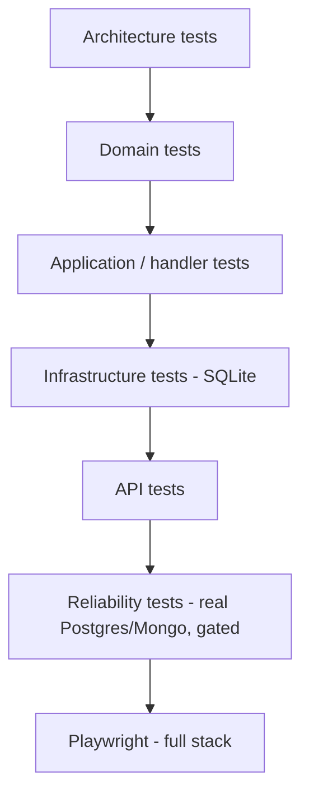

# 17. Chiến lược test

## Mục đích

Giải thích cái gì được test ở đâu, vì sao các reliability test bị chặn sau một biến môi trường, và những mẹo mà codebase này dùng để làm cho bộ máy bất đồng bộ trở nên tất định.

## Hình dạng



12 project xUnit, mỗi project production một project test, cộng thêm Jasmine cho Angular và Playwright cho các luồng xuyên service.

## Architecture test đi trước

`Sales.Architecture.Tests/DependencyRulesTests.cs` dùng NetArchTest để biến việc phân tầng thành thứ chạy được:

```csharp
var result = Types.InAssembly(typeof(Sales.Domain.Product).Assembly).ShouldNot()
    .HaveDependencyOnAny("Sales.Application", "Sales.Infrastructure", "Inventory", "AuditLog",
        "BuildingBlocks.Application", "BuildingBlocks.Infrastructure", "BuildingBlocks.Web",
        "Microsoft.EntityFrameworkCore", "KafkaFlow").GetResult();
Assert.True(result.IsSuccessful, string.Join(", ", result.FailingTypeNames ?? []));
```

Mười hai quy tắc phủ mọi ranh giới tầng — trong đó có hai khẳng định về "không gian âm" đáng lưu ý:

```csharp
[Fact] public void BuildingBlocks_contracts_do_not_contain_trace_parsing_behavior()
[Fact] public void Api_exception_handlers_do_not_depend_on_provider_specific_persistence_exceptions()
```

Chúng mã hóa *các quyết định*, không chỉ cấu trúc: contract phải thuần dữ liệu, và Npgsql chỉ được chạm tới tầng web thông qua `IPersistenceExceptionClassifier`. Một comment ghi "đừng làm X" thì sẽ bị phớt lờ; một build fail thì không.

## Domain test

Không mock, không fake, không hạ tầng — dựng một aggregate, gọi một method, khẳng định kết quả.

```csharp
[Fact]
public void UndoConfirmed_throws_when_a_line_is_sell_through_discontinued() { … }
```

`OrderTests`, `ProductVariantTests`, `CategoryTests`, `SoftDeleteTests`, `SpecificationTests`, `InventoryItemTests`. Đây là các test nhanh nhất và giá trị tín hiệu cao nhất — mỗi invariant nên có một test, bao gồm cả đường bị từ chối.

## Application test

Kiểm tra phần điều phối của handler với fake cho các port. `ConfirmOrderHandlerTests` kiểm tra rằng version được xác nhận, method domain được gọi, và unit of work được commit — không bao giờ kiểm tra chính các quy tắc, vì chúng thuộc về domain test.

Cũng ở đây: `ValidationBehaviorTests`, `BuildingBlocksApplicationBehaviorTests`, `MappingTests` (khẳng định mọi Mapster register đều compile được), và `EnumExtensionsTests`.

## Infrastructure test

`SqliteSalesFixture` dựng schema từ chính model EF thật trên SQLite in-memory. Nhanh, không cần Docker, và bắt được các bug mapping thật sự — thiếu một `Ignore`, một converter hỏng, một navigation chưa cấu hình truy cập theo field.

Đây là lý do `SalesDbContext.OnModelCreating` rào chắn các sequence của nó:

```csharp
if (Database.IsNpgsql())
    foreach (var codeSequence in EntityCodeSequence.All)
        builder.HasSequence<long>(codeSequence.SequenceName)…
```

Không có rào chắn đó, SQLite hoàn toàn không dựng nổi schema.

Cũng được phủ ở đây: `CachedProductReadServiceTests` (hành vi cache-aside), `SalesInventoryEventProcessorTests` (inbox và các bước chuyển trạng thái), `EfInboxFailureRecorderTests`, `SalesRecurringJobsTests`.

## API test

`ApiExceptionHandlerTests` (mỗi exception → status, mã, log level), `CategoriesControllerAuthorizationTests` (các attribute role), `HealthControllerTests`, `SalesSwaggerDocumentsFactoryTests`, `OrderRealtimeNotifierTests`.

Test phân quyền quan trọng hơn vẻ ngoài của chúng — thiếu một `[Authorize(Roles = …)]` là điều vô hình khi review và thảm họa khi lên production.

## Reliability test

Một số hành vi chỉ xuất hiện khi chạy với database thật: xung đột serializable, phân loại unique violation, `nextval` dưới điều kiện đồng thời, filtered unique index. Các test đó được đánh dấu và chặn lại:

```csharp
[Trait("Category", "Reliability")]
```

```bash
RUN_RELIABILITY_TESTS=true dotnet test Sales.sln
```

Khi biến chưa được đặt, chúng skip gọn gàng. CI chạy `--filter "Category!=Reliability"` ở mỗi lần push và chỉ chạy bộ reliability trên `main` hoặc khi có yêu cầu, với service container Postgres và Mongo thật.

Đánh đổi được nói rõ: phản hồi hằng ngày vẫn nhanh, còn các test chậm vẫn chạy trước khi có gì đó vào được `main`.

## Làm cho bộ máy bất đồng bộ trở nên tất định

Hai kỹ thuật đáng học theo.

**Phơi ra một chu kỳ đơn lẻ.** Vòng lặp nền không test được, nên mỗi cái phơi ra một method `internal` chạy một lần:

```csharp
/// Runs exactly one claim-and-publish cycle […] Exposed to reliability tests so the retry and
/// dead-letter state machine can be exercised deterministically against a real database without
/// starting the background loop.
internal Task RunPublishCycleAsync(TDbContext db, CancellationToken ct = default) => PublishReadyMessages(db, ct);
```

`InternalsVisibleTo("Sales.Infrastructure.Tests")` đã được cấu hình sẵn. Test điều khiển máy trạng thái từng bước thay vì ngủ rồi cầu may.

**Inject thời gian.** Các service nhận `Func<DateTimeOffset> utcNow` hoặc `IClock`, không bao giờ dùng thẳng `DateTimeOffset.UtcNow`. Một test cho "dead-letter sau 5 lần thử với backoff lũy thừa" sẽ đẩy đồng hồ tới thay vì chờ tám phút.

## Chuỗi log là một hợp đồng

```csharp
/// Member names are already the outcome text reported to consume logs […] Renaming a member
/// therefore changes that log value; SalesInventoryEventProcessorTests asserts the exact strings
/// and fails if one is renamed.
private enum OrderTransition { Ignored, Reserved, Rejected, Released }
```

Các chuỗi kết quả xuất hiện trong truy vấn Seq và trên dashboard. Coi chúng là hợp đồng, với một test bắt buộc điều đó, sẽ ngăn một lần đổi tên âm thầm làm hỏng observability.

## Test frontend

Jasmine + Karma, spec nằm cạnh source. Giá trị cao nhất là ở phần logic thuần: `cart-line.model.spec.ts`, `category-tree.mapper.spec.ts`, `dashboard.mapper.spec.ts`, `display-formatters.spec.ts`, và trên hết là `api-client-result.spec.ts`, phủ mọi nhánh status-code của bộ đọc envelope.

`app-routes-smoke.spec.ts` khẳng định mọi lazy route đều phân giải được — một đường dẫn `loadChildren` hỏng vẫn compile bình thường và chỉ fail lúc chạy.

## Playwright

Các luồng full-stack chạy trên compose stack đang bật, nằm ở `tests/Playwright/specs`: `sales-api.spec.ts`, `kafka-flow.spec.ts`, `reconfirm-flow.spec.ts`, `over-available-after-undo.spec.ts`, `audit-update.spec.ts`. Đây là những test duy nhất chứng minh Sales → Kafka → Inventory → Kafka → Sales → Mongo chạy thông từ đầu tới cuối. `AuditProbe` là một app console nhỏ để truy vấn kho audit trong các lần chạy đó.

## Cần viết gì cho một feature mới

1. domain test cho mỗi invariant, bao gồm cả đường bị từ chối
2. handler test cho đường thành công và cho mỗi exception được ném ra
3. validator test cho mỗi thông báo khác nhau
4. mapping test nếu bạn thêm một `IRegister`
5. architecture test nếu bạn thêm một quy tắc phân tầng
6. authorization test nếu bạn thêm một chốt chặn role
7. reliability test nếu bạn chạm vào outbox, inbox, retry hoặc concurrency

## Câu lệnh

```bash
dotnet test Sales.sln                                  # everything except gated reliability tests
dotnet test Sales.sln --filter "Category!=Reliability"  # what CI runs on every push
RUN_RELIABILITY_TESTS=true dotnet test Sales.sln        # + real Postgres/Mongo
cd src/Web/Sales.Web && npm test
cd tests/Playwright && npx playwright test
```

## Lỗi thường gặp

| Sai lầm | Hậu quả |
|---|---|
| Test một quy tắc thông qua API | chậm, và fail vì mười lý do chẳng liên quan |
| Mock `DbContext` | bạn test cái mock, không phải phần mapping |
| Dùng `Thread.Sleep` để chờ một background service | flaky, và chậm ngay cả khi pass |
| Dùng hạ tầng thật trong unit test | CI fail trên một máy chẳng liên quan |
| Không chặn một infrastructure test | người đóng góp không có Docker sẽ không chạy được bộ test |
| Đổi tên một chuỗi kết quả | dashboard và saved search hỏng âm thầm |

## Liên quan

- [../tech/reliability-tests.md](../tech/reliability-tests.md)
- [../project/backend/testing-rule.md](../project/backend/testing-rule.md)
- [kafka-playwright-debug-guide.md](kafka-playwright-debug-guide.md)
