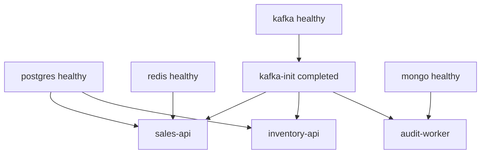

# 18. Chạy & triển khai

## Mục đích

Cách dựng toàn bộ hệ thống, compose stack thực sự làm gì, và những gì cần thay đổi trước khi chạy ở một môi trường thật.

## Toàn bộ stack

```bash
sudo docker compose -f docker/docker-compose.yml up -d --build
sudo docker compose -f docker/docker-compose.yml ps
```

Khởi động lại riêng nửa observability (đây là phần ngốn bộ nhớ):

```bash
sudo docker compose -f docker/docker-compose.yml stop kibana apm-server elasticsearch otel-collector
sudo docker compose -f docker/docker-compose.yml up kibana apm-server elasticsearch otel-collector -d --build
```

Mười bốn service. Nhóm theo vai trò:

| Nhóm | Service |
|---|---|
| Dữ liệu | `postgres`, `redis`, `mongo` |
| Messaging | `kafka`, `kafka-init` |
| Ứng dụng | `sales-api`, `inventory-api`, `audit-worker` |
| Logging | `seq` |
| Telemetry | `otel-collector`, `apm-server`, `elasticsearch`, `kibana`, `kibana-init` |

Mọi service đều có `mem_limit`, vì riêng stack observability nếu không sẽ ngốn vài gigabyte.

## Thứ tự khởi động



Hai điều kiện `depends_on` khác nhau được dùng có chủ đích:

- `service_healthy` — phụ thuộc phải đang *phản hồi*, được xác nhận bằng healthcheck của chính nó;
- `service_completed_successfully` — một job chạy một lần phải đã *kết thúc*.

`kafka-init` thuộc loại thứ hai. Các ứng dụng chờ cho topic tồn tại rồi mới khởi động, vì tính năng tự tạo topic đã bị tắt.

## Topic Kafka lấy thẳng từ source

```yaml
kafka-init:
  volumes:
    - ../src/Shared/BuildingBlocks.Contracts/Messaging/KafkaTopics.cs:/opt/kafka-init/KafkaTopics.cs:ro
```

```bash
topics="$(sed -n 's/.*const string [A-Za-z0-9_]* = "\([^"]*\)".*/\1/p' "${TOPICS_SOURCE}" | sort -u)"
```

Script init mount file hằng số C# rồi grep tên topic ra khỏi đó, sau đó tạo mỗi topic với 3 partition và replication factor 1. Thêm một hằng số vào `KafkaTopics` rồi restart là đủ — danh sách không thể lệch với code vì không tồn tại danh sách thứ hai.

Tự tạo topic bị tắt, có chủ đích:

> Topic được cấp phát tường minh bởi kafka-init với số partition đã biết; đừng để một consumer/producer tự tạo topic với cách phân partition sai và phá vỡ thứ tự theo aggregate.

Một topic tự tạo với một partition duy nhất trông như vẫn chạy được và sẽ âm thầm phá hủy thứ tự theo từng aggregate mà outbox phụ thuộc vào.

## Dockerfile

Nhiều tầng, với thứ tự layer có chủ đích:

```dockerfile
COPY src/Shared/BuildingBlocks.Contracts/BuildingBlocks.Contracts.csproj src/Shared/BuildingBlocks.Contracts/
… every csproj …
RUN --mount=type=cache,id=sales-api-nuget,target=/root/.nuget/packages,sharing=locked \
    dotnet restore src/Services/Sales/Sales.Api/Sales.Api.csproj
COPY . .
RUN … dotnet publish … --no-restore
```

Copy mọi file `.csproj` trước `COPY . .` nghĩa là một thay đổi chỉ ở source sẽ tái sử dụng layer restore đã cache. Cache mount của BuildKit được chia sẻ giữa các lần build; `sharing=locked` ngăn ba image tranh nhau cùng một NuGet cache. Hãy giữ nguyên hình dạng này khi thêm project mới — nó là khác biệt giữa build lại trong 20 giây và trong 4 phút.

Image runtime: `aspnet:10.0` cho các API (kèm `curl` cho healthcheck), `runtime:10.0` cho worker.

## Công việc khởi động của từng service

| Service | Khi khởi động |
|---|---|
| sales-api | khởi động Kafka bus → áp migration + seed role và `admin` → đăng ký recurring job |
| inventory-api | áp migration → khởi động Kafka bus |
| audit-worker | ping Mongo (20 lần × 2 s) + tạo index → khởi động Kafka bus |

Các database được tạo bởi `docker/seed/postgres-init.sql` (`sales`, `inventory`, `hangfire`) trong lần chạy đầu tiên của container Postgres.

Áp migration lúc khởi động là ổn với dự án này và **không** phải thứ nên mang lên production — xem bên dưới.

## Chạy không cần Docker

```bash
dotnet restore Sales.sln
dotnet build Sales.sln --no-restore
dotnet run --project src/Services/Sales/Sales.Api        # :5000
dotnet run --project src/Services/Inventory/Inventory.Api
dotnet run --project src/Services/AuditLog/AuditLog.Worker
```

Chuỗi kết nối mặc định trỏ tới các hostname của Docker (`postgres`, `redis`, `kafka`, `mongo`), nên hoặc bạn chạy các container hạ tầng sao cho các tên đó phân giải được, hoặc ghi đè:

```bash
export ConnectionStrings__Sales="Host=localhost;Database=sales;Username=postgres;Password=postgres"
export Kafka__Brokers__0="localhost:9094"
```

Chú ý cổng `9094` — đó là listener bên ngoài của Kafka; `9092` chỉ truy cập được từ bên trong mạng compose.

## Client Angular

```bash
cd src/Web/Sales.Web
npm install
npm start          # http://localhost:4200
```

`proxy.conf.json` ánh xạ `/sales-api` → `localhost:5000` (với `ws: true`, bắt buộc để SignalR nâng cấp kết nối) và `/inventory-api` → `localhost:5001`, đồng thời cắt bỏ tiền tố. Đó là lý do base URL mặc định của client là đường dẫn tương đối và không cần CORS trong môi trường development.

## CI

`.github/workflows/ci.yml`, hai job:

**`fast-checks`** chạy ở mỗi lần push và PR — restore, build Release, `dotnet test --filter "Category!=Reliability"`, và `docker compose config` để bắt một file compose hỏng trước khi nó tới tay ai đó.

**`reliability-tests`** chỉ chạy khi push vào `main` hoặc kích hoạt thủ công — dựng service container Postgres và Mongo, đặt `RUN_RELIABILITY_TESTS=true`, và chạy `--filter "Category=Reliability"`. Khi fail, nó đổ ra 300 dòng log cuối của mọi container và upload chúng dưới dạng artifact, nên một infrastructure test flaky vẫn chẩn đoán được mà không cần chạy lại.

## Kiểm chứng một thay đổi

```bash
dotnet test Sales.sln
docker compose -f docker/docker-compose.yml config
cd tests/Playwright && npm run test:audit
RUN_RELIABILITY_TESTS=true dotnet test Sales.sln
```

## Còn thiếu gì để lên production

Stack này là môi trường phát triển local. Trước khi chạy ở nơi thật:

| Thiếu sót | Vì sao quan trọng |
|---|---|
| Áp migration lúc khởi động | hai instance tranh nhau migrate; không có kế hoạch rollback. Hãy dùng job migration riêng hoặc một chốt chặn. |
| `Jwt:Key` và `admin`/`Admin123!` bị commit | ai cũng tạo được token hợp lệ |
| Replication factor 1, một broker duy nhất | mất một node là mất mọi message |
| Ứng dụng không có TLS/HSTS | TLS phải được kết thúc ở lớp biên |
| Không có rate limiting | bị lạm dụng một cách dễ dàng |
| `/health` chỉ là một chuỗi tĩnh | container báo healthy trong khi Postgres đã sập |
| `xpack.security.enabled: false` trên Elasticsearch | cụm mở toang |
| Listener Kafka dạng plaintext | không xác thực, không mã hóa |
| Không có resource request/limit ngoài `mem_limit` | scheduler không đảm bảo gì cả |

Được theo dõi trong [../tech/discrepancies.md](../tech/discrepancies.md).

## Lỗi thường gặp

| Sai lầm | Hậu quả |
|---|---|
| Thêm topic mà không restart `kafka-init` | producer fail; tự tạo topic đã bị tắt |
| Thêm project mà không thêm dòng COPY cho `.csproj` của nó | mọi lần build đều restore lại từ đầu |
| `depends_on` mà không có điều kiện | app khởi động trước khi database chấp nhận kết nối |
| Dùng `9092` từ máy host | không kết nối được — listener đó chỉ nội bộ compose |
| Chạy client Angular mà không có proxy | lỗi CORS và không có SignalR |
| Cho rằng mặc định của compose là an toàn cho production | xem bảng ở trên |

## Liên quan

- [../tech/configuration-and-environment.md](../tech/configuration-and-environment.md)
- [../tech/monitoring-demo.md](../tech/monitoring-demo.md)
- [17-testing-strategy.md](17-testing-strategy.md)
