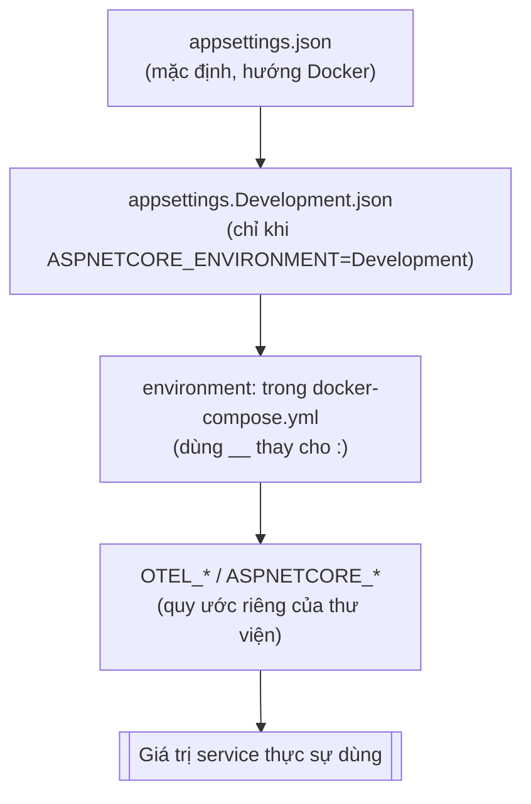
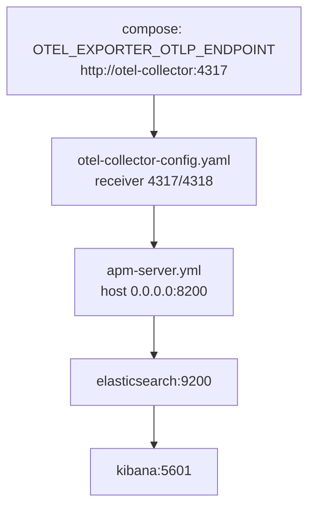

# Configuration usage guide trong Sales Management

Tài liệu này trả lời hai câu hỏi mà bình thường phải đọc code mới biết:

1. Giá trị cấu hình đang chạy được **khai báo ở đâu**, và nó có ý nghĩa gì?
2. Muốn đổi nó thì **sửa file nào**, và đổi xong ảnh hưởng tới cái gì?

Tài liệu **giải thích cơ chế**. Bảng tra cứu vét cạn từng key (giá trị mặc định của cả ba service) nằm ở [../tech/configuration-and-environment.md](../tech/configuration-and-environment.md) — khi cần biết "key X mặc định là bao nhiêu", tra ở đó; khi cần biết "vì sao giá trị tôi vừa sửa không có tác dụng", đọc ở đây.

## Tóm tắt nhanh

- Có **bốn tầng** khai báo cấu hình, tầng sau che tầng trước: `appsettings.json` → `appsettings.Development.json` → biến môi trường trong compose → biến môi trường theo quy ước riêng của thư viện (`OTEL_*`).
- Biến môi trường dùng `__` (hai gạch dưới) thay cho `:`. `Outbox__PollIntervalMilliseconds` chính là `"Outbox": { "PollIntervalMilliseconds": ... }`.
- Có **ba kiểu bind** trong code: `GetConnectionString`, `GetSection(...).Get<T>()`, và Options pattern có validate. Chỉ kiểu thứ ba bắt lỗi cấu hình lúc khởi động.
- **Không thấy key trong `appsettings.json` không có nghĩa là không cấu hình được.** Nhiều section chỉ tồn tại dưới dạng giá trị mặc định trong C# (`InboxConsumer`, `Outbox`, `SalesWeb:AllowedOrigins`).
- Khai báo hạ tầng (image, port, RAM, healthcheck) nằm ở `docker/docker-compose.yml`; khai báo cấp toàn solution (`net10.0`, nullable) nằm ở `Directory.Build.props`.

## 1. Bốn tầng khai báo

Thứ tự ưu tiên từ thấp đến cao. Tầng sau **che** tầng trước, không xóa nó.

### Tầng 1 — `appsettings.json`

Mặc định của service, commit vào repo. Giá trị ở đây hướng Docker: hostname là **tên service trong compose**, không phải `localhost`.

```json
{
  "ConnectionStrings": {
    "Sales": "Host=postgres;Database=sales;Username=postgres;Password=postgres",
    "Redis": "redis:6379"
  },
  "Kafka": { "Brokers": ["kafka:9092"] },
  "Seq": { "Url": "http://seq:5341" }
}
```

`postgres`, `redis`, `kafka`, `seq` chỉ phân giải được **bên trong mạng compose**. Đây là nguồn gốc của lỗi "chạy `dotnet run` ngoài Docker thì không kết nối được database" ở mục 8.

### Tầng 2 — `appsettings.Development.json`

Chỉ được nạp khi `ASPNETCORE_ENVIRONMENT=Development`. Dùng cho những thứ chỉ có nghĩa lúc dev.

Ví dụ thật trong `Sales.Api/appsettings.Development.json`:

```json
{
  "Swagger": { "InventoryApiUrl": "http://localhost:5001/swagger/v1/swagger.json" }
}
```

`Swagger:InventoryApiUrl` **không tồn tại** trong `appsettings.json`. Chạy ở môi trường khác Development, Swagger UI gộp sẽ không có tài liệu của Inventory — đó là chủ đích.

### Tầng 3 — biến môi trường trong compose

Thắng cả hai tầng trên. Quy ước của ASP.NET Core: **`__` thay cho `:`**.

```yaml
sales-api:
  environment:
    ASPNETCORE_URLS: http://+:8080
    ASPNETCORE_ENVIRONMENT: Development
    Outbox__PollIntervalMilliseconds: 1000
```

`Outbox__PollIntervalMilliseconds: 1000` tương đương khai báo JSON:

```json
{ "Outbox": { "PollIntervalMilliseconds": 1000 } }
```

Điểm đáng chú ý: section `Outbox` **không có trong bất kỳ file `appsettings.json` nào**. Mặc định của nó nằm trong C# (`OutboxPublisherService.cs:29`, giá trị `2000`), và compose hạ xuống `1000` để lúc dev thấy message xuất hiện nhanh hơn. Muốn đổi, sửa dòng trong compose — không cần tìm key trong appsettings vì nó không ở đó.

### Tầng 4 — biến môi trường ngoài hệ thống config của .NET

Một số thư viện đọc biến môi trường theo quy ước riêng, không đi qua `IConfiguration`:

| Biến | Ai đọc | Tác dụng |
|---|---|---|
| `OTEL_EXPORTER_OTLP_ENDPOINT` | OpenTelemetry SDK | địa chỉ collector nhận trace/metric/log |
| `OTEL_SERVICE_NAME` | OpenTelemetry SDK | tên service hiện trong Kibana APM |
| `ASPNETCORE_URLS` | ASP.NET Core host | địa chỉ lắng nghe |
| `ASPNETCORE_ENVIRONMENT` | ASP.NET Core host | quyết định tầng 2 có được nạp không |

Không tìm những key này trong `appsettings.json` — chúng không bao giờ ở đó.

### Sơ đồ



**Hệ quả quan trọng:** sửa `appsettings.json` mà thấy không có gì thay đổi thì gần như chắc chắn có một tầng cao hơn đang che nó. Kiểm tra bằng:

```bash
sudo docker compose -f docker/docker-compose.yml config | grep -A 10 "sales-api:"
```

## 2. Ba kiểu bind trong code

Biết giá trị khai báo ở đâu mới là nửa đầu. Nửa sau là nó được đọc vào code như thế nào — quyết định việc sai cấu hình sẽ nổ lúc nào.

### Kiểu 1 — `GetConnectionString`, dùng ngay tại chỗ

`src/Services/Sales/Sales.Infrastructure/DependencyInjection.cs:40`:

```csharp
.UseNpgsql(configuration.GetConnectionString("Sales"))
```

Đọc trực tiếp section `ConnectionStrings`. Sai thì nổ lúc mở kết nối đầu tiên, không phải lúc khởi động.

Một chuỗi kết nối có thể được đăng ký nhiều lần cho nhiều mục đích khác nhau. Redis là ví dụ (`DependencyInjection.cs:122-123`):

```csharp
services.AddStackExchangeRedisCache(options => options.Configuration = configuration.GetConnectionString("Redis"));
services.AddSingleton<IConnectionMultiplexer>(_ => ConnectionMultiplexer.Connect(configuration.GetConnectionString("Redis")!));
```

Cùng một `ConnectionStrings:Redis`, hai đăng ký: `IDistributedCache` cho cache-aside, `IConnectionMultiplexer` cho distributed lock. Đổi chuỗi này là đổi cả hai. Chi tiết xem [Redis-cache-usage-guide.md](Redis-cache-usage-guide.md).

### Kiểu 2 — `GetSection(...).Get<T>()` kèm giá trị fallback

`src/Services/AuditLog/AuditLog.Worker/DependencyInjection.cs:22-23`:

```csharp
var brokers = configuration.GetSection("Kafka:Brokers").Get<string[]>() ?? ["kafka:9092"];
var auditGroupId = configuration["Kafka:AuditGroupId"] ?? KafkaConsumerGroups.AuditMongoDb;
```

Đọc một lần lúc khởi động rồi dựng đối tượng. Toán tử `??` nghĩa là **thiếu key không làm service chết** — nó chạy tiếp với giá trị mặc định. Tiện, nhưng cấu hình sai chính tả sẽ im lặng bị bỏ qua.

### Kiểu 3 — Options pattern có validate

Kiểu duy nhất bắt lỗi lúc khởi động. `src/Services/Sales/Sales.Infrastructure/Hangfire/SalesRecurringJobsExtensions.cs:16-20`:

```csharp
services.AddOptions<SalesRecurringJobsOptions>()
    .Bind(configuration.GetSection(SalesRecurringJobsOptions.SectionName))
    .ValidateOnStart();
services.TryAddEnumerable(
    ServiceDescriptor.Singleton<IValidateOptions<SalesRecurringJobsOptions>, SalesRecurringJobsOptionsValidator>());
```

`ValidateOnStart()` là điểm mấu chốt. Không có nó, một cron sai cú pháp chỉ lộ ra lúc job đáng lẽ phải chạy — có thể là 0h sáng hôm sau. Có nó, service **không khởi động được**, kèm thông báo nêu đích danh job nào sai (`SalesRecurringJobsOptionsValidator.cs`).

Quy tắc validate nằm trong chính option class (`RecurringJobSettings.IsValid()`):

```csharp
return !string.IsNullOrWhiteSpace(Queue)
    && IsValidCron(Cron);
```

Và `Queue` cố ý không có giá trị mặc định — comment trong `RecurringJobSettings.cs` giải thích: một job bật mà quên khai báo queue thì phải fail lúc khởi động, chứ không được lặng lẽ chạy sang queue khác.

### Chọn kiểu nào khi thêm cấu hình mới

| Tình huống | Dùng |
|---|---|
| Chuỗi kết nối | `GetConnectionString` |
| Một giá trị đơn, có mặc định hợp lý | `GetValue`/`GetSection(...).Get<T>()` |
| Nhóm nhiều field, sai thì phải chặn khởi động | Options pattern + `ValidateOnStart()` |

### Cấu hình không nằm trong appsettings

Đây là phần dễ nhầm nhất. Ba section sau **được bind từ code nhưng không xuất hiện trong bất kỳ `appsettings.json` nào**:

| Section | Bind ở | Mặc định thật nằm ở |
|---|---|---|
| `InboxConsumer` | `BuildingBlocks.Infrastructure/DependencyInjection.cs:23` | `InboxConsumerOptions.cs` (`MaxAttempts = 5`, `RedrivePollSeconds = 15`, `RedriveBatchSize = 50`) |
| `Outbox` | `OutboxPublisherService.cs:29` | tham số thứ hai của `GetValue` (`2000`) |
| `SalesWeb:AllowedOrigins` | `RealtimeServiceCollectionExtensions.cs:38-48` | mảng fallback trong `ReadAllowedOrigins` (`http://localhost:4200`, `http://127.0.0.1:4200`) |

Chúng vẫn cấu hình được bình thường — chỉ cần thêm section vào `appsettings.json` hoặc đặt biến môi trường. Không thấy key không có nghĩa là bị hardcode.

## 3. Cấu hình theo chủ đề

Mỗi mục dưới đây theo cùng một khuôn: **khai báo ở đâu → bind vào cái gì → đổi thì ảnh hưởng gì**.

### Database

| Key | Service | Ý nghĩa |
|---|---|---|
| `ConnectionStrings:Sales` | Sales.Api | database nghiệp vụ Sales |
| `ConnectionStrings:Inventory` | Inventory.Api | database nghiệp vụ Inventory |
| `ConnectionStrings:Hangfire` | Sales.Api | storage riêng của Hangfire |
| `ConnectionStrings:Mongo` + `Mongo:Database` | AuditLog.Worker | store audit log |

Ba database Postgres nằm trên **cùng một instance**, được tạo bởi `docker/seed/postgres-init.sql`:

```sql
CREATE DATABASE sales;
CREATE DATABASE inventory;
CREATE DATABASE hangfire;
```

Script này mount vào `/docker-entrypoint-initdb.d/` và chỉ chạy khi thư mục dữ liệu **còn trống**. Thêm một dòng `CREATE DATABASE` vào đây mà stack đã chạy trước đó thì không có tác dụng gì — phải xóa volume `postgres-data` (mất toàn bộ dữ liệu) hoặc tự tạo database bằng tay.

### Kafka

`Kafka:Brokers` trỏ `kafka:9092`. Đây là listener **nội bộ compose**. Từ máy host phải dùng `localhost:9094`. Khai báo hai listener nằm ở compose:

```yaml
KAFKA_LISTENERS: CONTROLLER://:9093,PLAINTEXT://:9092,EXTERNAL://:9094
KAFKA_ADVERTISED_LISTENERS: PLAINTEXT://kafka:9092,EXTERNAL://localhost:9094
```

Một khai báo đáng chú ý, kèm sẵn lý do trong comment của compose:

```yaml
KAFKA_AUTO_CREATE_TOPICS_ENABLE: "false"
```

Topic được tạo tường minh bởi service `kafka-init` với số partition biết trước. Nếu để broker tự tạo, một producer/consumer có thể sinh ra topic sai số partition và **phá thứ tự message theo aggregate**. Đây là lý do "thêm topic mà không restart `kafka-init`" luôn dẫn tới lỗi chứ không tự khỏi.

`kafka-init` không có danh sách topic riêng — nó đọc thẳng từ source C#:

```yaml
KAFKA_TOPICS_SOURCE: /opt/kafka-init/KafkaTopics.cs
volumes:
  - ../src/Shared/BuildingBlocks.Contracts/Messaging/KafkaTopics.cs:/opt/kafka-init/KafkaTopics.cs:ro
```

Nghĩa là **`KafkaTopics.cs` là nguồn sự thật duy nhất** cho danh sách topic; không có chỗ thứ hai để đồng bộ. Chi tiết ở [kafka-usage-guide.md](kafka-usage-guide.md).

### JWT & CORS

`Jwt:Issuer`, `Jwt:Audience`, `Jwt:Key` được khai báo **giống hệt nhau** ở cả `Sales.Api` và `Inventory.Api`. Đó không phải trùng lặp thừa: Sales phát hành token, Inventory phải validate được token đó, nên ba giá trị buộc phải khớp. Đổi ở một bên mà quên bên kia thì mọi request sang Inventory trả 401.

`Jwt:Key` hiện là `local-development-key-change-before-production` — chuỗi này commit trong repo, chỉ dùng cho dev. Xem mục "Secrets" ở [../tech/configuration-and-environment.md](../tech/configuration-and-environment.md).

`SalesWeb:AllowedOrigins` điều khiển CORS cho client Angular và SignalR. Không có trong appsettings, mặc định `http://localhost:4200` và `http://127.0.0.1:4200`. Chạy client ở cổng khác thì phải khai báo thêm section này.

### Log

Có **hai** hệ thống log level cùng tồn tại, và đây là chỗ hay nhầm:

```json
"Logging": { "LogLevel": { "Default": "Information", "Microsoft.EntityFrameworkCore.Database.Command": "Warning" } },
"Serilog": { "MinimumLevel": { "Default": "Information", "Override": { "Microsoft": "Warning" } } }
```

`Serilog:MinimumLevel` mới là cái chi phối output thực tế, vì Serilog là logger provider đang chạy (`SerilogBootstrap.cs`). `Logging:LogLevel` là cấu hình của `Microsoft.Extensions.Logging`, giữ lại cho các thành phần chưa qua Serilog. Muốn bật log SQL của EF Core, hạ mức trong **cả hai** cho chắc.

`Seq:Url` được đọc ở `SerilogBootstrap.cs:31`, kèm fallback `http://seq:5341`.

`HttpLogging` điều khiển việc ghi body request/response, đọc ở `RequestObservabilityMiddleware.cs:83-84`:

```csharp
var sensitiveHeaders = configuration.GetSection("HttpLogging:SensitiveHeaders").Get<string[]>() ?? DefaultSensitiveHeaders;
var sensitiveJsonFields = configuration.GetSection("HttpLogging:SensitiveJsonFields").Get<string[]>() ?? DefaultSensitiveJsonFields;
```

Hai danh sách này là cơ chế che dữ liệu nhạy cảm. **Khai báo đè lên chúng là thay thế toàn bộ, không phải cộng thêm** — khai báo `SensitiveHeaders: ["X-Api-Key"]` sẽ làm `Authorization` không còn được che. Thêm field mới thì chép lại cả danh sách cũ.

Chi tiết ở [Seqlog-usage-guide.md](Seqlog-usage-guide.md).

### Job định kỳ

```json
"SalesRecurringJobs": {
  "MaintenanceCleanup": { "Enabled": true, "Queue": "maintenance", "Cron": "0 0 * * *" },
  "CancelExpiredPendingOrders": {
    "Schedule": { "Enabled": true, "Queue": "critical", "Cron": "*/5 * * * *" },
    "ExpirationMinutes": 30,
    "BatchSize": 100
  }
}
```

Chú ý sự bất đối xứng: `MaintenanceCleanup` chỉ có lịch, còn `CancelExpiredPendingOrders` bọc lịch vào trong `Schedule` rồi thêm tham số nghiệp vụ bên cạnh. Comment trong `SalesRecurringJobsOptions.cs` giải thích: mỗi job một property, để thêm job không làm class phình thành danh sách key phẳng.

`Enabled: false` không chỉ là bỏ qua — nó **gỡ job khỏi storage Hangfire**. Đây là thứ gần nhất với feature flag mà dự án có.

Cron chấp nhận 5 hoặc 6 trường (6 trường tính cả giây, dùng Cronos). Sai cú pháp thì service không khởi động.

Đổi `Cron` xong phải **restart service**: recurring job đăng ký một lần lúc khởi động (`RegisterSalesRecurringJobs`). Chi tiết ở [14-background-jobs.md](14-background-jobs.md).

### Observability

Chuỗi telemetry đi qua bốn khai báo ở bốn file khác nhau:



- **compose** khai báo mỗi service gửi đi đâu và tự xưng tên gì (`OTEL_SERVICE_NAME: sales-api`). Tên này là thứ bạn nhìn thấy trong Kibana APM.
- **`docker/otel-collector-config.yaml`** khai báo nhận OTLP ở 4317 (gRPC) / 4318 (HTTP), qua `memory_limiter` (giới hạn 256 MiB) và `batch`, rồi xuất sang `apm-server:8200`. Cả ba pipeline traces/metrics/logs đều dùng chung đường này.
- **`docker/apm-server.yml`** khai báo nhận ở `0.0.0.0:8200`, bật anonymous auth (chỉ hợp lệ cho dev), ghi vào `http://elasticsearch:9200`.
- **`kibana-init`** import dashboard một lần, idempotent (`overwrite=true`), tự chờ Kibana sẵn sàng.

Đứt ở đâu thì mất telemetry ở đó — đổi cổng của một mắt xích phải đổi luôn mắt xích đứng trước. Chi tiết ở [open-telemetry-usage-guide.md](open-telemetry-usage-guide.md) và [Elastic-usage-guide.md](Elastic-usage-guide.md).

## 4. Khai báo hạ tầng trong Docker Compose

Mọi service trong `docker/docker-compose.yml` dùng chung một bộ trường. Hiểu một khối là đọc được cả 14 khối.

```yaml
elasticsearch:
  mem_limit: 1g
  image: docker.elastic.co/elasticsearch/elasticsearch:9.1.0
  environment:
    discovery.type: single-node
    xpack.security.enabled: "false"
    ES_JAVA_OPTS: -Xms512m -Xmx512m
  ports: ["9200:9200"]
  volumes: ["elastic-data:/usr/share/elasticsearch/data"]
```

| Trường | Ý nghĩa | Điểm cần lưu ý |
|---|---|---|
| `image` | chốt cứng version | `elasticsearch`, `kibana`, `apm-server` phải **cùng 9.1.0**; nâng một cái là phải nâng cả ba |
| `mem_limit` | giới hạn RAM thật | vượt là container bị OOM-kill, không phải chạy chậm |
| `ES_JAVA_OPTS` | heap của JVM | 512m nằm trong `mem_limit` 1g — heap phải nhỏ hơn limit vì JVM còn dùng bộ nhớ ngoài heap |
| `ports: ["9200:9200"]` | `host:container` | **cổng bên trái** mới là cổng gõ từ máy bạn |
| `volumes` | dữ liệu sống qua restart | xóa volume là mất index |
| `xpack.security.enabled: "false"` | tắt auth | chỉ hợp lệ cho local |

Khối thứ hai đáng mổ xẻ là `kafka-init`, vì nó thuộc kiểu khác — job chạy một lần rồi thoát:

```yaml
kafka-init:
  image: apache/kafka:4.1.1
  depends_on:
    kafka: { condition: service_healthy }
  environment:
    KAFKA_BOOTSTRAP_SERVER: kafka:9092
    KAFKA_TOPIC_PARTITIONS: 3
    KAFKA_TOPIC_REPLICATION_FACTOR: 1
    KAFKA_TOPICS_SOURCE: /opt/kafka-init/KafkaTopics.cs
  entrypoint: ["/bin/bash", "/opt/kafka-init/kafka-init-topics.sh"]
```

Nó không có `ports` (không ai gọi vào), không có `restart` (chạy xong là xong), và mount file từ repo vào container để đọc.

### `depends_on`: hai điều kiện khác nhau

```yaml
sales-api:
  depends_on:
    postgres: { condition: service_healthy }
    redis: { condition: service_healthy }
    kafka-init: { condition: service_completed_successfully }
```

- `service_healthy` — chờ `healthcheck` của service kia báo khỏe. Dùng cho service chạy dài.
- `service_completed_successfully` — chờ container kia **thoát với mã 0**. Dùng cho job one-shot như `kafka-init`.

Dùng nhầm `service_healthy` cho `kafka-init` sẽ treo vĩnh viễn, vì một job đã thoát thì không bao giờ "healthy".

`depends_on` không điều kiện (dạng `depends_on: [elasticsearch]` như ở `kibana`) chỉ đảm bảo **thứ tự khởi động**, không đảm bảo service kia đã sẵn sàng.

### Bảng cổng ra host

| Cổng host | Service |
|---|---|
| 5000 | Sales API (`/swagger`, `/hangfire`, `/hubs/orders`) |
| 5001 | Inventory API |
| 5432 | PostgreSQL |
| 6379 | Redis |
| 27017 | MongoDB |
| 9094 | Kafka (listener EXTERNAL) |
| 5341 / 8081 | Seq (ingest / UI) |
| 9200 | Elasticsearch |
| 5601 | Kibana |
| 8200 | APM Server |
| 4317 / 4318 | OTel Collector (gRPC / HTTP) |

## 5. Khai báo cấp build & CI

### `Directory.Build.props`

```xml
<Project>
  <PropertyGroup>
    <TargetFramework>net10.0</TargetFramework>
    <Nullable>enable</Nullable>
    <ImplicitUsings>enable</ImplicitUsings>
    <TreatWarningsAsErrors>false</TreatWarningsAsErrors>
    <AnalysisLevel>latest</AnalysisLevel>
  </PropertyGroup>
</Project>
```

File này ở thư mục gốc nên MSBuild áp nó cho **mọi project** bên dưới — cả 16 project trong `src/` lẫn 13 project test trong `tests/` — mà không project nào phải khai báo lại. Đổi `TargetFramework` ở đây là đổi cho cả 29 project cùng lúc. Ngược lại, muốn một project lệch chuẩn thì phải khai báo đè trong chính `.csproj` của nó.

### Dockerfile

Mỗi service có Dockerfile riêng, đường dẫn khai báo ở compose:

```yaml
build:
  context: ..
  dockerfile: src/Services/Sales/Sales.Api/Dockerfile
```

`context: ..` nghĩa là build context là **thư mục gốc repo**, không phải `docker/`. Cấu trúc layer và lý do phải liệt kê từng `.csproj` xem [18-running-and-deployment.md](18-running-and-deployment.md).

### `.github/workflows/ci.yml`

Hai job, tách theo chi phí:

| Job | Chạy khi nào | Gồm gì |
|---|---|---|
| `fast-checks` | mọi push và pull request | restore, build Release, test `Category!=Reliability`, và `docker compose config` để validate cú pháp compose |
| `reliability-tests` | chỉ push vào `main` hoặc bấm tay qua Actions | dựng Postgres/Mongo thật rồi chạy `Category=Reliability`, thu log container khi hỏng |

Bước `docker compose config` đáng chú ý: nó bắt lỗi cú pháp compose ngay trong CI, nên một khai báo sai YAML không lọt được vào `main`.

Job reliability chọn `postgres:16` và `mongo:7` — khác version với compose local (`postgres:17-alpine`, `mongo:8`). Đây là điểm cần biết khi một test chỉ hỏng trên CI.

## 6. Muốn đổi X thì sửa ở đâu

| Mục tiêu | Sửa ở | Cần gì sau đó |
|---|---|---|
| Đổi cổng Sales API ra host | `docker-compose.yml`, `ports: ["5000:8080"]` → đổi số bên trái | `up -d` lại service đó |
| Trỏ sang Postgres bên ngoài | `ConnectionStrings:*` trong appsettings, hoặc biến `ConnectionStrings__Sales` ở compose | restart service |
| Đổi nhịp poll outbox | `Outbox__PollIntervalMilliseconds` ở compose (không có trong appsettings) | restart service |
| Bật log response body | `HttpLogging:LogResponseBody: true`, và hạ Serilog xuống `Debug` | restart service |
| Tắt một recurring job | `SalesRecurringJobs:<Job>:Enabled: false` (hoặc `:Schedule:Enabled` với `CancelExpiredPendingOrders`) | restart; job bị gỡ khỏi Hangfire |
| Đổi mức log một namespace | `Serilog:MinimumLevel:Override` | restart service |
| Thêm origin cho client Angular | thêm section `SalesWeb:AllowedOrigins` (chưa có sẵn) | restart Sales.Api |
| Thêm topic Kafka | `KafkaTopics.cs` | chạy lại `kafka-init` |
| Nâng version Elasticsearch | `image:` của **cả ba** `elasticsearch`, `kibana`, `apm-server` | `up -d --build`, có thể phải xóa volume |
| Đổi target framework | `Directory.Build.props` | rebuild toàn solution |

## 7. Kiểm tra giá trị đang thực sự chạy

```bash
# Cấu hình compose sau khi merge, thấy đúng biến môi trường mỗi service nhận
sudo docker compose -f docker/docker-compose.yml config

# Biến môi trường thật bên trong container đang chạy
sudo docker compose -f docker/docker-compose.yml exec sales-api printenv | sort

# appsettings mà container thực sự dùng
sudo docker compose -f docker/docker-compose.yml exec sales-api cat /app/appsettings.json
```

Khi ba nguồn này mâu thuẫn với file trong repo, tin container — nó mới là thứ đang chạy.

## 8. Lỗi thường gặp

| Sai lầm | Hậu quả |
|---|---|
| Sửa `appsettings.json` rồi kết luận cấu hình không có tác dụng | biến môi trường ở compose đang che nó; xem mục 1 |
| Đặt biến môi trường `Outbox:PollIntervalMilliseconds` | không ăn — biến môi trường phải dùng `__`, không dùng `:` |
| Chạy `dotnet run` ngoài Docker với appsettings mặc định | không kết nối được: `Host=postgres`, `redis:6379` chỉ phân giải trong mạng compose |
| Tìm key `Outbox` / `InboxConsumer` trong appsettings không thấy nên tưởng bị hardcode | mặc định nằm trong C#; vẫn khai báo đè được |
| Đổi `Cron` mà không restart service | recurring job đăng ký lúc khởi động, lịch cũ vẫn chạy |
| Sửa `appsettings.json` trong thư mục `bin/` | đó là bản copy sinh ra lúc build; sửa ở project source |
| Khai báo `HttpLogging:SensitiveHeaders` chỉ với header mới | thay thế cả danh sách — `Authorization` thôi được che |
| Thêm `CREATE DATABASE` vào `postgres-init.sql` khi stack đã chạy | script chỉ chạy lúc volume còn trống, không có tác dụng |
| Đổi `Jwt:Key` ở Sales mà quên Inventory | mọi request sang Inventory trả 401 |
| Nâng version Elasticsearch mà quên Kibana/APM Server | stack observability không khởi động được |
| Dùng `localhost:9092` để nối Kafka từ host | sai listener; phải là `localhost:9094` |

## Liên quan

- [../tech/configuration-and-environment.md](../tech/configuration-and-environment.md) — bảng tra cứu vét cạn từng key và giá trị mặc định
- [18-running-and-deployment.md](18-running-and-deployment.md) — dựng stack, Dockerfile, thứ tự khởi động
- [13-observability.md](13-observability.md) — log, trace, metric dùng để làm gì
- [14-background-jobs.md](14-background-jobs.md) — bốn cơ chế job và khi nào dùng cơ chế nào
- [kafka-usage-guide.md](kafka-usage-guide.md), [Redis-cache-usage-guide.md](Redis-cache-usage-guide.md), [Seqlog-usage-guide.md](Seqlog-usage-guide.md), [open-telemetry-usage-guide.md](open-telemetry-usage-guide.md), [Elastic-usage-guide.md](Elastic-usage-guide.md)
