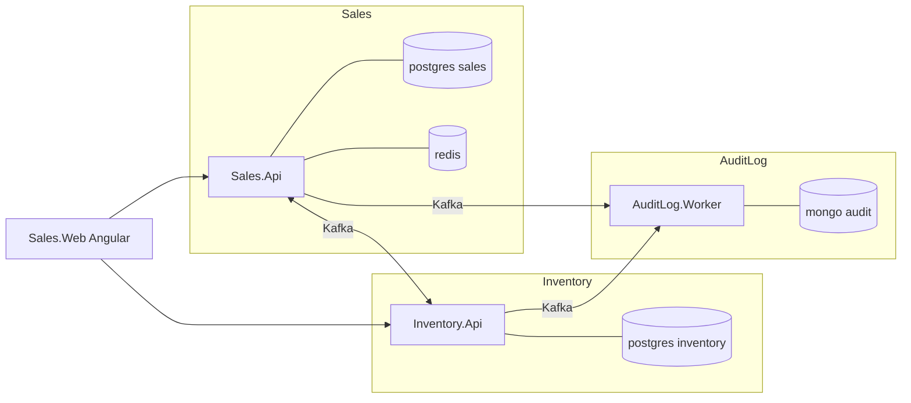

# 1. Project Overview

## Purpose

A greenfield .NET 10 sales-management system built as a DDD / Clean Architecture practice project. It is deliberately over-engineered relative to its feature set: the point is to demonstrate bounded contexts, CQRS, reliable messaging, auditing, and observability working together end to end.

Read this first, then [02-solution-structure.md](02-solution-structure.md).

## The business, in one paragraph

An operator maintains a catalog (categories → products → variants, where a variant is a colour/size combination with its own SKU and price) and a customer list. They create a draft order for a customer, add lines, then confirm it. Confirmation is not instant: Sales asks Inventory to reserve stock, and the order sits in `PendingInventory` until Inventory replies. If every line is available the order becomes `Confirmed`; if any line is short the whole request is rejected. A confirmed order can be undone, which releases the stock. Orders left idle too long are cancelled automatically. Everything that changes is audited into MongoDB.

## The three bounded contexts



| Context | Owns | Does not own |
|---|---|---|
| **Sales** | catalog, customers, orders, identity | stock levels |
| **Inventory** | stock per variant, reservations | prices, customers, order status |
| **AuditLog** | the durable audit trail | any business decision |

They share **no** database and **no** project reference. The only link is `BuildingBlocks.Contracts` — a set of records that travel over Kafka.

## Why it is built this way

| Decision | Reason |
|---|---|
| Separate contexts | stock and sales change for different reasons and at different rates; keeping them apart forces the integration to be explicit |
| Async messaging, not HTTP calls | confirming an order must not fail because Inventory is restarting |
| Transactional outbox | a Kafka publish cannot join a database transaction; writing the event to the same transaction can |
| Inbox on consumers | at-least-once delivery means duplicates are normal, not exceptional |
| Version-based staleness guard | two topics carry the confirmation and the undo, so events can arrive out of order |
| CQRS | reads want joins, projections, and paging; writes want whole aggregates and invariants |
| ETag / If-Match | two operators editing one order must not silently overwrite each other |
| Hybrid auditing | most changes are a field diff (`ChangeTracker`); a few need business meaning (enrichers) |

## Technology

| Layer | Choice |
|---|---|
| Runtime | .NET 10, C# 14 |
| API | ASP.NET Core controllers |
| Messaging | Apache Kafka 4.1 via KafkaFlow 4.2 |
| Relational store | PostgreSQL 17 + EF Core 10 (Npgsql) |
| Audit store | MongoDB 8 |
| Cache / lock | Redis 8 |
| Jobs | Hangfire 1.8 (PostgreSQL storage) |
| Mediation | MediatR 12 |
| Validation | FluentValidation 12 |
| Mapping | Mapster 7 |
| Realtime | SignalR |
| Logging | Serilog → Console + Seq + OTLP |
| Telemetry | OpenTelemetry → Collector → APM Server → Elasticsearch → Kibana |
| Client | Angular 18 + ng-zorro-antd |
| Tests | xUnit, NetArchTest, Jasmine/Karma, Playwright |

## Run it

```bash
sudo docker compose -f docker/docker-compose.yml up -d --build
sudo docker compose -f docker/docker-compose.yml ps

sudo docker compose -f docker/docker-compose.yml stop kibana apm-server elasticsearch otel-collector
sudo docker compose -f docker/docker-compose.yml up kibana apm-server elasticsearch otel-collector -d --build
```

| What | Where |
|---|---|
| Sales Swagger (aggregates Inventory) | http://localhost:5000/swagger |
| Inventory OpenAPI | http://localhost:5001/openapi/v1.json |
| Seq | http://localhost:8081 |
| Kibana | http://localhost:5601 |
| Hangfire | http://localhost:5000/hangfire (loopback) |
| Angular client | http://localhost:4200 (`npm start`) |

Log in with `admin` / `Admin123!` — development only.

## Walk one flow

1. `POST /api/auth/login` → access token.
2. `GET /api/common/colors`, `/sizes`, `GET /api/categories` → the ids you will submit.
3. `POST /api/products` with a published variant.
4. `POST /api/inventory/{variantId}/adjust` on the Inventory API to stock it.
5. `POST /api/customers`.
6. `POST /api/orders` → a `Draft` order plus an `ETag`.
7. `POST /api/orders/{id}/confirm` with `If-Match: "<etag>"`.
8. `GET /api/orders/{id}` a second later → `Confirmed`, or `InventoryRejected` with a reason.
9. Find the whole thing in Seq by `CorrelationId`, and in Kibana as one trace.

## Where to go next

| You want | Read |
|---|---|
| The project layout | [02-solution-structure.md](02-solution-structure.md) |
| What happens on one request | [03-request-lifecycle.md](03-request-lifecycle.md) |
| How writes are modelled | [05-cqrs-and-mediatr.md](05-cqrs-and-mediatr.md), [06-ddd-in-this-project.md](06-ddd-in-this-project.md) |
| How the two services talk | [07-domain-events-and-outbox.md](07-domain-events-and-outbox.md), [08-integration-events-and-inbox.md](08-integration-events-and-inbox.md) |
| Exact business rules | [../tech/business/](../tech/business/) |
| Rules for writing code here | [../project/backend/](../project/backend/) |
