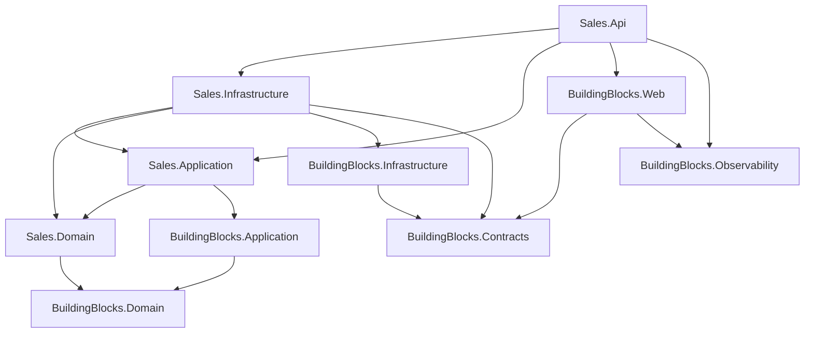

# 2. Solution Structure

## Purpose

Explain what each of the 16 projects is for, why the split exists, and how to decide where a new file goes.

## The dependency rule

```
Api / Worker  ->  Infrastructure  ->  Application  ->  Domain
```

Arrows point *inward*, toward the code with the fewest dependencies. Domain knows nothing about EF Core, Kafka, Redis, HTTP, or MediatR. Application knows about Domain and declares *ports* (interfaces) for what it needs. Infrastructure implements those ports. The API host wires everything together.

This is not a style preference — `tests/Sales.Architecture.Tests/DependencyRulesTests.cs` fails the build when it is broken.



## Why four layers per service

Each layer answers one question:

| Layer | Question | Changes when |
|---|---|---|
| Domain | *What is always true?* | the business rules change |
| Application | *What can a user do?* | a use case is added |
| Infrastructure | *How is it stored and transported?* | a technology is swapped |
| Api | *How is it exposed?* | the wire protocol changes |

The payoff is testability: `Sales.Domain.Tests` needs no database, and `Sales.Application.Tests` needs no Kafka.

## The services

### Sales — the modular monolith

| Project | Contains |
|---|---|
| `Sales.Domain` | `Order`, `Product`, `Customer`, `Category` aggregates; `OrderLine`, `ProductVariant`, `Color`, `Size` entities; `Money`, `ProductSnapshot`, `CustomerSnapshot` value objects; domain events; repository contracts; specifications; `ProductCodeRules` |
| `Sales.Application` | feature-first commands, queries, handlers, validators, DTOs, Mapster registers, ports |
| `Sales.Infrastructure` | `SalesDbContext`, EF configurations, migrations, read services, repositories, Redis cache, Kafka mapper/consumer/publisher, Hangfire jobs, audit adapters, code generators |
| `Sales.Api` | controllers, request/response models, ETag helpers, SignalR hub, Hangfire dashboard filter, composition root |

Sales owns identity: ASP.NET Core Identity tables live in `SalesDbContext`, and `AuthController` issues the JWTs both APIs accept.

### Inventory — the reservation service

| Project | Contains |
|---|---|
| `Inventory.Domain` | `Reservation` aggregate, `InventoryItem` entity, `ReservationLine`, `ReservationStatus`, repository contracts |
| `Inventory.Application` | `ReserveStockCommand`, `ReleaseStockCommand`, `AdjustInventoryCommand`, queries, `InventoryTransactionBehavior`, ports |
| `Inventory.Infrastructure` | `InventoryDbContext`, configurations, migrations, repositories, read service, inbox, event outbox, transaction manager, Kafka adapters, maintenance |
| `Inventory.Api` | one controller, health, Swagger CORS, composition root |

Notice what Inventory does **not** have: no Redis, no Hangfire, no identity, no SignalR. Each service takes only the infrastructure it needs.

### AuditLog — the trail

| Project | Contains |
|---|---|
| `AuditLog.Infrastructure` | `AuditDocument`, `MongoAuditWriter`, `AuditEventHandler`, `MongoOptions` |
| `AuditLog.Worker` | Generic Host, Kafka consumer registration, Mongo startup readiness |

There is no `AuditLog.Domain` or `AuditLog.Application` — the worker has no business rules, it transforms and stores. Inventing empty layers to be symmetric would be cargo cult.

## The shared building blocks

Six projects, split by *what may depend on them*:

| Project | Purpose | Dependency ceiling |
|---|---|---|
| `BuildingBlocks.Domain` | `AggregateRoot<TId>`, `Entity<TId>`, `IDomainEvent`, `DomainException` | BCL only |
| `BuildingBlocks.Application` | CQRS markers, MediatR behaviors, `IUnitOfWork`, `IClock`, `PagedResult<T>`, Mapster registration | no Infrastructure, no Web, no EF |
| `BuildingBlocks.Contracts` | integration events, `EventEnvelope`, `AuditLogEvent`, topics, groups, headers, error codes | nothing — not even other BuildingBlocks |
| `BuildingBlocks.Infrastructure` | outbox/inbox, `KafkaOutboxPublisher`, EF audit interceptor, `RetryBackoff`, Hangfire helpers, shared metrics | no service, no Web, no ASP.NET Core |
| `BuildingBlocks.Observability` | Serilog sink policy, base OpenTelemetry pipeline | no service names |
| `BuildingBlocks.Web` | `AddBuildingBlocksWeb`, exception handling, API models, Swagger, JWT, request middleware | no service, no Domain/Infrastructure |

The split exists so `BuildingBlocks.Contracts` can be referenced by anything without dragging in EF Core, and so `BuildingBlocks.Domain` stays testable with zero packages.

### What was deliberately *not* shared

Two near-duplicate classes were left unmerged on purpose:

- `SalesOutboxPublisher` / `InventoryOutboxPublisher` — the base class is shared, but each service keeps its own subclass. Merging the hosted services was judged too reliability-sensitive for the saving.
- The Kafka consumer *processors* — `SalesInventoryEventProcessor` and `InventoryIntegrationEventProcessor` look similar but contain genuinely different business logic.

Knowing what was left alone is as useful as knowing what was shared.

## Where does my file go?

| I am writing | Project | Folder |
|---|---|---|
| a rule that must always hold | `<Service>.Domain` | `Aggregates/` or `Entities/` |
| a new use case | `<Service>.Application` | `Features/<Aggregate>/Commands/` |
| a read for a screen | `<Service>.Application` + `.Infrastructure` | `Features/<Aggregate>/Queries/` + `Persistence/ReadServices/` |
| an EF mapping | `<Service>.Infrastructure` | `Persistence/Configurations/` |
| a Kafka contract | `BuildingBlocks.Contracts` | `IntegrationEvents/<Context>/` |
| an HTTP endpoint | `<Service>.Api` | `Controllers/` |
| something genuinely reusable and business-free | `BuildingBlocks.*` | pick by dependency ceiling |

## Solution-wide settings

`Directory.Build.props` sets `net10.0`, nullable reference types, implicit usings, and `AnalysisLevel=latest` for every project. Do not override them per project.

## Related

- [../project/backend/architecture.md](../project/backend/architecture.md) — the same content as rules
- [../project/backend/folder-structure.md](../project/backend/folder-structure.md)
- [../tech/dependency-injection-map.md](../tech/dependency-injection-map.md)
- [../tech/code-map.md](../tech/code-map.md)
