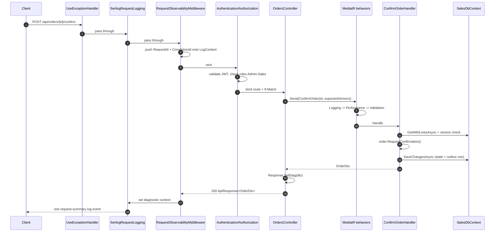

# 3. Request Lifecycle

## Purpose

Follow one HTTP request from the socket to the database and back, naming every component it passes through. Once you can trace `POST /api/orders/{id}/confirm` you can trace anything in this codebase.

## The pipeline



## Step by step

### 1. Exception handling — outermost

`app.UseExceptionHandler()` wraps everything. When anything below throws, `ApiExceptionHandler` converts it into `ApiErrorResponse`, logs it once at the level the mapping declares, and attaches it to the current trace span. Being outermost is why controllers contain no `try`/`catch`.

Note the ordering subtlety: by the time `UseExceptionHandler` invokes the handler, the exception has already unwound past the `LogContext` scope pushed in step 3. That is why `ApiExceptionHandler` reads correlation values straight off `HttpContext` rather than relying on ambient log properties.

### 2. Request logging

`UseSerilogRequestLogging` writes exactly **one** summary event per request. `RequestLoggingDefaults.Configure` drops `/health` and `/hangfire` to `Debug` and raises exceptions and 5xx to `Error`.

### 3. Observability enrichment

`RequestObservabilityMiddleware` is the interesting one. It:

- resolves `TraceId` (`Activity.Current.TraceId`) and `CorrelationId` (`X-Correlation-Id` header, else the trace id),
- pushes `RequestId` and `CorrelationId` onto Serilog's `LogContext`, so every nested log inherits them,
- after the request, sets `RequestId`, `CorrelationId`, `TraceId`, `UserId`, `ClientIp`, `Url`, `Route`, `UserAgent` on `IDiagnosticContext`, which is what the step-2 summary event reads,
- when `Debug` is enabled, captures request/response bodies with sensitive headers and JSON fields masked.

Two sinks, one definition: the `TraceId` a client sees in an error response is the same string you paste into Seq or Kibana.

### 4. CORS, authentication, authorization

Sales applies the `SalesWeb` CORS policy (explicit origins + credentials, because SignalR needs them), then validates the JWT, then evaluates `[Authorize(Roles = "Admin,Sales")]`.

### 5. Model binding and the controller

Route values bind (`{id:guid}`), the body binds to a request model or directly to a command, and `Request.RequireVersion()` parses `If-Match` — throwing `BadHttpRequestException(428)` if it is missing or non-numeric.

The controller then does the only thing controllers do: build a request object and `_sender.Send(...)`.

### 6. The MediatR pipeline

Three behaviors wrap every request, outermost first:

| Behavior | Does |
|---|---|
| `LoggingBehavior` | `Debug` breadcrumbs before and after; on failure logs the destructured request at `Debug` only |
| `PerformanceBehavior` | warns when the request took ≥ 500 ms |
| `ValidationBehavior` | runs every registered `IValidator<TRequest>` in parallel; throws `ValidationException` if any failed |

Inventory adds a fourth, `InventoryTransactionBehavior`, registered *after* the shared three so validation still runs before a transaction opens.

`LoggingBehavior` deliberately does not log failures above `Debug`. Every dispatch path already logs its own failure once, at its own boundary — re-logging here would double every error in Seq.

### 7. The handler

```csharp
var order = await orderRepository.LoadAndCheck(request.Id, request.ExpectedVersion, ct);
await productRepository.EnsureOrderLinesCanStillBeOrdered(order.Lines, ct);
order.RequestConfirmation();
await unitOfWork.SaveChangesAsync(ct);
return mapper.Map<OrderDto>(order);
```

Load → check version → re-validate live state → call domain behavior → commit → map. The handler orchestrates; it decides nothing. `RequestConfirmation()` is where the rule "only a draft order can be confirmed" lives.

### 8. Saving

`SalesDbContext.SaveChangesAsync` does three things in one transaction:

1. maps each buffered domain event through `DomainEventMapper` and adds an `OutboxMessage`,
2. calls `base.SaveChangesAsync` — which fires `AuditSaveChangesInterceptor`, adding audit outbox rows too,
3. clears the aggregates' domain events and signals the outbox publisher.

The state change, the integration event, and the audit event are now atomic. Nothing has touched Kafka yet.

### 9. Response

The controller sets the `ETag` from the new version and wraps the DTO in `ApiResponse<T>`. The middleware stack unwinds, the summary log event is written, and the client gets:

```json
{ "success": true, "message": null, "correlationId": "…",
  "data": { "id": "…", "status": "PendingInventory", "version": 4, … } }
```

with `ETag: "4"`.

### 10. Afterwards

Milliseconds later, outside the request, `SalesOutboxPublisher` wakes on the signal, claims the row, publishes to Kafka, and marks it processed. That story continues in [07-domain-events-and-outbox.md](07-domain-events-and-outbox.md).

## The failure path

`POST /confirm` on an already-confirmed order:

1. `Order.RequestConfirmation` → `EnsureDraft` → `DomainException("Only a draft order can be edited.")`
2. unwinds through the handler and the behaviors — `LoggingBehavior` logs it at `Debug`, then rethrows
3. `ApiExceptionHandler` finds the Sales-registered `DomainException` mapping → `400`, code `invalid_operation`, `LogLevel.Information`
4. logs once, attaches the exception to the span but leaves the span status OK (4xx is not a server fault)
5. writes `ApiErrorResponse` with the trace and correlation ids

## Common mistakes

| Mistake | Why it breaks |
|---|---|
| `try`/`catch` in a controller | duplicates the log and produces a non-standard error body |
| business logic in a controller | untestable without HTTP, and invisible to the domain tests |
| logging a failure in a handler *and* letting it bubble | two Error events per failure |
| forgetting `Response.SetEtag` | the client cannot make its next mutation |
| forgetting to pass `CancellationToken` | a disconnected client's work keeps running |
| calling `SaveChangesAsync` twice in one handler | two transactions, and the outbox row can commit without the state change |

## Related

- [05-cqrs-and-mediatr.md](05-cqrs-and-mediatr.md)
- [12-validation-and-error-handling.md](12-validation-and-error-handling.md)
- [13-observability.md](13-observability.md)
- [../tech/api-conventions.md](../tech/api-conventions.md)
