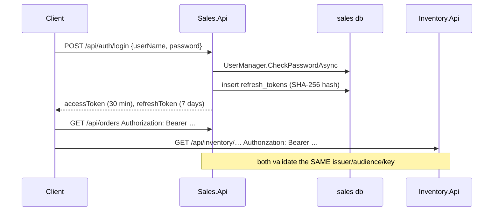

# 4. Authentication & Authorization

## Purpose

Explain how a caller proves who they are, how that identity travels between two APIs and a WebSocket, and where the role checks live.

## The shape



Sales is the only issuer. Inventory validates but never issues. That is why both `appsettings.json` files carry identical `Jwt` sections.

## Why JWT and not sessions

The two APIs are separate processes with separate databases. A shared server-side session would need a shared store and a lookup per request. A signed token carries the identity and roles inline, so Inventory can authorize without asking Sales anything.

The cost is revocation: an access token stays valid until it expires. That is why the access token is short (30 minutes) and the refresh token is the thing that can be revoked.

## Token issuance

`Sales.Api/Controllers/AuthController.cs`:

```csharp
var claims = new List<Claim>
{
    new(JwtRegisteredClaimNames.Sub, user.Id.ToString()),
    new(JwtRegisteredClaimNames.UniqueName, user.UserName!)
};
foreach (var role in await _users.GetRolesAsync(user))
    claims.Add(new Claim(ClaimTypes.Role, role));
```

Signed HMAC-SHA256 with `Jwt:Key`, valid 30 minutes.

The refresh token is 48 random bytes, base64. Only its SHA-256 hex is stored:

```csharp
_db.RefreshTokens.Add(new RefreshToken
{
    UserId = user.Id,
    TokenHash = Hash(refresh),
    ExpiresAt = now.AddDays(7)
});
```

A database leak therefore does not hand out usable refresh tokens.

## Refresh rotation

`POST /api/auth/refresh` looks up a row where the hash matches, `RevokedAt` is null, and `ExpiresAt` is in the future. It stamps `RevokedAt` on that row and issues a fresh pair. Refresh tokens are single-use: presenting the same one twice fails.

## Why `AuthController` bypasses CQRS

It uses `UserManager<ApplicationUser>` and `SalesDbContext` directly, with no command, handler, or aggregate. That is deliberate and documented in the class: authentication is not a Sales business use case, and wrapping Identity in a domain model would add ceremony without adding a rule. Do not copy the pattern for business endpoints.

## Validation

`BuildingBlocks.Web/Authentication/JwtAuthenticationExtensions.cs`, called from `AddBuildingBlocksWeb`:

```csharp
ValidateIssuer = true, ValidateAudience = true,
ValidateLifetime = true, ValidateIssuerSigningKey = true
```

Never disable one of these. Sales additionally sets `ClockSkew = 30s`; the ASP.NET Core default is five minutes, which makes expiry tests confusing.

## SignalR

A browser cannot set an `Authorization` header on a WebSocket handshake. `RealtimeServiceCollectionExtensions.ConfigureJwtBearerForSignalR` therefore reads the token from the query string:

```csharp
var accessToken = context.Request.Query["access_token"];
var path = context.HttpContext.Request.Path;
if (!string.IsNullOrEmpty(accessToken) && path.StartsWithSegments("/hubs/orders"))
    context.Token = accessToken;
```

Two guards matter: it only applies when no bearer token was already supplied, and it only applies to `/hubs/orders`. Tokens in query strings end up in access logs, so the path check must stay narrow.

## Authorization

Role-based, no policies. Roles are seeded at startup by `IdentitySeeder` along with a development `admin` user.

| Role | Intent |
|---|---|
| `Admin` | full access, including catalog and customer status changes |
| `Sales` | day-to-day order and customer work |
| `Warehouse` | stock adjustment |

Checks are attributes on the controller or the action:

```csharp
[Authorize(Roles = "Admin,Sales")]          // OrdersController, CustomersController
[Authorize(Roles = "Admin")]                 // catalog writes, customer status
[Authorize(Roles = "Admin,Warehouse")]       // POST /api/inventory/{id}/adjust
[Authorize]                                  // reads: categories, common, products, inventory
[AllowAnonymous]                             // AuthController, HealthController
```

Never re-check a role inside a handler. The attribute is the contract, and `CategoriesControllerAuthorizationTests` asserts it.

## Who did it?

Authorization decides *whether*; the audit trail records *who*. `HttpExecutionContext` reads `ClaimTypes.NameIdentifier` from the current principal:

```csharp
public string Actor => accessor.HttpContext?.User.FindFirstValue(ClaimTypes.NameIdentifier) ?? "system";
```

`SalesAuditContextAccessor` adapts that to the audit pipeline, so every audit event and every outbox envelope carries an actor. Background work has no principal and correctly reports `"system"`.

## Common mistakes

| Mistake | Consequence |
|---|---|
| Checking roles inside a handler | the rule is invisible to Swagger and to the authorization tests |
| Widening the SignalR query-string path check | tokens leak into logs for ordinary endpoints |
| Adding `AllowAnyOrigin` alongside `AllowCredentials` | the browser rejects it; SignalR stops working |
| Storing a raw refresh token | a database leak becomes an account takeover |
| Leaving `Jwt:Key` at the committed value | anyone can mint valid tokens |

## Related

- [../tech/security.md](../tech/security.md)
- [../project/backend/security-rule.md](../project/backend/security-rule.md)
- [../tech/api-endpoints.md](../tech/api-endpoints.md)
