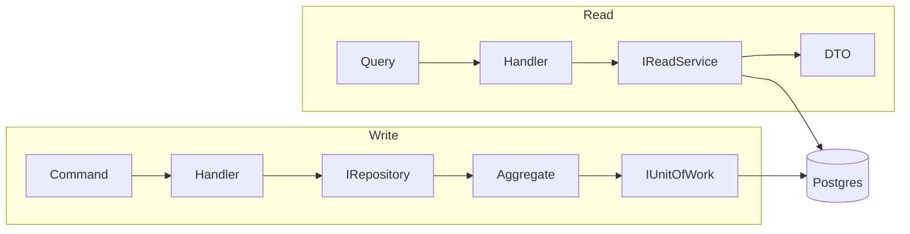
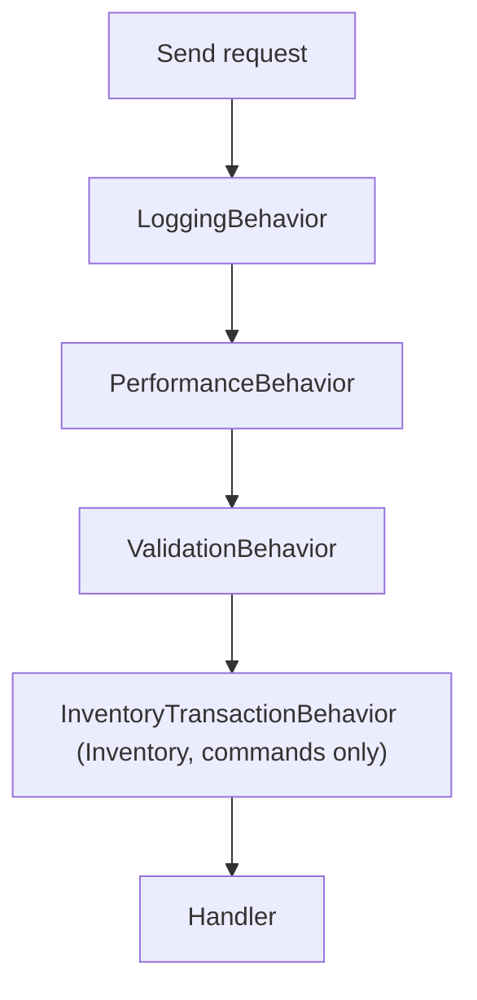

# 5. CQRS & the MediatR Pipeline

## Purpose

Explain why reads and writes are modelled differently here, and how the MediatR pipeline turns that into code.

## The problem CQRS solves

A write needs a whole aggregate: load `Order` with its lines, call a method, let it enforce its rules, save. A read needs the opposite: join products to categories to variants, project a handful of columns, page, sort, count. Forcing both through one model gives you either repositories that leak `IQueryable` or aggregates loaded just to be mapped away.

So the two sides are separated:



Same database, two paths. This is CQRS-lite: no separate read store, no eventual consistency between the sides.

## The markers

```csharp
public interface ICommand : IRequest;
public interface ICommand<TResponse> : IRequest<TResponse>;
public interface IQuery<TResponse> : IRequest<TResponse>;
```

Three lines in `BuildingBlocks.Application`, and they earn their keep: a behavior can be constrained to `TRequest : ICommand<TResponse>` so it never wraps a query. `InventoryTransactionBehavior` uses exactly that to avoid opening a serializable transaction for a read.

## A command, end to end

```csharp
// ConfirmOrder.cs
public sealed record ConfirmOrder(Guid Id, long ExpectedVersion) : ICommand<OrderDto>;

// ConfirmOrderHandler.cs
public sealed class ConfirmOrderHandler(
    IOrderRepository orderRepository,
    IProductRepository productRepository,
    IUnitOfWork unitOfWork,
    ILogger<ConfirmOrderHandler> logger,
    IMapper mapper) : IRequestHandler<ConfirmOrder, OrderDto>
{
    public async Task<OrderDto> Handle(ConfirmOrder request, CancellationToken ct)
    {
        var order = await orderRepository.LoadAndCheck(request.Id, request.ExpectedVersion, ct);
        await productRepository.EnsureOrderLinesCanStillBeOrdered(order.Lines, ct);
        order.RequestConfirmation();
        await unitOfWork.SaveChangesAsync(ct);
        return mapper.Map<OrderDto>(order);
    }
}
```

Six steps, always in this order: **load → check version → re-validate → call domain → commit → map**. The handler makes no decision — `RequestConfirmation()` owns the rule.

Command and handler live in separate files. It looks verbose until you are scanning `Features/Orders/Commands/` for "what can happen to an order".

## A query, end to end

```csharp
public sealed record SearchOrders(DateTimeOffset? From, DateTimeOffset? To, string? Customer,
    OrderStatus? Status = null, int Page = 1, int PageSize = 20) : IQuery<PagedResult<OrderDto>>;

public sealed class SearchOrdersHandler(IOrderReadService readService)
    : IRequestHandler<SearchOrders, PagedResult<OrderDto>>
{
    public async Task<PagedResult<OrderDto>> Handle(SearchOrders request, CancellationToken ct) =>
        await readService.SearchAsync(request.From, request.To, request.Customer,
                                      request.Status, request.Page, request.PageSize, ct);
}
```

The handler is a one-liner on purpose. All the work is in `OrderReadService`, which is `AsNoTracking`, composes specifications, pages, and counts. A query handler that touches a repository or a `DbContext` is a bug.

## Shared command logic

When several commands need the same orchestration, it becomes an `internal static` extension class, not a base class and not another command:

```csharp
// OrderCommandSupport.cs
public static async Task<Order> LoadAndCheck(this IOrderRepository repo, Guid id, long expected, CancellationToken ct)
{
    var order = await repo.GetWithLinesAsync(id, ct) ?? throw new NotFoundException(nameof(Order), id);
    if (order.Version != expected) throw new ConflictException(order.Version);
    return order;
}
```

`Materialize` (resolve `OrderLineInput`s into validated `ProductSnapshot`s) and `EnsureOrderLinesCanStillBeOrdered` live beside it. `CategoryCommandSupport` does the same for categories.

## The pipeline



Registration order determines wrapping order:

```csharp
services.AddScoped(typeof(IPipelineBehavior<,>), typeof(LoggingBehavior<,>));
services.AddScoped(typeof(IPipelineBehavior<,>), typeof(PerformanceBehavior<,>));
services.AddScoped(typeof(IPipelineBehavior<,>), typeof(ValidationBehavior<,>));
```

Inventory registers its transaction behavior **after** calling `AddApplicationBuildingBlocks()`, so validation still runs before a transaction opens. Getting that order wrong means holding a serializable transaction while validating.

### What each behavior does

**`LoggingBehavior`** — `Debug` breadcrumbs with elapsed time. On failure it logs the destructured request, still at `Debug`, then rethrows. The extended comment in that file explains why it must never log at Warning or Error: every dispatch path already logs its failure once at its own boundary, and re-logging here would double every error in Seq and break error-rate counting.

**`PerformanceBehavior`** — warns at ≥ 500 ms. Nothing else; it never changes behaviour.

**`ValidationBehavior`** — runs all `IValidator<TRequest>` instances in parallel and throws `ValidationException` with the combined failures. It returns early when no validator is registered, so queries pay nothing.

**`InventoryTransactionBehavior`** — see [15-concurrency-and-idempotency.md](15-concurrency-and-idempotency.md). It is the reason Inventory handlers never call `SaveChangesAsync`.

## Registration

```csharp
services.AddMediatR(cfg => cfg.RegisterServicesFromAssembly(assembly));
services.AddValidatorsFromAssembly(assembly);
services.AddApplicationMapping(assembly);
services.AddApplicationBuildingBlocks();
```

Everything is assembly-scanned. Adding a command means adding two files; no registration edit.

## Common mistakes

| Mistake | Why it hurts |
|---|---|
| Implementing `IRequest<T>` directly | behaviors constrained to `ICommand<T>` silently skip it |
| A query handler touching a repository | loads and tracks an aggregate to throw it away |
| A command handler sending another command | hides the transaction boundary; extract a support method instead |
| Business rules in the handler | invisible to domain tests, and duplicated the next time |
| Registering a service behavior before `AddApplicationBuildingBlocks()` | validation runs inside your transaction |
| Two `SaveChangesAsync` calls in one handler | the outbox row can commit without the state change |

## Related

- [06-ddd-in-this-project.md](06-ddd-in-this-project.md)
- [12-validation-and-error-handling.md](12-validation-and-error-handling.md)
- [../project/backend/cqrs-rule.md](../project/backend/cqrs-rule.md)
