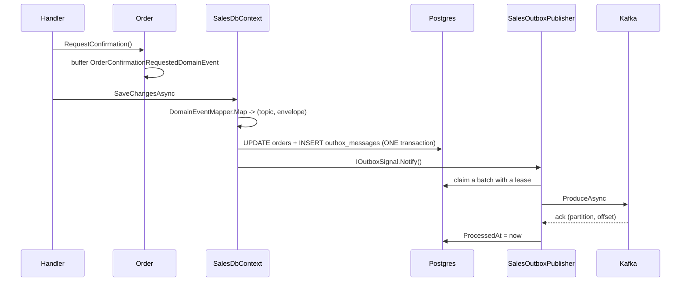

# 7. Domain Events & the Transactional Outbox

## Purpose

Explain how a fact raised inside an aggregate becomes a message on Kafka without ever risking the two getting out of sync.

## The problem

You want this to be atomic:

1. the order becomes `PendingInventory`
2. Inventory is told to reserve stock

But a database transaction and a Kafka publish cannot join. Publish first and the database write may fail — Inventory reserves stock for an order that does not exist. Save first and the publish may fail — the order waits forever for a reply nobody was asked for.

## The solution

Write the *intent to publish* into the same transaction as the state change, then publish it separately.



If the process dies anywhere after the commit, the row is still there and the next cycle publishes it. Worst case is a duplicate — which the consumer's inbox handles.

## Step 1: the aggregate raises

```csharp
public void RequestConfirmation()
{
    EnsureDraft();
    Status = OrderStatus.PendingInventory;
    Touch();
    Raise(new OrderConfirmationRequestedDomainEvent(Id,
        _lines.Select(x => new OrderLineReservation(x.ProductVariantId, x.Sku, x.Quantity)).ToArray()));
}
```

`AggregateRoot` buffers it in a private list. Nothing has left the aggregate yet.

## Step 2: the DbContext drains the buffer

```csharp
public override async Task<int> SaveChangesAsync(CancellationToken ct = default)
{
    var aggregates = ChangeTracker.Entries<AggregateRoot<Guid>>()
        .Select(x => x.Entity)
        .Where(x => x.GetDomainEvents().Count > 0)
        .ToArray();

    foreach (var aggregate in aggregates)
        foreach (var domainEvent in aggregate.GetDomainEvents())
            if (DomainEventMapper.Map(aggregate, domainEvent, executionContext) is { } mapped)
                OutboxMessages.Add(OutboxMessage.From(mapped.Envelope, mapped.Topic));

    var result = await base.SaveChangesAsync(ct);
    foreach (var aggregate in aggregates) aggregate.ClearDomainEvents();
    if (aggregates.Length > 0) outboxSignal?.Notify();
    return result;
}
```

Three things to notice:

- events are collected **before** `base.SaveChangesAsync`, so the outbox rows are part of the same transaction;
- the buffer is cleared **after** a successful save, so a failed save leaves the events for a retry;
- the signal fires **after** the commit, so the publisher never sees an uncommitted row.

## Step 3: mapping

```csharp
private static (string Topic, object Payload)? MapToPayload(IDomainEvent domainEvent) => domainEvent switch
{
    OrderConfirmationRequestedDomainEvent e => MapOrderConfirmationRequested(e),
    OrderUndoComfirmedDomainEvent e         => MapOrderUndoConfirmed(e),
    _ => null
};
```

Returning `null` means "internal only". Today only two of the seven Sales domain events cross the boundary; the rest reach the audit trail via `ChangeTracker` instead. **A domain event with no mapping is not a bug.**

The mapper also converts the domain event into a *contract* type. `OrderConfirmationRequestedDomainEvent` (domain vocabulary) becomes `OrderConfirmationRequested` (contract vocabulary) so the domain can be refactored without breaking consumers.

`EventEnvelopeFactory.Create` then wraps the payload:

| Field | Source |
|---|---|
| `EventId` | new GUID — the inbox deduplication key |
| `EventType` | the payload's runtime type name |
| `AggregateId` | the aggregate's id — **the Kafka partition key** |
| `Version` | the aggregate's version — used for staleness checks |
| `CorrelationId` | `IExecutionContext.CorrelationId` |
| `Actor` | `IExecutionContext.Actor` |
| `Data` | the payload, serialized by *runtime* type |

`AggregateId` as the key is what guarantees that two events for one order never arrive out of order.

## Step 4: publishing

`OutboxPublisherService<TDbContext>` runs a loop:

1. wake on the signal, or after the poll interval (default 2 s, 1 s in compose);
2. select up to 100 rows that are unprocessed, not dead-lettered, due, and unleased, oldest `OccurredAt` first;
3. claim them with one `ExecuteUpdateAsync` setting `LockId` and `LockedUntil = now + 30s`;
4. reload only rows carrying this cycle's `LockId` and publish each;
5. on success `ProcessedAt = now`; on failure increment `Attempts`, store the error, release the lease, and set `NextAttemptAt` from `RetryBackoff`;
6. at 10 attempts, stamp `DeadLetteredAt` and stop retrying;
7. refresh the backlog and dead-letter gauges.

The lease is the whole concurrency story. Two API instances can run the loop simultaneously; each claims disjoint rows, and a crashed instance's rows become claimable again after 30 seconds.

`KafkaOutboxPublisher` does the actual produce, opening a `kafka.publish <topic>` span and writing `traceparent`/`tracestate` so the consumer continues the same trace.

## Ordering guarantee

Rows are claimed and published ordered by `OccurredAt`, and keyed by `AggregateId`, so all events for one order land on one partition in the order they occurred. Events for *different* aggregates have no ordering guarantee — and must not need one.

## Audit events ride the same rails

`AuditSaveChangesInterceptor` runs inside `base.SaveChangesAsync` and adds *more* outbox rows — one `AuditLogEvent` per changed aggregate, bound for `sales.audit.v1`. Business state, integration event, and audit record all commit together.

## Common mistakes

| Mistake | Consequence |
|---|---|
| Publishing to Kafka from a handler | breaks atomicity — the whole point of the outbox |
| Calling `SaveChangesAsync` twice in one handler | the outbox row can commit without the state change |
| Raising a domain event before mutating | the event describes state that was never saved |
| Marking a row processed before the ack | a lost message that nothing retries |
| Using a random Kafka key | destroys per-aggregate ordering |
| Deleting outbox rows on publish | no audit trail, no replay |

## Related

- [08-integration-events-and-inbox.md](08-integration-events-and-inbox.md)
- [../tech/outbox-inbox-schema.md](../tech/outbox-inbox-schema.md)
- [../guides/kafka-usage-guide.md](kafka-usage-guide.md)
