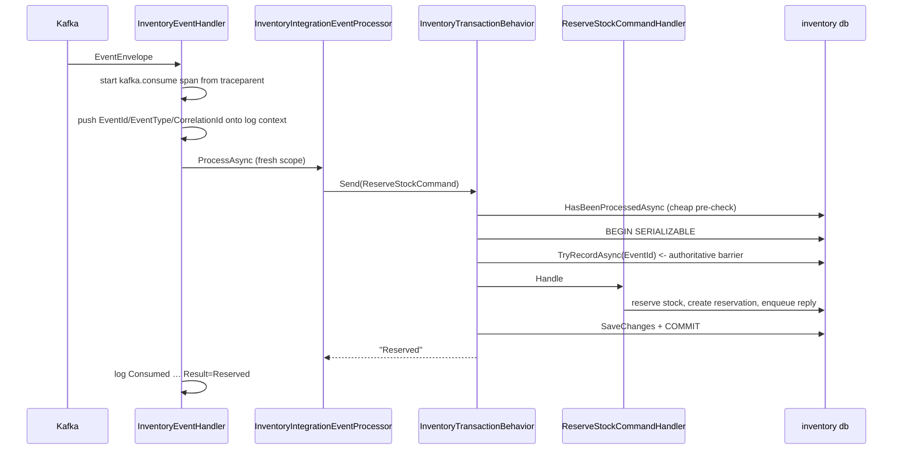

# 8. Integration Events, the Inbox & Retry

## Purpose

The other half of [07-domain-events-and-outbox.md](07-domain-events-and-outbox.md): what happens when a message *arrives*, and why the consuming side needs just as much machinery as the producing side.

## Three problems on the consumer side

1. **Duplicates.** At-least-once delivery means the same event can arrive twice. Reserving stock twice is a real bug.
2. **Failures.** KafkaFlow commits the offset whether or not your handler succeeded — so throwing *loses* the message.
3. **Out-of-order arrival.** Confirmation and undo travel on different topics, so a release can overtake a reserve.

Each gets its own mechanism: the inbox, the re-drive service, and the version guard.

## The consume path



## The handler base class

```csharp
public abstract class IntegrationEventHandler<THandler>(
    IServiceScopeFactory scopes, ILogger<THandler> logger,
    ActivitySource activitySource, IMessageLogContext messageLogContext)
    : IMessageHandler<EventEnvelope>
```

`SalesIntegrationEventHandler` and `InventoryEventHandler` derive from it and add nothing but their type name. All the cross-cutting work — tracing, log context, structured consume logs, scoped processor resolution, failure recording — lives once in the base.

### The rule that surprises everyone

```csharp
catch (Exception ex)
{
    var failure = await RecordFailure(context, envelope, ex);
    logger.LogError(ex, "Consume failed …");

    if (failure is null) throw;   // nowhere to persist it -> fail loudly

    // Do NOT rethrow: KafkaFlow commits the offset regardless, so a throw would
    // drop the event rather than retry it.
}
```

Swallowing an exception normally hides a bug. Here it is the correct behaviour, because the failure has been made durable in the inbox first. Rethrowing would commit the offset *and* lose the event. The one case that rethrows is when no `IInboxFailureRecorder` is registered — then there is nowhere to store it, so the loss is made loud.

## The inbox

The `inbox_messages` primary key **is** the idempotency mechanism. A duplicate insert raises a Postgres unique violation, recognised by `PostgresExceptions.IsUniqueViolation`.

The two services implement it differently, for good reasons.

**Sales** opens an explicit transaction so the inbox row and the order transition commit together:

```csharp
await using var transaction = await db.Database.BeginTransactionAsync();
var inbox = await db.InboxMessages.SingleOrDefaultAsync(x => x.EventId == envelope.EventId);
if (inbox is null)
{
    db.InboxMessages.Add(InboxMessage.Create(envelope.EventId, clock.UtcNow, consumer: "sales-v1"));
    await db.SaveChangesAsync();
}
else if (inbox.Status is Processed or DeadLettered)
{
    SalesMetrics.InboxDuplicate.Add(1);
    await transaction.RollbackAsync();
    return "Duplicate";
}
```

**Inventory** puts it in a pipeline behavior, with a two-stage check:

```csharp
// Stage 1 — cheap, non-transactional. Lets a duplicate skip the transaction entirely.
if (request is IIdempotentCommand<TResponse> preChecked
    && await inbox.HasBeenProcessedAsync(preChecked.EventId, ct))
    return preChecked.DuplicateResponse;

await using var transaction = await transactions.BeginSerializableTransactionAsync(ct);
// Stage 2 — authoritative. The pre-check can race; this cannot.
if (request is IIdempotentCommand<TResponse> idempotent
    && !await inbox.TryRecordAsync(idempotent.EventId, ct))
{
    await transaction.RollbackAsync(ct);
    return idempotent.DuplicateResponse;
}
```

The pre-check costs one lightweight query per *first* delivery and saves a whole serializable transaction per *duplicate*. It is an optimisation, not the barrier — the comment in the file says so explicitly.

## An event with no handler is still processed

`SalesInventoryEventProcessor` saves and commits unconditionally, even when the event type matched nothing:

> An event Sales has no handler for is still processed successfully, so its Inbox row must be persisted as Processed here — a re-driven row left in Failed state is selected by `InboxRedriveService` on every cycle forever.

Same for an orphan event whose order does not exist: the inbox row is committed and `order_not_found` is returned, so redelivery is cheap.

## Re-drive: the actual retry mechanism

Kafka will never redeliver a message whose offset was committed. So failed events are replayed from the inbox, with the envelope stored alongside:

```csharp
row.Payload = JsonSerializer.Serialize(envelope);  // EfInboxFailureRecorder
```

`InboxRedriveService` then, every 15 seconds:

- selects up to 50 rows with `Status = Failed`, a payload, and `NextAttemptAt` due;
- deserializes and replays each through `IIntegrationEventProcessor` **in its own scope**, so a failed attempt's tracked changes cannot leak into the failure-recording scope;
- on success counts `inbox.retried` — the processor itself marks the row `Processed`;
- on failure records another attempt with exponential backoff, dead-lettering at 5.

Both pipelines share `RetryBackoff.ForAttempt(n) = min(300s, 2^min(n,8))`.

## Out-of-order events

Ordering holds within a partition, but confirmation and undo are different topics. `Reservation.LastOrderVersion` is the guard:

```csharp
public bool IsStale(long orderVersion) => orderVersion <= LastOrderVersion;
```

Every version-carrying transition consults it, and callers consult the same method before mutating inventory items — so the two can never disagree.

The hard case is **release before reserve**. If an undo overtakes its confirmation there is no reservation to release. Creating nothing would let the delayed reserve hold stock for a cancelled order. So a tombstone is written:

```csharp
reservationRepository.Add(Reservation.CreateReleasedTombstone(request.OrderId, request.OrderVersion));
return "ReleasedBeforeReserve";
```

A line-less `Released` reservation carrying the version. The delayed older reserve is now stale and ignored; a genuinely newer confirmation can still `Reactivate`.

## Outcome strings

Processors return a short string that lands in the consume log and is asserted by tests: `Reserved`, `ReservedAcknowledged`, `AlreadyReserved`, `Rejected`, `Released`, `AlreadyReleased`, `StaleRelease`, `ReleasedBeforeReserve`, `Duplicate`, `Ignored`. Renaming one is a breaking change.

## Common mistakes

| Mistake | Consequence |
|---|---|
| Rethrowing from a consumer handler | the offset is committed and the event is lost |
| Checking the inbox without a transaction | a race between two consumers double-processes |
| Not persisting the inbox row for an unhandled event | the re-drive service reselects it forever |
| Comparing timestamps instead of versions | clock skew decides your business outcome |
| Not storing the envelope on failure | nothing to replay — Kafka will not send it again |
| Assuming Kafka retries a failed handler | it does not; the inbox does |

## Related

- [07-domain-events-and-outbox.md](07-domain-events-and-outbox.md)
- [15-concurrency-and-idempotency.md](15-concurrency-and-idempotency.md)
- [../tech/retry-and-dead-letter.md](../tech/retry-and-dead-letter.md)
- [kafka-playwright-debug-guide.md](kafka-playwright-debug-guide.md)
