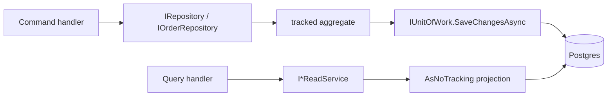

# 9. Repository & Unit of Work

## Purpose

Explain the two persistence paths — repositories for writes, read services for reads — and why keeping them apart is what makes the CQRS split real.

## Two paths



| Need | Use |
|---|---|
| Load an aggregate to change it | repository |
| Return data to a client | read service |
| Aggregate, join, page, sort for display | read service |

Loading an aggregate through a repository just to map it into a DTO is the mistake this split exists to prevent.

## The repository contract

```csharp
public interface IRepository<T> where T : AggregateRoot<Guid>
{
    Task<T?> GetByIdAsync(Guid id, CancellationToken ct = default);
    Task<IReadOnlyList<T>> GetByIdsAsync(IEnumerable<Guid> ids, CancellationToken ct = default);
    Task AddAsync(T aggregate, CancellationToken ct = default);
    void Update(T aggregate);
    void Delete(T aggregate);
}
```

Five members, all in aggregate terms. There is no `Find(Expression<...>)`, no `IQueryable`, no `Where`. That is the point: a repository that returns `IQueryable` is not an abstraction, it is a `DbSet` with extra steps, and the query logic ends up scattered across handlers.

`Sales.Architecture.Tests.Domain_repositories_do_not_expose_queryables` enforces it.

## Specialised repositories

```csharp
public interface IOrderRepository : IRepository<Order>
{
    Task<IReadOnlyCollection<Guid>> FindExpiredCancellableOrderIdsAsync(DateTimeOffset before, int batchSize, CancellationToken ct = default);
    Task<Order?> GetWithLinesAsync(Guid id, CancellationToken ct = default);
}
```

`GetWithLinesAsync` exists because `GetByIdAsync` does not `Include` the lines. A handler that calls `order.ReplaceLines(...)` on a lines-less order silently deletes them all — so any handler that touches children **must** use the include-aware method.

`IProductRepository` uses a different trick: several members have default interface implementations returning safe empty values, overridden by `ProductRepository` with the real queries. The interface can grow without breaking every test double.

## The implementation

```csharp
public class Repository<T>(SalesDbContext db) : IRepository<T> where T : AggregateRoot<Guid>
{
    protected readonly SalesDbContext Db = db;

    public Task<T?> GetByIdAsync(Guid id, CancellationToken ct = default) =>
        Db.Set<T>().SingleOrDefaultAsync(x => x.Id == id, ct);
    …
}
```

Three habits worth copying:

- `SingleOrDefaultAsync` on a unique key, never `FirstOrDefault` — if two rows exist you want to know;
- bulk loads deduplicate ids and use one `Contains` query instead of N round trips;
- **no `SaveChangesAsync`**. A repository stages changes; it never commits.

`IgnoreQueryFilters()` appears in exactly two places (`GetBySkuAsync`, `GetByProductCodeAsync`) where a lookup must see soft-deleted rows. It is not a general escape hatch — it also bypasses the filtered unique indexes.

## Unit of Work

```csharp
public interface IUnitOfWork
{
    Task<int> SaveChangesAsync(CancellationToken cancellationToken = default);
}
```

One member. Application depends on this instead of `DbContext`, which is what keeps EF Core out of the Application layer — the architecture test checks it.

`SalesDbContext` implements `IUnitOfWork` directly, and `UnitOfWork` is a thin wrapper so handlers inject the narrow port rather than the whole context surface.

### The transaction boundary

In Sales, **one `SaveChangesAsync` per command** *is* the transaction. That single call:

1. maps buffered domain events into outbox rows,
2. fires `AuditSaveChangesInterceptor`, which adds audit outbox rows,
3. commits everything atomically,
4. clears the domain events and signals the outbox publisher.

Calling it twice in one handler creates two transactions — and the second can fail after the first committed, leaving an outbox row without its state change.

Inventory inverts this: handlers never call `SaveChangesAsync` at all. `InventoryTransactionBehavior` owns the serializable transaction and commits after the handler returns.

## Read services

```csharp
public sealed class OrderReadService(SalesDbContext db, IMapper mapper) : IOrderReadService
{
    public async Task<PagedResult<OrderDto>> SearchAsync(…)
    {
        (page, pageSize) = Paging.Normalize(page, pageSize);
        var query = db.Orders.Include(x => x.Lines).AsNoTracking();

        Specification<Order>? spec = null;
        if (from is not null) spec = Compose(spec, new OrderCreatedFromSpecification(from.Value));
        …
        if (spec is not null) query = query.Where(spec.ToExpression());

        var total = await query.LongCountAsync(ct);
        var orders = await query.OrderByDescending(x => x.CreatedAt)
                                .Skip((page - 1) * pageSize).Take(pageSize).ToListAsync(ct);
        return new(mapper.Map<OrderDto[]>(orders), page, pageSize, total);
    }
}
```

Always `AsNoTracking`. Always `Paging.Normalize`. Always count on the *filtered* query, before paging.

`ProductReadService` goes further and builds its DTOs by hand rather than mapping, because it needs a join across variants, colours, and sizes plus min/max price aggregation. It loads all variants for the page in **one** query and groups in memory — the N+1 that a naive `Include` chain would produce is exactly what the read-service layer exists to let you avoid.

## Decorating a read service

```csharp
services.AddScoped<ProductReadService>();
services.AddScoped<IProductReadService>(sp => new CachedProductReadService(
    sp.GetRequiredService<ProductReadService>(),
    sp.GetRequiredService<IProductCache>()));
```

The concrete type is registered, then the interface resolves to a decorator wrapping it. Handlers know nothing about the cache. See [11-caching.md](11-caching.md).

## Common mistakes

| Mistake | Consequence |
|---|---|
| Returning `IQueryable` from a repository | query logic leaks into handlers; the abstraction is fake |
| `GetByIdAsync` then mutating children | children are not loaded — they get deleted on save |
| `SaveChangesAsync` inside a repository | the handler loses control of the transaction |
| Loading an aggregate for a read | tracking overhead and no projection |
| Tracked entities in a read service | accidental writes on the next save |
| Counting after `Skip/Take` | `total` reports the page size |
| Looping `GetByIdAsync` | N+1 |

## Related

- [05-cqrs-and-mediatr.md](05-cqrs-and-mediatr.md)
- [10-database-and-migrations.md](10-database-and-migrations.md)
- [../project/backend/repository-rule.md](../project/backend/repository-rule.md)
