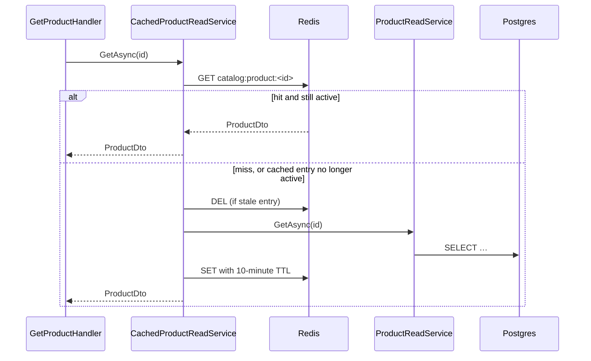

# 11. Caching with Redis

## Purpose

Explain the Sales product cache, why it is a decorator rather than a call in a handler, and why invalidation is the hard half. Dashboard.Bff also has a separate snapshot cache, described at the end.

## What is cached

Sales caches exactly one thing: `ProductDto` for `GET /api/products/{id}`. Redis also holds a distributed lock for the cleanup job.

That is a deliberately small footprint. A cache is a second copy of your data, and every copy is a chance to be wrong.

## Cache-aside



The cache is a copy of a database read, not a source of truth. A cold cache is only slower, never wrong.

## The decorator

```csharp
services.AddScoped<ProductReadService>();
services.AddScoped<IProductReadService>(sp => new CachedProductReadService(
    sp.GetRequiredService<ProductReadService>(),
    sp.GetRequiredService<IProductCache>()));
```

`GetProductHandler` injects `IProductReadService` and has no idea a cache exists. Removing the cache is a one-line registration change. Compare that with `if (cached != null) return cached;` scattered through handlers.

## What is *not* cached, and why

```csharp
/// <remarks>
/// Deliberately uncached: the cache only holds published products, and this read exists to
/// return a product a command just wrote, whatever status it landed in.
/// </remarks>
public Task<ProductDto?> GetForWriteResultAsync(Guid id, CancellationToken ct = default)
    => inner.GetForWriteResultAsync(id, ct);
```

This is the subtlest part of the design. `GetAsync` returns published products only. A command that creates a `Draft` product and then reads it back through `GetAsync` gets `null` and reports "not found" for something it just created. So write-result reads use a separate, uncached method.

`SearchAsync` is not cached either — paginated, multi-filter results have too many key permutations and go stale on any product change.

## The generic base

```csharp
public abstract class CacheService<T> : ICacheService<T>
{
    protected virtual TimeSpan Ttl => TimeSpan.FromMinutes(10);
    protected abstract string KeyPrefix { get; }
    protected abstract Guid GetId(T value);
    protected virtual string Key(Guid id) => $"{KeyPrefix}:{id:N}";
    // GetAsync / SetAsync / RemoveAsync over IDistributedCache with System.Text.Json
}
```

`ProductCache` supplies `"catalog:product"` and `value => value.Id`. A new cache is about ten lines.

The port (`ICacheService<T>` → `IProductCache`) lives in Application; only the implementation knows about Redis. Application never sees `IDistributedCache`.

## Dashboard snapshot cache

Dashboard.Bff caches the aggregated `DashboardSnapshot` under `dashboard:snapshot`. The BFF has no Application layer, so the port is service-local: `IDashboardSnapshotCache`, implemented by `RedisDashboardSnapshotCache` over `IDistributedCache` with an in-memory fallback for local/dev scenarios.

The endpoint reads the cache first and rebuilds synchronously only on a miss. `DashboardSnapshotRefreshJob` normally refreshes the same key every minute.

## Invalidation

Every write path that changes the cached shape removes the entry — **after** the save:

```csharp
product.UpdateVariant(request.VariantId, color, size, request.Price, status);
await unitOfWork.SaveChangesAsync(cancellationToken);
await productCache.RemoveAsync(product.Id, cancellationToken);
```

Order matters. Invalidate *before* the commit and a concurrent read can repopulate the cache from the pre-commit state — leaving a stale entry that nothing will clear for ten minutes.

Remove, do not update. Writing the new value into the cache means two code paths producing the DTO, which will drift.

Currently invalidated by: create product (via read-back), update product, delete product, add/update/deactivate/delete variant.

### The safety net

```csharp
var cached = await cache.GetAsync(id, cancellationToken);
if (cached is not null)
{
    if (IsActive(cached)) return cached;
    await cache.RemoveAsync(id, cancellationToken);
}
```

If an invalidation is ever missed, a cached entry for a now-unpublished or deleted product is evicted on read rather than served. Belt and braces, because forgetting one invalidation call is the easiest mistake to make here.

## TTL as a backstop

10 minutes absolute. That is not a performance number — it is the maximum time a *missed* invalidation can serve stale data. Long enough to be useful, short enough that a bug is survivable.

## The distributed lock

Different use of Redis entirely. `MaintenanceCleanupJob` runs daily and must not run twice at once across instances:

```csharp
var lockAcquired = await cache.StringSetAsync(CleanupLockKey, lockToken, CleanupLockDuration, When.NotExists);
if (!lockAcquired) return;
try { /* delete old inbox/outbox rows */ }
finally { await cache.ScriptEvaluateAsync(ReleaseLockScript, [CleanupLockKey], [lockToken]); }
```

The release is a Lua compare-and-delete:

```lua
if redis.call('get', KEYS[1]) == ARGV[1] then return redis.call('del', KEYS[1]) else return 0 end
```

Without it, a slow instance whose lock expired would delete the lock a *different* instance now holds. This is the classic Redlock footgun.

Note the framing: the lock is an optimisation. The cleanup deletes rows matching a predicate, so running it twice is harmless. **Never let a Redis lock be the only thing protecting correctness** — Inventory makes the same point differently by using a Postgres advisory lock inside its transaction, keeping Redis out of that context entirely.

## Common mistakes

| Mistake | Consequence |
|---|---|
| Caching in the handler instead of a decorator | every caller must remember; removing the cache touches every handler |
| Invalidating before the save | a concurrent read repopulates the stale value |
| Updating the cache instead of removing | two code paths build the DTO; they drift |
| Caching search results | key explosion and immediate staleness |
| Caching an aggregate | tracked entity semantics do not survive serialization |
| Reading a write result through the cached path | a Draft product comes back `null` |
| Releasing a lock with a plain `DEL` | you delete someone else's lock |

## Related

- [Redis-cache-usage-guide.md](Redis-cache-usage-guide.md) — deep dive (Vietnamese)
- [../tech/cache-conventions.md](../tech/cache-conventions.md)
- [../project/backend/redis-rule.md](../project/backend/redis-rule.md)
