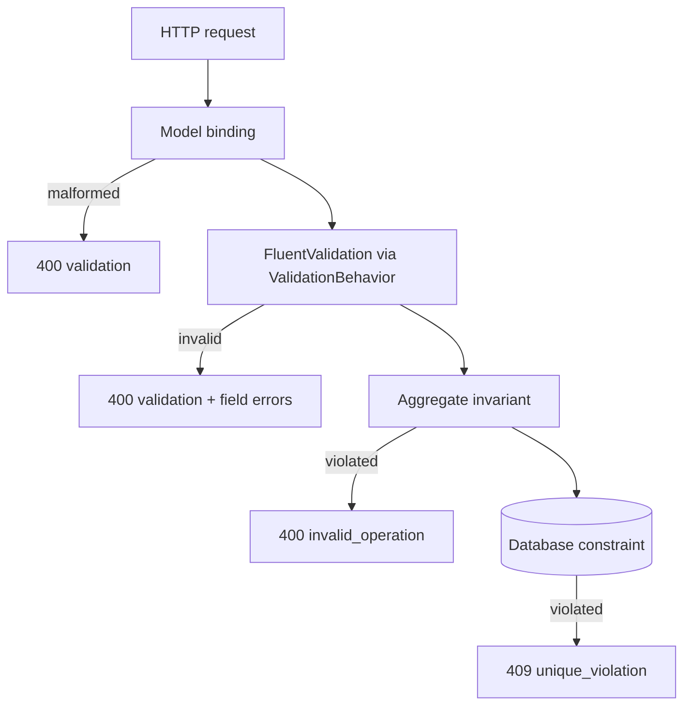

# 12. Validation & Error Handling

## Purpose

Explain the three layers of validation, why the same rule sometimes appears twice on purpose, and how any exception becomes a consistent HTTP response.

## Three layers, three jobs



| Layer | Answers | Failure |
|---|---|---|
| Model binding | is this well-formed JSON with the right types? | `400 validation` |
| FluentValidation | is this request plausible before we touch the domain? | `400 validation` + field errors |
| Aggregate | is this operation legal for this entity right now? | `400 invalid_operation` |
| Database | is this globally consistent? | `409 unique_violation` |

## Why the duplication is deliberate

`ValidPhone()` checks 9–15 digits. So does `Customer.NormalizePhone`. That is not redundancy:

- the **validator** gives the caller a good message with the field name, before any work happens;
- the **aggregate** is the guarantee. It holds for a command dispatched from a Hangfire job, a Kafka consumer, or a test — none of which pass through the validator.

The rule: a validator improves the *message*; the aggregate provides the *guarantee*. Never move an invariant out of the aggregate because a validator already checks it.

## FluentValidation

One validator per command, assembly-scanned:

```csharp
public sealed class CreateOrderValidator : AbstractValidator<CreateOrder>
{
    public CreateOrderValidator()
    {
        RuleFor(x => x.CustomerId).ValidAggregateId();
        RuleFor(x => x.Lines).NotEmpty();
        RuleForEach(x => x.Lines).SetValidator(new OrderLineInputValidator());
        RuleFor(x => x.Lines).HaveUniqueProducts();
    }
}
```

Reusable rules become extension methods rather than copy-paste — `ValidAggregateId()`, `ValidExpectedVersion()` (cross-feature), `ValidPhone()`, `ValidCustomerName()`, `HaveUniqueProducts()` (feature-scoped).

`ValidationBehavior` runs all validators for a request in parallel and throws once with the combined failures. Queries have no validators; paging is *clamped* by `Paging.Normalize`, not rejected — asking for page 0 or 500 items is not an error, it is a request to be reasonable about.

## Status strings

Commands take status as `string`, not as an enum:

```csharp
private static EProductStatus ParseProductStatus(string status)
{
    if (Enum.TryParse<EProductStatus>(status, ignoreCase: true, out var productStatus))
        return productStatus;
    throw new DomainException("Product status is invalid.");
}
```

The validator only checks presence and length; parsing and the transition rule live in the handler and the aggregate. Query parameters are the opposite — `OrderStatus? status` binds by name, so `?status=Nonsense` is rejected at the boundary with a `400` rather than silently ignored.

## The exception hierarchy

| Exception | Meaning | HTTP | Code |
|---|---|---|---|
| `DomainException` | invariant violated | 400 | `invalid_operation` |
| `NotFoundException` | resource missing | 404 | `not_found` |
| `ConflictException` | version mismatch | 409 | `concurrency_conflict` |
| `ValidationException` | request invalid | 400 | `validation` |
| `UnauthorizedAccessException` | credential rejected | 401 | `unauthorized` |
| `BadHttpRequestException` | malformed request/header | its own | `invalid_request` |
| `OperationCanceledException` | client disconnected | 499 | `operation_cancelled` |
| anything else | bug | 500 | `internal_server_error` |

Four types cover the whole application. There is no `OrderNotFoundException`, no `ProductInvalidStateException` — a hierarchy that mirrors the domain adds classes without adding information.

## Error codes

Declared once in `ErrorCodes` with a default description in `ErrorCatalog`:

```csharp
public const string ConcurrencyConflict = "concurrency_conflict";
public static readonly ErrorDefinition ConcurrencyConflict =
    new(ErrorCodes.ConcurrencyConflict, "The resource was modified by another request.");
```

Services do not define their own codes; they override the *wording* through `IErrorMessageProvider`:

```csharp
ErrorCodes.NotFound => "The requested sales resource was not found.",
```

So a client can switch on a stable machine-readable code while humans read a service-appropriate sentence. `ErrorCatalogTests` fails if a code is declared without being registered.

## Mapping to HTTP

`ApiExceptionHandler` is the single place the HTTP boundary translates and logs a failure. Order matters:

1. service-registered mappings,
2. persistence classification,
3. the built-in exception types,
4. fallback to 500.

Sales registers three mappings in its host:

```csharp
options.Map<ConflictException>((exception, errorCatalog) =>
{
    var error = errorCatalog.Get(ErrorCodes.ConcurrencyConflict);
    var errors = new[] { new ApiError("current_version", exception.CurrentVersion.ToString()) };
    return new ApiExceptionMapping(409, error.Code, error.Description, errors, LogLevel: LogLevel.Warning);
});
```

Note the current version is returned to the client so it can retry with a correct ETag.

### Log level is part of the mapping

```csharp
LogLevel LogLevel = LogLevel.Error   // the default
```

`Information` for client-caused failures, `Warning` for conflicts and contention, `Error` for things needing an engineer. The default is `Error` **so a mapping that forgets to classify itself is loud rather than silent** — a good default for a safety property.

### Persistence failures

EF and Npgsql exceptions never reach the web layer as themselves. `PostgresPersistenceExceptionClassifier` translates them:

| Exception | HTTP | Code | `retryable` |
|---|---|---|---|
| `DbUpdateConcurrencyException` | 409 | `concurrency_conflict` | `False` |
| Postgres unique violation | 409 | `unique_violation` | `False` |
| serialization failure / deadlock | 409 | `concurrency_conflict` | `True` |

An architecture test forbids `Microsoft.EntityFrameworkCore` and `Npgsql` inside `BuildingBlocks.Web.ExceptionHandling`, so the port cannot be bypassed. The `retryable` flag tells the client whether replaying the identical request is safe.

### What else the handler does

```csharp
activity.AddException(exception);
activity.SetTag("error.code", mapping.ErrorCode);
if (mapping.StatusCode >= 500) activity.SetStatus(ActivityStatusCode.Error, mapping.ErrorCode);
```

`UseExceptionHandler` stops the exception before ASP.NET Core instrumentation sees it, so the handler records it on the span itself. And only 5xx sets the span to `Error` — otherwise every validation failure would count against the service's trace error rate and the dashboard would be useless.

## The response

```json
{ "status": 409, "errorCode": "concurrency_conflict",
  "message": "The sales resource was changed by another request.",
  "traceId": "4bf92f3577b34da6a3ce929d0e0e4736",
  "correlationId": "4bf92f3577b34da6a3ce929d0e0e4736",
  "errors": [ { "code": "current_version", "message": "5" } ],
  "validationErrors": [] }
```

Model-binding failures get the identical shape via `AddSharedApiModelResponses`. One error shape, whatever went wrong. `traceId` pastes straight into Seq or Kibana.

## Common mistakes

| Mistake | Consequence |
|---|---|
| Moving an invariant into a validator | it stops applying to jobs, consumers, and tests |
| A new exception type per business rule | class explosion, no new information |
| Defining a service-local error code | clients cannot switch on codes reliably |
| `try`/`catch` in a controller | duplicate logs, non-standard body |
| Forgetting `LogLevel` on a mapping | it defaults to `Error` — safe, but noisy |
| Marking a 4xx span as `Error` | validation failures inflate the error rate |
| Returning an EF exception message | leaks schema details to clients |

## Related

- [../tech/exception-and-error-catalog.md](../tech/exception-and-error-catalog.md)
- [../tech/business/validation-rules.md](../tech/business/validation-rules.md)
- [../project/backend/validation-rule.md](../project/backend/validation-rule.md), [exception-rule.md](../project/backend/exception-rule.md)
