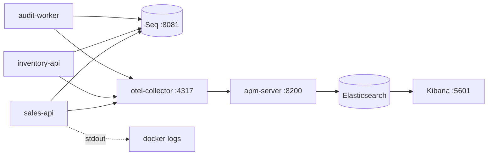

# 13. Observability

## Purpose

Explain how to answer "what happened to order X?" using logs, traces, and metrics that were designed to be correlated rather than collected.

## The pipeline



Two destinations by intent: **Seq** for fast text triage during development, **Kibana/APM** for traces and metrics across services. Logs go to both, so a log line found in Seq can be pivoted into its trace in Kibana.

## One policy, three services

```csharp
public static LoggerConfiguration ConfigureSharedSinks(this LoggerConfiguration config,
    IConfiguration configuration, string defaultServiceName) =>
    config.ReadFrom.Configuration(configuration)
        .Enrich.FromLogContext()
        .Enrich.WithProperty("Service", serviceName)
        .Enrich.WithProperty("Environment", environment)
        .WriteTo.Console()
        .WriteTo.Seq(configuration["Seq:Url"] ?? "http://seq:5341")
        .WriteTo.OpenTelemetry(...);
```

One `builder.AddBuildingBlocksLogging("sales-api")` per host. No service configures a sink of its own — that is how three services stay queryable with one saved search.

## Two ids, two purposes

This is the single most important distinction in this chapter.

| | `TraceId` | `CorrelationId` |
|---|---|---|
| What | W3C trace identifier | business workflow identifier |
| Scope | one technical operation | the whole user-visible workflow |
| Source | `Activity.Current.TraceId` | `X-Correlation-Id` header, else the trace id |
| Changes | per hop | never |
| Travels via | `traceparent` header | inside the `EventEnvelope` |

Both are defined exactly once, in `ApiModelExtensions`:

```csharp
public static string GetTraceId(this HttpContext context) =>
    Activity.Current?.TraceId.ToHexString() ?? context.TraceIdentifier;

public static string GetCorrelationId(this HttpContext context) =>
    context.Request.Headers.TryGetValue("X-Correlation-Id", out var v) && !string.IsNullOrWhiteSpace(v)
        ? v.ToString() : context.GetTraceId();
```

The value returned in an error response, pushed onto the log scope, and stamped on the request summary is *the same string*. A user pasting a trace id from an error message finds their request. `TraceCorrelationContractTests` locks this in.

## Request logging

`RequestObservabilityMiddleware` does the work:

- pushes `RequestId` and `CorrelationId` onto Serilog's `LogContext`, so every nested log — including Kafka publishes triggered by the request — inherits them;
- after the request, sets `RequestId`, `CorrelationId`, `TraceId`, `UserId`, `ClientIp`, `Url`, `Route`, `UserAgent` on `IDiagnosticContext`, which is what `UseSerilogRequestLogging`'s single summary event reads.

Two mechanisms because they serve different things: `LogContext` for nested logs, `IDiagnosticContext` for the one summary event that is written after the pipeline unwinds.

Bodies are captured only at `Debug`, capped at 8 KB, with `Authorization`/`Cookie` headers and configured JSON fields masked to `***`. `RequestLoggingDefaults` drops `/health` and `/hangfire` to `Debug` — uptime polling is not an incident.

## One failure, one log

Read `LoggingBehavior`'s comment; it is the design in a paragraph:

> This deliberately does not log failures at Warning or Error. Every execution path that dispatches MediatR already logs its own failures once, at its own boundary and with the context only that boundary has […] Re-logging the same exception here would double every failure in Seq and break error-rate counting.

| Path | Logger | Context it uniquely has |
|---|---|---|
| HTTP | `ApiExceptionHandler` | error code, status, path |
| Kafka | `IntegrationEventHandler` | topic, partition, offset |
| Outbox / inbox | the cycle services | attempts, dead-letter state |
| Jobs | the job class | batch counts |

If you catch an exception, log it, and rethrow, you have made every failure appear twice.

## Tracing across Kafka

The hard part of distributed tracing here is that the request ends before the work does. Publish:

```csharp
using var activity = activitySource.StartActivity($"kafka.publish {message.Topic}", ActivityKind.Producer);
var traceParent = activity?.Id ?? Activity.Current?.Id;
if (traceParent is not null) headers.SetString(ContractHeaders.TraceParent, traceParent);
```

Consume:

```csharp
var parentContext = TraceContextParser.Parse(
    context.Headers.GetString(ContractHeaders.TraceParent),
    context.Headers.GetString(ContractHeaders.TraceState));
var activity = source.StartActivity($"kafka.consume {topic}", ActivityKind.Consumer, parentContext);
```

The consume span becomes a child of the publish span, so one Kibana trace spans **Sales HTTP → Kafka → Inventory → Kafka → Sales → Mongo**, across three processes.

`IMessageLogContext.Push(EventEnvelopeLogContext.From(envelope, activity))` adds `EventId`, `EventType`, `CorrelationId`, `TraceId` to every log written while that message is processed.

## Instrumentation

| Host | ActivitySource | Meter | Auto-instrumentation |
|---|---|---|---|
| sales-api | `Sales.Infrastructure.Kafka` | `Sales.Infrastructure` | ASP.NET Core, HttpClient, EF Core, runtime |
| inventory-api | `Inventory.Infrastructure.Kafka` | `Inventory.Infrastructure` | same |
| audit-worker | `AuditLog.Infrastructure.Kafka` | — | runtime |

Service names come from `OTEL_SERVICE_NAME` for both OpenTelemetry and Serilog, so the two agree.

## Metrics that matter

| Metric | Watch for |
|---|---|
| `<svc>.outbox.backlog` | should trend to 0; sustained growth means the publisher is stuck |
| `<svc>.outbox.deadletters` | any non-zero value needs an operator |
| `<svc>.inbox.duplicate` | normal and healthy — at-least-once delivery working |
| `<svc>.inbox.dead_lettered` | a poison message |
| `inventory.reservation.rejected` | rising = stock shortages, not necessarily a bug |
| `sales.orders.expiration.cancelled` | abandoned carts |
| `sales.orders.expiration.failed` | the job is hitting errors |

Backlog and dead-letter counts are **observable gauges** refreshed every publish cycle, so they are point-in-time truth rather than derived from counters.

## Debugging a real question

*"Order 7f3a… is stuck in PendingInventory."*

1. **Seq**: `OrderId = '7f3a…'` → find the confirm request, note its `CorrelationId`.
2. **Seq**: `CorrelationId = '…'` → the whole workflow. Is there a `Published sales.order-confirmation-requested.v1` line? If not, the outbox is stuck — check `sales.outbox.backlog` and `LastError` on the row.
3. If published, look for `Consumed` in the Inventory logs. Nothing? Check the consumer group is alive and `AutoOffsetReset` is `Earliest`.
4. Consumed with `Result=Rejected`? The reply exists — check whether Sales consumed `inventory.stock-rejected.v1`.
5. `Consume failed`? Look at `Attempts` and `DeadLettered` in the same event; the inbox row holds `LastError`.
6. **Kibana**: search the trace id for the end-to-end waterfall and the latency of each hop.

## Common mistakes

| Mistake | Consequence |
|---|---|
| Logging and rethrowing | every failure appears twice |
| String interpolation in a log message | no structured properties; unqueryable |
| Inventing a new name for `OrderId` | your log does not join to the others |
| Logging bodies at `Information` | PII in production logs |
| Adding a sink in one service | that service's logs stop matching everyone else's |
| Marking 4xx spans as `Error` | the error-rate dashboard becomes meaningless |
| Not propagating `traceparent` | the trace stops at the process boundary |

## Related

- [Seqlog-usage-guide.md](Seqlog-usage-guide.md), [open-telemetry-usage-guide.md](open-telemetry-usage-guide.md), [Elastic-usage-guide.md](Elastic-usage-guide.md) — deep dives (Vietnamese)
- [../tech/logging-and-observability-strategy.md](../tech/logging-and-observability-strategy.md)
- [../tech/monitoring-demo.md](../tech/monitoring-demo.md)
