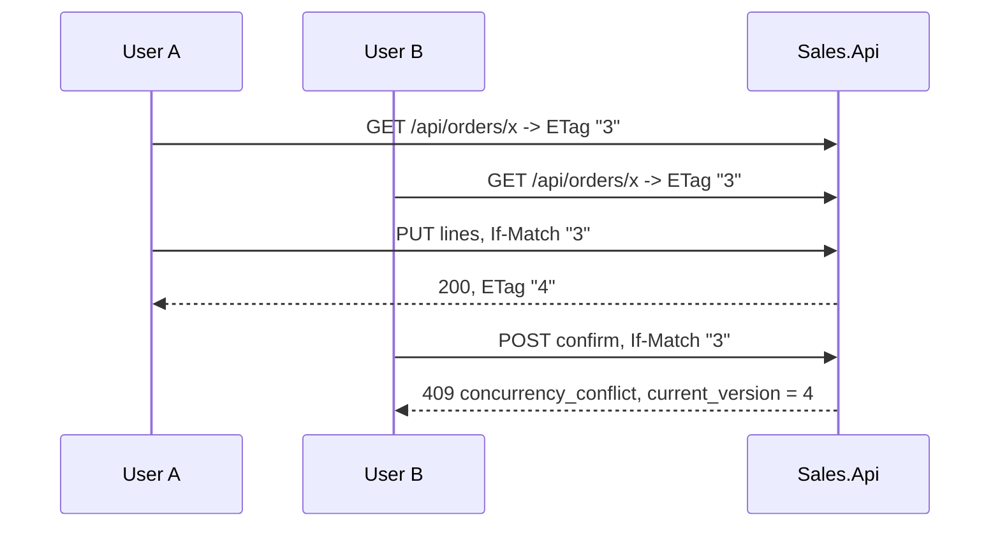

# 15. Concurrency & Idempotency

## Purpose

Four different consistency problems appear in this system, and each has a different answer. Confusing them is the fastest way to introduce a subtle bug.

| Problem | Mechanism |
|---|---|
| Two users edit one order | optimistic concurrency (`Version` / ETag) |
| Two reservations race for the same stock | serializable transactions |
| One event delivered twice | inbox deduplication |
| Two events arrive out of order | aggregate version guard |

## 1. Optimistic concurrency



`AggregateRoot.Version` starts at 1 and increments in `Touch()` on every mutation:

```csharp
protected void Touch()
{
    Version++;
    UpdatedAt = DateTimeOffset.UtcNow;
}
```

The API surfaces it as an `ETag`, requires it back as `If-Match`, and `LoadAndCheck` compares:

```csharp
var order = await orderRepository.GetWithLinesAsync(orderId, ct) ?? throw new NotFoundException(nameof(Order), orderId);
if (order.Version != expectedVersion) throw new ConflictException(order.Version);
```

The 409 carries the current version so the client can refetch and retry.

There is a second line of defence. `Version` is also the EF concurrency token, so even a request that skips the check hits `DbUpdateConcurrencyException` if another transaction changed the row first. Belt at the API, braces at the database.

Missing or non-numeric `If-Match` gives `428 Precondition Required` — "you must tell me what version you saw", not "your version is wrong".

> Enforced today on the four mutating **order** endpoints. Product, customer, and category writes accept an ETag-carrying DTO but do not require `If-Match`; only the EF token protects them. See [../tech/discrepancies.md](../tech/discrepancies.md).

## 2. Serializable transactions

Optimistic concurrency detects a conflict on *one row you already read*. Reserving stock is different: you read several items, decide based on all of them, then write. Another transaction could change one between your read and your write.

So every Inventory command runs at `IsolationLevel.Serializable`:

```csharp
await using var transaction = await transactions.BeginSerializableTransactionAsync(cancellationToken);
try
{
    var response = await next(cancellationToken);
    await unitOfWork.SaveChangesAsync(cancellationToken);
    await transaction.CommitAsync(cancellationToken);
    return response;
}
catch { await transaction.RollbackAsync(cancellationToken); throw; }
```

Postgres detects the conflict and aborts the loser with a serialization failure, classified as `409 concurrency_conflict` with `retryable=True` — the same request replayed will now see the committed state and can succeed. That flag is why the classification distinguishes retryable from non-retryable conflicts.

Note what the behavior owns: the transaction, the inbox insert, `SaveChangesAsync`, and the commit. Handlers do none of those. That is a real constraint, and the reason the shared `ValidationBehavior` must be registered *before* it.

## 3. Inbox deduplication

At-least-once delivery means duplicates are normal. Reserving stock twice is not.

The `inbox_messages` primary key **is** the mechanism: a duplicate insert raises a unique violation.

```csharp
catch (DbUpdateException ex) when (PostgresExceptions.IsUniqueViolation(ex))
{
    SalesMetrics.InboxDuplicate.Add(1);
    await transaction.RollbackAsync();
    return "Duplicate";
}
```

The critical property is that the inbox insert and the business change are in the **same transaction**. Otherwise:

- insert first, crash before the business change → the event is marked processed but nothing happened;
- change first, crash before the insert → a redelivery applies it twice.

Inventory adds a cheap pre-check before opening the transaction, and the comment is explicit that it is not the barrier:

> This mainly helps when Kafka retries/redeliveries are common. It can race with a concurrent writer, so the transactional `TryRecordAsync` insert below stays the authoritative barrier.

Audit writes use a different idempotency mechanism entirely — a MongoDB upsert keyed on the unique `AuditId`.

## 4. Out-of-order events

Kafka guarantees ordering *within a partition*. Confirmation and undo travel on **different topics**, so a release can overtake a reserve.

The guard is a version comparison — never a timestamp:

```csharp
public bool IsStale(long orderVersion) => orderVersion <= LastOrderVersion;
```

`LastOrderVersion` holds the highest *Sales order* version applied to this reservation. Every version-carrying transition consults it, and callers consult the same method before mutating inventory items, so the two can never disagree.

### The hard case: release before reserve

An undo arrives for an order with no reservation. Do nothing, and a delayed reserve arrives later and holds stock for a cancelled order. So a tombstone is written:

```csharp
reservationRepository.Add(Reservation.CreateReleasedTombstone(request.OrderId, request.OrderVersion));
return "ReleasedBeforeReserve";
```

A line-less `Released` reservation carrying the release's version. Now:

- the delayed *older* reserve is stale → ignored, no stock held;
- a genuinely *newer* confirmation is not stale → `Reactivate` works.

No stock is held while the tombstone exists, because a tombstone has no lines. This is covered by both an in-memory and a real-Postgres reliability test.

## Distributed coordination

| Need | Mechanism | Still safe if the lock fails? |
|---|---|---|
| One publisher per outbox row | `LockId` + `LockedUntil` (30 s) | yes — duplicate publish is deduplicated by the inbox |
| One Sales cleanup run | Redis `SET NX PX` + Lua release | yes — delete-by-predicate |
| One Inventory cleanup run | `pg_try_advisory_xact_lock` | yes — same |
| Unique business codes | Postgres `nextval` | this one *is* the guarantee |

The rule: a distributed lock is an optimisation. The operation under it must be idempotent, because leases expire mid-operation.

## Correlation and causation

| Id | Answers |
|---|---|
| `TraceId` | which technical operation? |
| `CorrelationId` | which business workflow? |
| `CausationId` | which event caused this one? |
| `EventId` | which message is this? |

Inventory replies set `CausationId = request.EventId`, so you can walk the causal chain: HTTP request → `CorrelationId` → confirmation event → reply event whose `CausationId` is the confirmation's `EventId`.

## Realtime is not consistency

SignalR notifications are best-effort and always sent **after** the commit:

```csharp
await db.SaveChangesAsync();
await transaction.CommitAsync();
await NotifyOrderStatusChangedAfterCommit(order, previousStatus, currentStatus);
```

The notifier catches its own exceptions and logs a warning. A failed notification must never fail a committed business operation. Clients treat a notification as a hint to re-read, never as data.

## Common mistakes

| Mistake | Consequence |
|---|---|
| Comparing timestamps for staleness | clock skew decides your business outcome |
| Inbox insert outside the business transaction | lost or doubly-applied events |
| Trusting a non-transactional pre-check | two consumers both process the event |
| Auto-retrying a 409 with the same ETag | an infinite loop |
| Relying on a lock for correctness | leases expire mid-operation |
| Notifying before commit | clients see a state that gets rolled back |
| Forgetting `Touch()` | the ETag does not change, so a stale write is accepted |

## Related

- [08-integration-events-and-inbox.md](08-integration-events-and-inbox.md)
- [../tech/concurrency-and-idempotency.md](../tech/concurrency-and-idempotency.md)
- [../tech/reliability-tests.md](../tech/reliability-tests.md)
