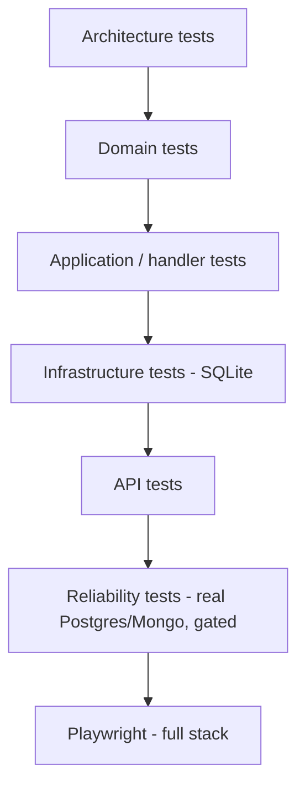

# 17. Testing Strategy

## Purpose

Explain what is tested where, why reliability tests are gated behind an environment variable, and the tricks this codebase uses to make asynchronous machinery deterministic.

## The shape



12 xUnit projects, one per production project, plus Jasmine for Angular and Playwright for cross-service flows.

## Architecture tests come first

`Sales.Architecture.Tests/DependencyRulesTests.cs` uses NetArchTest to make the layering executable:

```csharp
var result = Types.InAssembly(typeof(Sales.Domain.Product).Assembly).ShouldNot()
    .HaveDependencyOnAny("Sales.Application", "Sales.Infrastructure", "Inventory", "AuditLog",
        "BuildingBlocks.Application", "BuildingBlocks.Infrastructure", "BuildingBlocks.Web",
        "Microsoft.EntityFrameworkCore", "KafkaFlow").GetResult();
Assert.True(result.IsSuccessful, string.Join(", ", result.FailingTypeNames ?? []));
```

Twelve rules cover every layer boundary — including two negative-space assertions worth noting:

```csharp
[Fact] public void BuildingBlocks_contracts_do_not_contain_trace_parsing_behavior()
[Fact] public void Api_exception_handlers_do_not_depend_on_provider_specific_persistence_exceptions()
```

Those encode *decisions*, not just structure: contracts stay data-only, and Npgsql must reach the web layer only through `IPersistenceExceptionClassifier`. A comment saying "don't do X" gets ignored; a failing build does not.

## Domain tests

No mocks, no fakes, no infrastructure — construct an aggregate, call a method, assert.

```csharp
[Fact]
public void UndoConfirmed_throws_when_a_line_is_sell_through_discontinued() { … }
```

`OrderTests`, `ProductVariantTests`, `CategoryTests`, `SoftDeleteTests`, `SpecificationTests`, `InventoryItemTests`. Fastest tests, highest signal — every invariant should have one, including the rejection path.

## Application tests

Handler orchestration with fakes for the ports. `ConfirmOrderHandlerTests` checks that the version is verified, the domain method is called, and the unit of work is committed — never the rules themselves, which belong to the domain tests.

Also here: `ValidationBehaviorTests`, `BuildingBlocksApplicationBehaviorTests`, `MappingTests` (asserting every Mapster register compiles), and `EnumExtensionsTests`.

## Infrastructure tests

`SqliteSalesFixture` builds the schema from the real EF model against in-memory SQLite. Fast, no Docker, and it catches genuine mapping bugs — a missing `Ignore`, a broken converter, a navigation not configured for field access.

This is why `SalesDbContext.OnModelCreating` guards its sequences:

```csharp
if (Database.IsNpgsql())
    foreach (var codeSequence in EntityCodeSequence.All)
        builder.HasSequence<long>(codeSequence.SequenceName)…
```

Without the guard, SQLite could not build the schema at all.

Also covered here: `CachedProductReadServiceTests` (cache-aside behaviour), `SalesInventoryEventProcessorTests` (inbox and transitions), `EfInboxFailureRecorderTests`, `SalesRecurringJobsTests`.

## API tests

`ApiExceptionHandlerTests` (each exception → status, code, log level), `CategoriesControllerAuthorizationTests` (the role attributes), `HealthControllerTests`, `SalesSwaggerDocumentsFactoryTests`, `OrderRealtimeNotifierTests`.

Authorization tests matter more than they look — a missing `[Authorize(Roles = …)]` is invisible in review and catastrophic in production.

## Reliability tests

Some behaviour only appears against a real database: serializable conflicts, unique-violation classification, `nextval` under concurrency, filtered unique indexes. Those tests are marked and gated:

```csharp
[Trait("Category", "Reliability")]
```

```bash
RUN_RELIABILITY_TESTS=true dotnet test Sales.sln
```

Unset, they skip cleanly. CI runs `--filter "Category!=Reliability"` on every push and the reliability suite only on `main` or on demand, with real Postgres and Mongo service containers.

The trade is explicit: everyday feedback stays fast, and the slow tests still run before anything reaches `main`.

## Making async machinery deterministic

Two techniques worth stealing.

**Expose a single cycle.** Background loops are untestable, so each exposes an `internal` one-shot:

```csharp
/// Runs exactly one claim-and-publish cycle […] Exposed to reliability tests so the retry and
/// dead-letter state machine can be exercised deterministically against a real database without
/// starting the background loop.
internal Task RunPublishCycleAsync(TDbContext db, CancellationToken ct = default) => PublishReadyMessages(db, ct);
```

`InternalsVisibleTo("Sales.Infrastructure.Tests")` is already configured. Tests drive the state machine step by step instead of sleeping and hoping.

**Inject time.** Services take `Func<DateTimeOffset> utcNow` or `IClock`, never `DateTimeOffset.UtcNow` directly. A test for "dead-letter after 5 attempts with exponential backoff" advances the clock instead of waiting eight minutes.

## Log strings are a contract

```csharp
/// Member names are already the outcome text reported to consume logs […] Renaming a member
/// therefore changes that log value; SalesInventoryEventProcessorTests asserts the exact strings
/// and fails if one is renamed.
private enum OrderTransition { Ignored, Reserved, Rejected, Released }
```

Outcome strings appear in Seq queries and dashboards. Treating them as a contract, with a test enforcing it, prevents a silent rename from breaking observability.

## Frontend tests

Jasmine + Karma, specs next to the source. Highest value on pure logic: `cart-line.model.spec.ts`, `category-tree.mapper.spec.ts`, `dashboard.mapper.spec.ts`, `display-formatters.spec.ts`, and above all `api-client-result.spec.ts`, which covers every status-code branch of the envelope reader.

`app-routes-smoke.spec.ts` asserts every lazy route resolves — a broken `loadChildren` path compiles fine and fails only at runtime.

## Playwright

Full-stack flows against a running compose stack, in `tests/Playwright/specs`: `sales-api.spec.ts`, `kafka-flow.spec.ts`, `reconfirm-flow.spec.ts`, `over-available-after-undo.spec.ts`, `audit-update.spec.ts`. These are the only tests that prove Sales → Kafka → Inventory → Kafka → Sales → Mongo works end to end. `AuditProbe` is a small console app for querying the audit store during those runs.

## What to write for a new feature

1. domain test per invariant, including rejection paths
2. handler test for the happy path and each thrown exception
3. validator test per distinct message
4. mapping test if you added an `IRegister`
5. architecture test if you added a layering rule
6. authorization test if you added a role gate
7. reliability test if you touched outbox, inbox, retry, or concurrency

## Commands

```bash
dotnet test Sales.sln                                  # everything except gated reliability tests
dotnet test Sales.sln --filter "Category!=Reliability"  # what CI runs on every push
RUN_RELIABILITY_TESTS=true dotnet test Sales.sln        # + real Postgres/Mongo
cd src/Web/Sales.Web && npm test
cd tests/Playwright && npx playwright test
```

## Common mistakes

| Mistake | Consequence |
|---|---|
| Testing a rule through the API | slow, and it fails for ten unrelated reasons |
| Mocking `DbContext` | you test the mock, not the mapping |
| `Thread.Sleep` to wait for a background service | flaky, and slow even when passing |
| Real infrastructure in a unit test | CI fails on an unrelated machine |
| Not gating an infrastructure test | contributors without Docker cannot run the suite |
| Renaming an outcome string | dashboards and saved searches break silently |

## Related

- [../tech/reliability-tests.md](../tech/reliability-tests.md)
- [../project/backend/testing-rule.md](../project/backend/testing-rule.md)
- [kafka-playwright-debug-guide.md](kafka-playwright-debug-guide.md)
