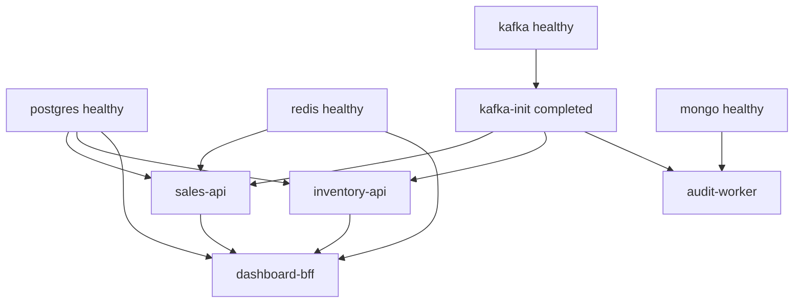

# 18. Running & Deployment

## Purpose

How to get the whole system up, what the compose stack actually does, and what would need to change before this ran anywhere real.

## The full stack

```bash
sudo docker compose -f docker/docker-compose.yml up -d --build
sudo docker compose -f docker/docker-compose.yml ps
```

Restarting just the observability half (it is the memory-hungry part):

```bash
sudo docker compose -f docker/docker-compose.yml stop kibana apm-server elasticsearch otel-collector
sudo docker compose -f docker/docker-compose.yml up kibana apm-server elasticsearch otel-collector -d --build
```

Fifteen services. Grouped by role:

| Group | Services |
|---|---|
| Data | `postgres`, `redis`, `mongo` |
| Messaging | `kafka`, `kafka-init` |
| Applications | `sales-api`, `inventory-api`, `dashboard-bff`, `audit-worker` |
| Logging | `seq` |
| Telemetry | `otel-collector`, `apm-server`, `elasticsearch`, `kibana`, `kibana-init` |

Every service has a `mem_limit`, because the observability stack alone will otherwise eat several gigabytes.

## Startup ordering



Two different `depends_on` conditions are used deliberately:

- `service_healthy` — the dependency must be *responding*, verified by its own healthcheck;
- `service_completed_successfully` — a one-shot job must have *finished*.

`kafka-init` is the second kind. Applications wait for topics to exist before they start, because auto-creation is disabled.

## Kafka topics come from the source

```yaml
kafka-init:
  volumes:
    - ../src/Shared/BuildingBlocks.Contracts/Messaging/KafkaTopics.cs:/opt/kafka-init/KafkaTopics.cs:ro
```

```bash
topics="$(sed -n 's/.*const string [A-Za-z0-9_]* = "\([^"]*\)".*/\1/p' "${TOPICS_SOURCE}" | sort -u)"
```

The init script mounts the C# constants file and greps the topic names out of it, then creates each with 3 partitions and replication factor 1. Adding a `KafkaTopics` constant and restarting is all that is needed — the list cannot drift from the code because there is no second list.

Auto-creation is off, on purpose:

> Topics are provisioned explicitly by kafka-init with a known partition count; do not let a consumer/producer auto-create a topic with the wrong partitioning and break aggregate ordering.

An auto-created single-partition topic would appear to work and quietly destroy the per-aggregate ordering the outbox depends on.

## Dockerfiles

Multi-stage, with a deliberate layer order:

```dockerfile
COPY src/Shared/BuildingBlocks.Contracts/BuildingBlocks.Contracts.csproj src/Shared/BuildingBlocks.Contracts/
… every csproj …
RUN --mount=type=cache,id=sales-api-nuget,target=/root/.nuget/packages,sharing=locked \
    dotnet restore src/Services/Sales/Sales.Api/Sales.Api.csproj
COPY . .
RUN … dotnet publish … --no-restore
```

Copying every `.csproj` before `COPY . .` means a source-only change reuses the cached restore layer. The BuildKit cache mount is shared across builds; `sharing=locked` prevents the three images racing on the same NuGet cache. Preserve this shape when adding a project — it is the difference between a 20-second and a 4-minute rebuild.

Runtime images: `aspnet:10.0` for APIs (plus `curl` for the healthcheck), `runtime:10.0` for the worker.

## Per-service startup work

| Service | On start |
|---|---|
| sales-api | start Kafka bus → apply migrations + seed roles and `admin` → register recurring jobs |
| inventory-api | apply migrations → start Kafka bus |
| dashboard-bff | register dashboard snapshot refresh recurring job |
| audit-worker | ping Mongo (20× 2 s) + create indexes → start Kafka bus |

Databases are created by `docker/seed/postgres-init.sql` (`sales`, `inventory`, `hangfire`, `dashboard`) on the Postgres container's first run.

Applying migrations at startup is fine for this project and **not** something to carry into production — see below.

## Running without Docker

```bash
dotnet restore Sales.sln
dotnet build Sales.sln --no-restore
dotnet run --project src/Services/Sales/Sales.Api        # :5000
dotnet run --project src/Services/Inventory/Inventory.Api
dotnet run --project src/Services/Dashboard/Dashboard.Bff # :5002
dotnet run --project src/Services/AuditLog/AuditLog.Worker
```

The default connection strings point at Docker hostnames (`postgres`, `redis`, `kafka`, `mongo`), so either run the infrastructure containers with those names resolvable or override:

```bash
export ConnectionStrings__Sales="Host=localhost;Database=sales;Username=postgres;Password=postgres"
export Kafka__Brokers__0="localhost:9094"
```

Note `9094` — that is Kafka's external listener; `9092` is only reachable inside the compose network.

## The Angular client

```bash
cd src/Web/Sales.Web
npm install
npm start          # http://localhost:4200
```

`proxy.conf.json` maps `/sales-api` → `localhost:5000` (with `ws: true`, required for the SignalR upgrade), `/inventory-api` → `localhost:5001`, and `/dashboard-api` → `localhost:5002`, stripping the prefix. That is why the client's default base URLs are relative paths and no CORS is needed in development.

## CI

`.github/workflows/ci.yml`, two jobs:

**`fast-checks`** on every push and PR — restore, build Release, `dotnet test --filter "Category!=Reliability"`, and `docker compose config` to catch a broken compose file before it reaches anyone.

**`reliability-tests`** only on `main` pushes or manual dispatch — spins up Postgres and Mongo service containers, sets `RUN_RELIABILITY_TESTS=true`, and runs `--filter "Category=Reliability"`. On failure it dumps the last 300 lines of every container's logs and uploads them as an artifact, so a flaky infrastructure test is diagnosable without a re-run.

## Verifying a change

```bash
dotnet test Sales.sln
docker compose -f docker/docker-compose.yml config
cd tests/Playwright && npm run test:audit
RUN_RELIABILITY_TESTS=true dotnet test Sales.sln
```

## What is missing for production

This stack is a local development environment. Before it ran anywhere real:

| Gap | Why it matters |
|---|---|
| Migrations applied at startup | two instances racing to migrate; no rollback plan. Use a migration job or gate. |
| `Jwt:Key` and `admin`/`Admin123!` committed | anyone can mint valid tokens |
| Replication factor 1, single broker | one node loses every message |
| No TLS/HSTS in the apps | TLS termination must exist at the edge |
| No rate limiting | trivially abusable |
| `/health` is a static string | a container reports healthy while Postgres is down |
| `xpack.security.enabled: false` on Elasticsearch | an open cluster |
| Plaintext Kafka listeners | no auth, no encryption |
| No resource requests/limits beyond `mem_limit` | no scheduler guarantees |

Tracked in [../tech/discrepancies.md](../tech/discrepancies.md).

## Common mistakes

| Mistake | Consequence |
|---|---|
| Adding a topic without restarting `kafka-init` | producers fail; auto-creation is off |
| Adding a project without adding its `.csproj` COPY line | every build restores from scratch |
| `depends_on` without a condition | the app starts before its database accepts connections |
| Using `9092` from the host | unreachable — that listener is compose-internal |
| Running the Angular client without the proxy | CORS failures and no SignalR |
| Assuming compose defaults are production-safe | see the table above |

## Related

- [../tech/configuration-and-environment.md](../tech/configuration-and-environment.md)
- [../tech/monitoring-demo.md](../tech/monitoring-demo.md)
- [17-testing-strategy.md](17-testing-strategy.md)
