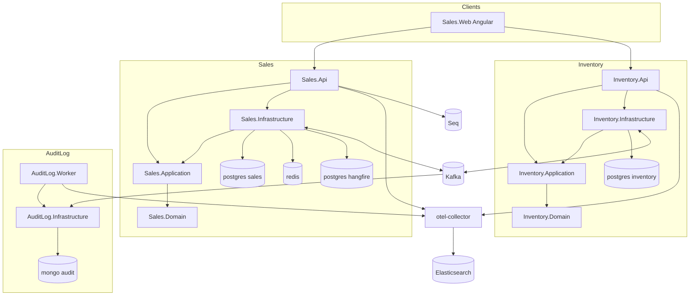

# Technical Knowledge Base

The project's encyclopedia: what exists, why it exists, where it is implemented, and what depends on it. Facts, not tutorials and not rules.

- Learning material → [../guides/](../guides/)
- Rules for generated code → [../project/](../project/)
- Known gaps between docs and code → [discrepancies.md](discrepancies.md)

## Business

| Document | Covers |
|---|---|
| [business/order-lifecycle.md](business/order-lifecycle.md) | order states, transitions, the confirmation saga, expiration |
| [business/inventory-lifecycle.md](business/inventory-lifecycle.md) | inventory items, reservations, staleness, reserve/release flows |
| [business/catalog-rules.md](business/catalog-rules.md) | category, product, and variant rules; codes; orderability |
| [business/customer-rules.md](business/customer-rules.md) | customer status machine, phone normalization and search |
| [business/stock-rules.md](business/stock-rules.md) | stock invariants and accounting |
| [business/pricing-rules.md](business/pricing-rules.md) | `Money`, line totals, what does not exist |
| [business/validation-rules.md](business/validation-rules.md) | every validator and every non-FluentValidation guarantee |

## API

| Document | Covers |
|---|---|
| [api-conventions.md](api-conventions.md) | middleware order, envelopes, correlation, ETags, paging |
| [api-endpoints.md](api-endpoints.md) | every endpoint with its roles, parameters, and responses |
| [exception-and-error-catalog.md](exception-and-error-catalog.md) | the exception hierarchy, error codes, HTTP mapping |

## Messaging

| Document | Covers |
|---|---|
| [messaging-conventions.md](messaging-conventions.md) | producing, consuming, delivery guarantees, outcome strings |
| [kafka-topics-and-schemas.md](kafka-topics-and-schemas.md) | topics, groups, envelope, payload schemas, versioning |
| [outbox-inbox-schema.md](outbox-inbox-schema.md) | table columns, publish cycle, consume paths, re-drive |
| [retry-and-dead-letter.md](retry-and-dead-letter.md) | backoff, dead-letter semantics, manual recovery |
| [audit-logging.md](audit-logging.md) | the hybrid audit pipeline into MongoDB |

## Data

| Document | Covers |
|---|---|
| [database-conventions.md](database-conventions.md) | stores, mapping conventions, indexes, transactions, sequences |
| [database-schema.md](database-schema.md) | tables, columns, relationships, the Mongo document |
| [cache-conventions.md](cache-conventions.md) | what is cached, keys, TTL, invalidation, the lock |

## Platform

| Document | Covers |
|---|---|
| [dependency-injection-map.md](dependency-injection-map.md) | every registration by host, with lifetimes |
| [configuration-and-environment.md](configuration-and-environment.md) | every key, every environment variable, every port |
| [background-jobs.md](background-jobs.md) | Hangfire jobs, hosted services, startup tasks |
| [concurrency-and-idempotency.md](concurrency-and-idempotency.md) | ETags, serializable transactions, inbox, staleness, correlation |
| [security.md](security.md) | tokens, roles, secrets, data protection, transport |
| [logging-and-observability-strategy.md](logging-and-observability-strategy.md) | sinks, tracing, metrics, standard property names |
| [monitoring-demo.md](monitoring-demo.md) | running the observability stack and following a request |
| [reliability-tests.md](reliability-tests.md) | the gated suite and what it proves |
| [frontend-map.md](frontend-map.md) | Angular routes, core services, features, contracts |

## Orientation

| Document | Covers |
|---|---|
| [code-map.md](code-map.md) | folder map and the main runtime flows |
| [architecture-checklist.md](architecture-checklist.md) | per-project architecture status, updated as the structure evolves |
| [patterns-guide.md](patterns-guide.md) | each pattern, how this project declares and uses it |
| [glossary.md](glossary.md) | short definitions of the recurring terms |
| [requirements-map.md](requirements-map.md) | original exercise requirements against the implementation |
| [review-notes.md](review-notes.md) | review findings: what is solid, what needs watching |
| [discrepancies.md](discrepancies.md) | **known gaps between documentation, design intent, and code** |

## Architecture in one picture

## Keeping this current

Whenever documentation and code disagree, the code wins. Fix the document in the same change, and record anything that cannot be fixed immediately in [discrepancies.md](discrepancies.md).
