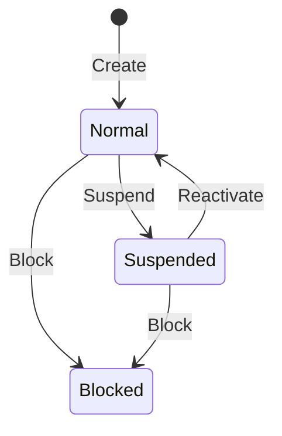

# Customer Rules

## Aggregate

`Sales.Domain.Aggregates.Customer`, root, soft-deletable, versioned.

| Property | Notes |
|---|---|
| `CustomerCode` | backend-assigned `CUS###` from `customer_code_seq` |
| `Name` | required, trimmed, max 200 |
| `Phone` | required, trimmed, stored as entered (max 32) |
| `NormalizedPhone` | digits only, 9–15, max 15, unique excluding soft-deleted |
| `ReversedPhone` | `NormalizedPhone` reversed, indexed for suffix search |
| `Email` | optional, trimmed, max 254 |
| `Address` | optional, trimmed, max 500 |
| `Status` | `Normal` / `Suspended` / `Blocked` (`ECustomerStatus`) |

## Status machine

| Rule | Where |
|---|---|
| A new customer starts `Normal` | `Customer` constructor |
| Only `Normal` can be suspended | `Customer.Suspend` |
| Only `Normal` or `Suspended` can be blocked | `Customer.Block` |
| Only `Suspended` can be reactivated | `Customer.Reactivate` — a blocked customer is terminal |
| Setting the status a customer already has is a no-op | each transition returns early |
| Deleted customers cannot be changed | `Customer.EnsureNotDeleted` |
| Only `Normal` customers can create orders | `CreateOrderHandler` |

`UpdateCustomerStatusHandler` parses the status string case-insensitively and routes to the right transition; an unparsable or illegal value throws `DomainException`.

## Phone normalization and search

`Customer.NormalizePhone` strips every non-digit and requires 9–15 digits, otherwise `DomainException("Phone must contain 9 to 15 digits.")`.

Two persisted forms support search without a full scan:

- prefix search → `NormalizedPhone.StartsWith(digits)`
- suffix search → `ReversedPhone.StartsWith(reverse(digits))`

`GET /api/customers?phone=…` applies both at once — a customer matches when its number starts with **or** ends with the digits entered (`CustomerReadService.SearchAsync`), so the caller never picks a match mode. Name search uses `EF.Functions.ILike` against a `gin_trgm_ops` index.

`ReversedPhone` is excluded from audit output as a technical field.

## Update semantics

`Customer.Update(name, phone, email, address)` always re-applies all four values, but only calls `Touch()` and raises `CustomerUpdatedDomainEvent` when `Name` or `Phone` actually changed. An email/address-only edit therefore does not bump the version — see [../discrepancies.md](../discrepancies.md).

## Soft delete

`Delete(deleteByUser)` is idempotent, sets `IsDelete`, `DeleteByUser`, `DeletedBy`, `DeletedAt`, and touches the aggregate. Actor defaults to `"system"` when blank. Deleted rows are hidden by the global query filter and released from the unique `CustomerCode` and `NormalizedPhone` indexes.

## Domain events

- `CustomerCreatedDomainEvent(CustomerId, Name, Phone)`
- `CustomerUpdatedDomainEvent(CustomerId, OldName, OldPhone, NewName, NewPhone)`

Neither is mapped to Kafka by `DomainEventMapper`. Customer changes reach the audit trail through the EF `ChangeTracker` audit pipeline instead. `Phone` and `Email` values are masked in audit output.

## Order snapshots

`CustomerSnapshot.Create(id, name, phone)` validates and normalizes, and the resulting name/phone are copied onto the order. Renaming a customer never rewrites an existing order.

## Code references

`Sales.Domain/Aggregates/Customer.cs`, `Sales.Application/Features/Customers/`, `Sales.Infrastructure/Persistence/Configurations/CustomerConfiguration.cs`, `Sales.Infrastructure/Persistence/ReadServices/CustomerReadService.cs`.

## Related

- [order-lifecycle.md](order-lifecycle.md)
- [validation-rules.md](validation-rules.md)
