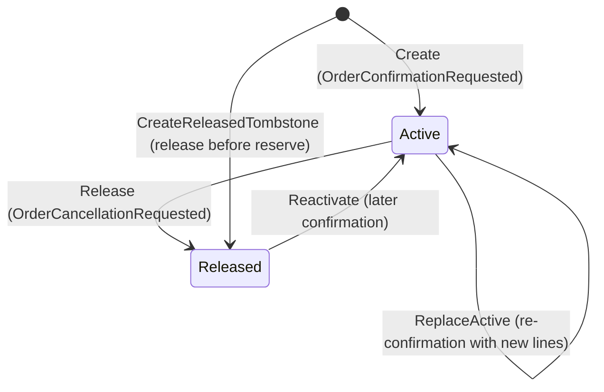

# Inventory & Reservation Lifecycle

## What exists

Two persisted concepts in the Inventory context:

- `InventoryItem` — stock for one product variant, keyed by `ProductId`. A plain `IEntity<Guid>`, not an aggregate root.
- `Reservation` — an aggregate root recording that stock is held for one Sales order, owning `ReservationLine` children.

`ProductId` in Inventory carries the Sales **product variant** id. The contract field kept the name `ProductId` for v1 compatibility (`OrderLineIntegration`).

## InventoryItem

| Property | Meaning |
|---|---|
| `ProductId` | primary key; the variant being tracked |
| `Sku` | normalized (trimmed, upper-cased) |
| `Available` | free to reserve |
| `Reserved` | held against active reservations |
| `Version` | optimistic concurrency token, incremented on every mutation |

Rules (`Inventory.Domain/Entities/InventoryItem.cs`):

- `Create` rejects a negative initial quantity.
- `Adjust(delta)` rejects any delta that would make `Available` negative.
- `Reserve(qty)` requires `qty > 0` and `Available >= qty`; moves Available → Reserved. Failure message: `Insufficient stock for {Sku}.`
- `Release(qty)` requires `qty > 0` and `Reserved >= qty`; moves Reserved → Available.
- **Available can never go negative.** That is the core invariant.

`InventoryItem` is excluded from audit generation (`options.IgnoreEntity<InventoryItem>()`); adjustments emit an explicit business audit event instead.

## Reservation states

| Status | Meaning |
|---|---|
| `Active` | holds stock for the order |
| `Released` | stock returned to available |

## Staleness guard

`Reservation.LastOrderVersion` holds the highest Sales order version applied. `IsStale(orderVersion) => orderVersion <= LastOrderVersion`.

Every version-carrying transition consults it, and callers consult the same method before mutating `InventoryItem`s, so the two can never disagree. This is how out-of-order delivery across two Kafka topics is handled — not timestamps.

### Release-before-reserve

If a release arrives for an order with no reservation (the undo event overtook the confirmation event), `CreateReleasedTombstone(orderId, orderVersion)` writes a line-less `Released` reservation carrying the version. Consequences:

- A delayed, older `Reserve` is rejected as stale — stock is not held for an already-cancelled order.
- A genuinely newer confirmation can still `Reactivate` the reservation.

Covered by `Inventory.Tests/ReleaseBeforeReserveTests.cs` and `Inventory.Infrastructure.Tests/ReleaseBeforeReservePostgresTests.cs`.

## Reserve flow

`ReserveStockCommandHandler`, triggered by `sales.order-confirmation-requested.v1`.

1. Load the existing reservation for the order.
2. If it is `Active` → `ReplaceActive` path: compute per-line deltas, reserve/release the difference, release removed lines. Returns `ReservedAcknowledged`, or `AlreadyReserved` when stale.
3. If it exists and is stale → return `stale_reservation`.
4. Load items for the requested variants. If **any** line is missing an item or has `Available < Quantity`, reject the **whole** request: publish `StockRejected` with `Insufficient stock for {sku}.` and return `Rejected`. Partial reservation never happens.
5. Otherwise reserve each line, create or reactivate the reservation, publish `StockReserved`, return `Reserved`.

## Release flow

`ReleaseStockCommandHandler`, triggered by `sales.order-undo-confirmation-requested.v1`.

| Situation | Outcome |
|---|---|
| No reservation | write tombstone, return `ReleasedBeforeReserve` |
| Already `Released` | `AlreadyReleased`, no change |
| Stale version | `StaleRelease`, no change |
| Otherwise | release every line's quantity, mark released, publish `StockReleased`, return `Released` |

These outcome strings are asserted by tests and appear in consume logs — renaming one is a breaking change.

## Manual adjustment

`POST /api/inventory/{productId}/adjust` (`Admin`, `Warehouse`) → `AdjustInventoryCommand`. Creates the item when absent, otherwise applies the signed delta. Emits an `InventoryItemAdjusted` audit event with `QuantityDelta` and resulting `Available`, and returns the new snapshot.

## Transactions and idempotency

Every Inventory command runs inside a `Serializable` transaction opened by `InventoryTransactionBehavior`:

1. Non-transactional pre-check `inbox.HasBeenProcessedAsync(eventId)` — lets duplicates return early without opening a transaction.
2. Open the serializable transaction.
3. Authoritative `inbox.TryRecordAsync(eventId)`; a duplicate rolls back and returns the command's `DuplicateResponse`.
4. Run the handler.
5. `SaveChangesAsync`, then commit.
6. Any failure rolls back and rethrows.

Handlers never commit. Serialization failures surface as `409 concurrency_conflict` with `retryable=True`.

## Metrics

`inventory.reservation.reserved`, `inventory.reservation.rejected`, plus the shared inbox/outbox counters and gauges.

## Code references

| Concern | File |
|---|---|
| Stock invariants | `Inventory.Domain/Entities/InventoryItem.cs` |
| Reservation aggregate | `Inventory.Domain/Aggregates/Reservation.cs` |
| Reserve / release | `Inventory.Application/Features/Reservations/Commands/` |
| Transaction + inbox | `Inventory.Application/Common/Behaviors/InventoryTransactionBehavior.cs` |
| Event → command | `Inventory.Infrastructure/Kafka/InventoryIntegrationEventProcessor.cs` |
| Reply publishing | `Inventory.Infrastructure/Kafka/InventoryEventOutbox.cs` |

## Related

- [order-lifecycle.md](order-lifecycle.md)
- [stock-rules.md](stock-rules.md)
- [../concurrency-and-idempotency.md](../concurrency-and-idempotency.md)
