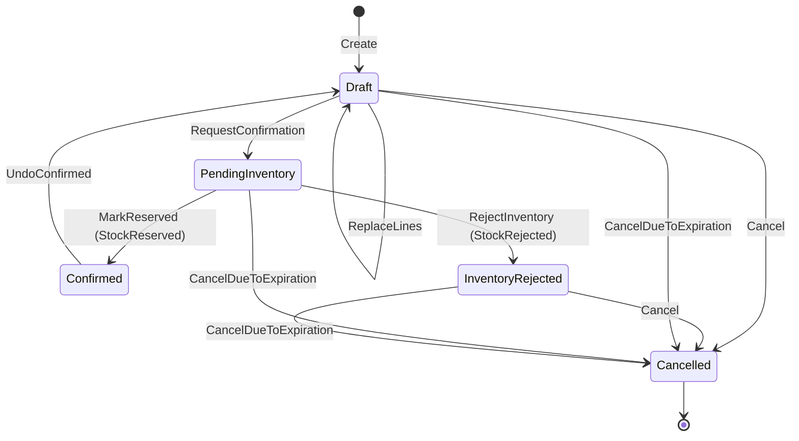
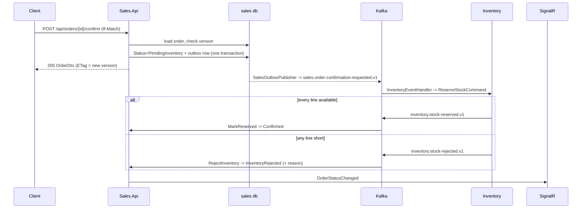

# Order Lifecycle

## What exists

`Sales.Domain.Order` is the aggregate root that owns `OrderLine` children, the status machine, and the totals. Its status enum is `OrderStatus` (`Sales.Domain/ValueObjects/OrderStatus.cs`).

## States

| Status | Meaning |
|---|---|
| `Draft` | created, editable, confirmation not requested |
| `PendingInventory` | confirmation requested, waiting for Inventory |
| `Confirmed` | Inventory reserved stock for every line |
| `InventoryRejected` | Inventory could not reserve (insufficient stock) |
| `Cancelled` | terminal |

## Transitions

## Rules

| Rule | Where |
|---|---|
| An order needs at least one line | `Order.SetLines` |
| A product variant may appear only once in an order | `Order.SetLines`, `OrderValidationRules.HaveUniqueProducts` |
| Only a `Draft` order can be edited | `Order.EnsureDraft` (via `ReplaceLines`, `RequestConfirmation`) |
| Only a `PendingInventory` order can be reserved or rejected | `Order.MarkReserved`, `Order.RejectInventory` |
| `Confirmed` and `PendingInventory` orders cannot be cancelled | `Order.Cancel` |
| Only a `Confirmed` order can be undone | `Order.UndoConfirmed` |
| An order confirmed with a discontinued (sell-through) variant cannot be undone | `Order.UndoConfirmed` — reversing would re-reserve stock for a variant that can no longer be sold |
| Only customers in `Normal` status can create an order | `CreateOrderHandler` |
| Line products must still be orderable at confirmation time | `OrderCommandSupport.EnsureOrderLinesCanStillBeOrdered` |
| Quantity > 0, discount 0–100 | `OrderLine.Validate`, `OrderLineInputValidator` |
| Every mutation requires the caller's expected version | `OrderCommandSupport.LoadAndCheck` → `ConflictException` |

## Line snapshots

An `OrderLine` stores a point-in-time copy of the product variant: `ProductId`, `ProductVariantId`, `ProductCode`, `Sku`, `ProductName`, `ColorCode`, `ColorName`, `SizeCode`, `UnitPrice`, `IsSellThroughDiscontinued`. Later catalog changes never rewrite a placed order. The snapshot is built by `ProductSnapshot.Create` in `OrderCommandSupport.Materialize`.

## Totals

- `OrderLine.LineTotal = Money.Vnd(UnitPrice.Amount * Quantity * (1 - DiscountPercent / 100))`
- `Order.Total` = sum of line totals; `Order.TotalQuantity` = sum of quantities.
- Both are computed, `Ignore`d by EF, and never persisted.
- See [pricing-rules.md](pricing-rules.md).

## Confirmation saga

Undo-confirm follows the same shape via `sales.order-undo-confirmation-requested.v1` → `ReleaseStockCommand` → `inventory.stock-released.v1`. `StockReleased` is recorded by Sales but does not change the order status — the status already moved to `Draft` when the undo was accepted.

## Expiration

`CancelExpiredPendingOrders` (Hangfire, `orders:cancel-expired`, every 5 minutes by default):

- Scans `Draft`, `PendingInventory`, `InventoryRejected` orders whose `UpdatedAt <= now - ExpirationMinutes` (default 30), batch clamped to 1000.
- Each order is cancelled in its own scope; a failure logs and continues.
- Cancelling a `PendingInventory` order raises `OrderUndoComfirmedDomainEvent` so Inventory releases the reservation.
- Emits a realtime notification per cancelled order, best-effort.
- Metrics: `sales.orders.expiration.{scanned,cancelled,skipped,failed,duration}`.

## Code references

| Concern | File |
|---|---|
| Aggregate | `src/Services/Sales/Sales.Domain/Aggregates/Order.cs` |
| Line entity | `src/Services/Sales/Sales.Domain/Entities/OrderLine.cs` |
| Commands | `Sales.Application/Features/Orders/Commands/` |
| Shared command logic | `Features/Orders/Commands/OrderCommandSupport.cs` |
| Inventory reply handling | `Sales.Infrastructure/Kafka/SalesInventoryEventProcessor.cs` |
| Expiration job | `Sales.Infrastructure/Hangfire/Jobs/CancelExpiredPendingOrdersJob.cs` |

## Related

- [inventory-lifecycle.md](inventory-lifecycle.md)
- [pricing-rules.md](pricing-rules.md)
- [../concurrency-and-idempotency.md](../concurrency-and-idempotency.md)
