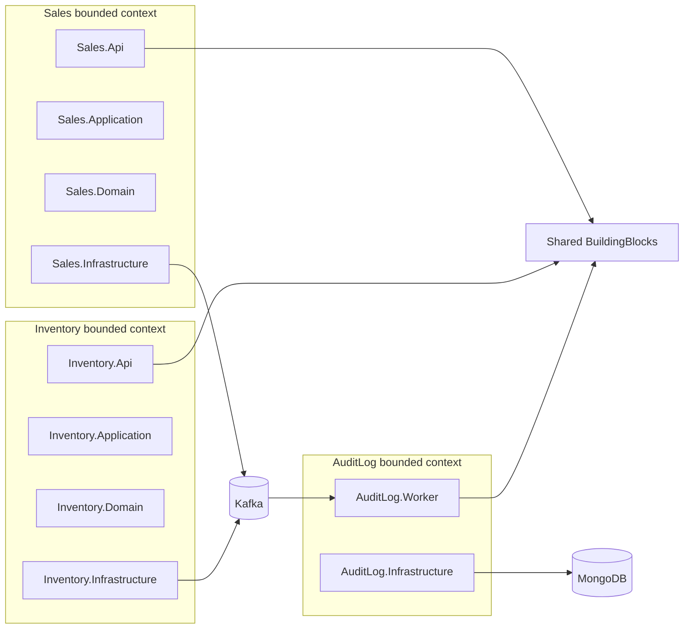
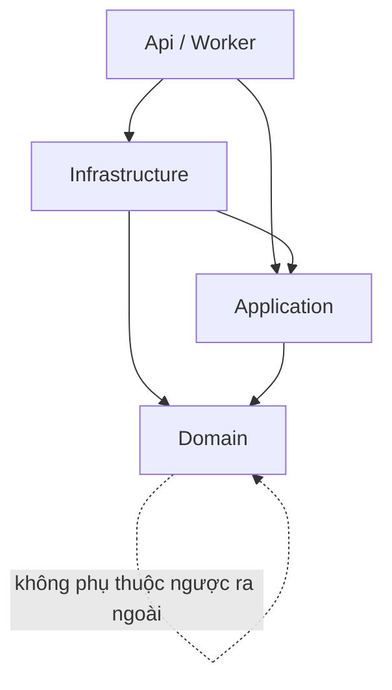

# Bản đồ code và các luồng chính

Tài liệu này giúp bạn tìm code nhanh theo tính năng và hiểu luồng chạy chính của hệ thống.

## 1. Thư mục tổng quan

```text
src/
  Services/
    Sales/
      Sales.Api/              HTTP API, controllers, auth, middleware
      Sales.Application/      commands, queries, DTO, validators, ports
      Sales.Domain/           aggregates, entities, value objects, domain events
      Sales.Infrastructure/   EF Core, repositories, Kafka, Redis, Hangfire
    Inventory/
      Inventory.Api/          HTTP API cho tồn kho
      Inventory.Application/  service ports, DTO
      Inventory.Domain/       inventory item, reservation, value objects
      Inventory.Infrastructure/ EF Core, Kafka, outbox/inbox
    AuditLog/
      AuditLog.Worker/        worker consume Kafka
      AuditLog.Infrastructure/ Mongo writer, audit document
  Shared/
    BuildingBlocks.Domain/
    BuildingBlocks.Application/
    BuildingBlocks.Contracts/
    BuildingBlocks.Infrastructure/
    BuildingBlocks.Web/
```

Mô hình bounded context:



## 2. Layer nào làm việc gì?

Mô hình dependency rule:



### Api/Worker

Trách nhiệm:

- Nhận request HTTP hoặc start worker.
- Cấu hình DI, middleware, auth, Swagger, startup tasks.
- Gọi Application layer hoặc Infrastructure service qua interface.

Không nên:

- Chứa business rule.
- Query DbContext trực tiếp cho use case nghiệp vụ.
- Publish Kafka trực tiếp.

### Application

Trách nhiệm:

- Định nghĩa command/query.
- Validate request.
- Điều phối use case: load aggregate, gọi method domain, commit Unit of Work.
- Định nghĩa port/interface để Infrastructure implement.

Không nên:

- Reference EF Core, Kafka, Redis, HTTP.
- Chứa SQL query.

### Domain

Trách nhiệm:

- Business rule.
- Aggregate, entity, value object.
- Domain events.

Không nên:

- Reference Application/Infrastructure.
- Biết database table hoặc Kafka topic.

### Infrastructure

Trách nhiệm:

- EF Core DbContext, configurations, migrations.
- Repository implementations.
- Kafka producer/consumer.
- Redis cache.
- Hangfire jobs.
- Mongo writer.

## 3. Flow: tạo sản phẩm

```text
HTTP POST /api/products
  -> ProductsController
  -> MediatR Send(CreateProduct)
  -> CreateProductHandler
  -> Product.Create(...)
  -> ProductRepository/Add
  -> UnitOfWork.SaveChangesAsync
  -> SalesDbContext.SaveChangesAsync
  -> enqueue Sales audit event vào outbox
  -> SalesOutboxPublisher publish Kafka
  -> AuditLog.Worker consume
  -> MongoAuditWriter upsert vào MongoDB
```

File liên quan:

- `Sales.Api/Controllers/ProductsController.cs`
- `Sales.Application/Commands/Products/CreateProduct.cs`
- `Sales.Application/Commands/Products/CreateProductHandler.cs`
- `Sales.Domain/Aggregates/Product.cs`
- `Sales.Infrastructure/Persistence/DbContexts/SalesDbContext.cs`
- `Sales.Infrastructure/Kafka/SalesOutboxPublisher.cs`
- `AuditLog.Infrastructure/Mongo/MongoAuditWriter.cs`

## 4. Flow: search sản phẩm

```text
HTTP GET /api/products?name=abc
  -> ProductsController
  -> MediatR Send(SearchProducts)
  -> SearchProductsHandler
  -> IProductReadService.SearchAsync
  -> ProductReadService query EF Core
  -> PagedResult<ProductDto>
```

Lưu ý:

- Search là Query, không dùng aggregate behavior.
- Search dùng read service, không dùng repository command-side.
- `GetById` có cache decorator, search không cache.

## 5. Flow: tạo đơn hàng

```text
HTTP POST /api/orders
  -> OrdersController
  -> CreateOrderHandler
  -> load Customer
  -> materialize ProductSnapshot từ product ids
  -> Order.Create(customerSnapshot, lines)
  -> repository add order
  -> UnitOfWork.SaveChangesAsync
  -> SalesDbContext enqueue audit event
  -> response có ETag = order version
```

File liên quan:

- `Sales.Api/Controllers/OrdersController.cs`
- `Sales.Application/Commands/Orders/CreateOrder.cs`
- `Sales.Application/Commands/Orders/CreateOrderHandler.cs`
- `Sales.Application/Commands/Orders/OrderCommandSupport.cs`
- `Sales.Domain/Aggregates/Order.cs`
- `Sales.Domain/Entities/OrderLine.cs`

## 6. Flow: sửa line đơn hàng có concurrency

```text
Client đọc order
  -> response có ETag: "1"

Client PUT /api/orders/{id}/lines
  Header: If-Match: "1"
  -> OrdersController.RequireVersion()
  -> ReplaceOrderLines command có ExpectedVersion = 1
  -> handler LoadAndCheck(orderId, expectedVersion)
  -> Order.ReplaceLines(...)
  -> SaveChanges
  -> nếu version trong DB đã đổi: 409 Conflict
  -> nếu thành công: response ETag mới
```

File liên quan:

- `Sales.Api/Extensions/ControllerEtagExtensions.cs`
- `Sales.Application/Commands/Orders/ReplaceOrderLines.cs`
- `Sales.Application/Commands/Orders/ReplaceOrderLinesHandler.cs`
- `Sales.Application/Commands/Orders/OrderCommandSupport.cs`
- `Sales.Infrastructure/Persistence/Configurations/OrderConfiguration.cs`

## 7. Flow: confirm đơn hàng và reserve stock

```text
Client POST /api/orders/{id}/confirm
  Header: If-Match: current version
  -> ConfirmOrderHandler
  -> Order.RequestConfirmation()
  -> Order raises OrderConfirmationRequestedDomainEvent
  -> SaveChanges
  -> SalesDbContext map domain event thành integration event
  -> ghi row vào Sales outbox
  -> SalesOutboxPublisher publish Kafka topic sales.order-confirmation-requested.v1
  -> Inventory consumer nhận event
  -> insert Inventory inbox
  -> reserve stock hoặc reject
  -> ghi Inventory outbox reply
  -> InventoryOutboxPublisher publish StockReserved/StockRejected
  -> Sales consumer nhận reply
  -> Sales update order status Confirmed hoặc InventoryRejected
  -> AuditLog.Worker consume events và ghi MongoDB
```

File liên quan:

- `Sales.Application/Commands/Orders/ConfirmOrderHandler.cs`
- `Sales.Domain/Aggregates/Order.cs`
- `Sales.Infrastructure/Kafka/DomainEventMapper.cs`
- `Sales.Infrastructure/Persistence/DbContexts/SalesDbContext.cs`
- `Inventory.Infrastructure/Kafka/InventoryIntegrationEventProcessor.cs`
- `Inventory.Application/Commands/ReserveStock/ReserveStockCommandHandler.cs`
- `Inventory.Application/Commands/ReleaseStock/ReleaseStockCommandHandler.cs`
- `Inventory.Domain/Entities/InventoryItem.cs`
- `Inventory.Domain/Aggregates/Reservation.cs`
- `Sales.Infrastructure/Kafka/SalesInventoryEventProcessor.cs`

## 8. Flow: AuditLog

```text
Any service publishes EventEnvelope
  -> Kafka topic
  -> AuditLog.Worker consumer
  -> AuditEventHandler
  -> MongoAuditWriter.UpsertAsync
  -> Mongo collection events
```

File liên quan:

- `AuditLog.Worker/DependencyInjection.cs`
- `AuditLog.Infrastructure/Mongo/AuditEventHandler.cs`
- `AuditLog.Infrastructure/Mongo/MongoAuditWriter.cs`
- `AuditLog.Infrastructure/Mongo/AuditDocument.cs`

## 9. Flow: Outbox publish

```text
Business transaction writes outbox row
  -> OutboxPublisherService polling/signaled
  -> claim rows bằng LockId/LockedUntil
  -> KafkaOutboxPublisher publish
  -> nếu Kafka ack: mark ProcessedAt
  -> nếu fail: Attempts++, NextAttemptAt backoff
  -> fail quá nhiều lần: DeadLetteredAt
```

File liên quan:

- `BuildingBlocks.Infrastructure/Outbox/OutboxPublisherService.cs`
- `BuildingBlocks.Infrastructure/Outbox/OutboxMessage.cs`
- `BuildingBlocks.Infrastructure/Kafka/KafkaOutboxPublisher.cs`
- `Sales.Infrastructure/Kafka/SalesOutboxPublisher.cs`
- `Inventory.Infrastructure/Kafka/InventoryOutboxPublisher.cs`

## 10. Flow: Inbox consume

```text
Kafka consumer receives event
  -> begin transaction
  -> insert EventId vào inbox
  -> unique violation: duplicate, skip
  -> apply business change
  -> save changes
  -> commit transaction
```

File liên quan:

- `Sales.Infrastructure/Kafka/SalesInventoryEventProcessor.cs`
- `Inventory.Infrastructure/Kafka/InventoryIntegrationEventProcessor.cs`
- `Inventory.Application/Commands/ReserveStock/ReserveStockCommandHandler.cs`
- `Inventory.Application/Commands/ReleaseStock/ReleaseStockCommandHandler.cs`
- `Sales.Infrastructure/Persistence/Inbox/InboxMessage.cs`
- `Inventory.Infrastructure/Persistence/Inbox/InboxRow.cs`

## 11. Checklist khi thêm tính năng mới

Nếu tính năng ghi dữ liệu Sales:

1. Thêm/sửa method trong aggregate Domain nếu có rule mới.
2. Thêm command record trong `Sales.Application/Commands/<Aggregate>/`.
3. Thêm validator.
4. Thêm handler.
5. Nếu cần DB access đặc thù, thêm repository method/interface.
6. Thêm endpoint controller.
7. Thêm test domain/application/infrastructure nếu có rủi ro.

Nếu tính năng đọc/search Sales:

1. Thêm query record.
2. Thêm query handler.
3. Thêm read service port nếu cần.
4. Implement query trong Infrastructure read service.
5. Thêm endpoint controller.
6. Thêm paging.

Nếu thêm event liên service:

1. Thêm contract trong `BuildingBlocks.Contracts/IntegrationEvents`.
2. Thêm topic trong `KafkaTopics`.
3. Thêm consumer group trong `KafkaConsumerGroups` nếu cần.
4. Map domain event sang integration event trong Infrastructure.
5. Publish qua Outbox.
6. Consumer xử lý idempotent qua Inbox.
7. Thêm AuditLog topic subscription nếu cần audit.
