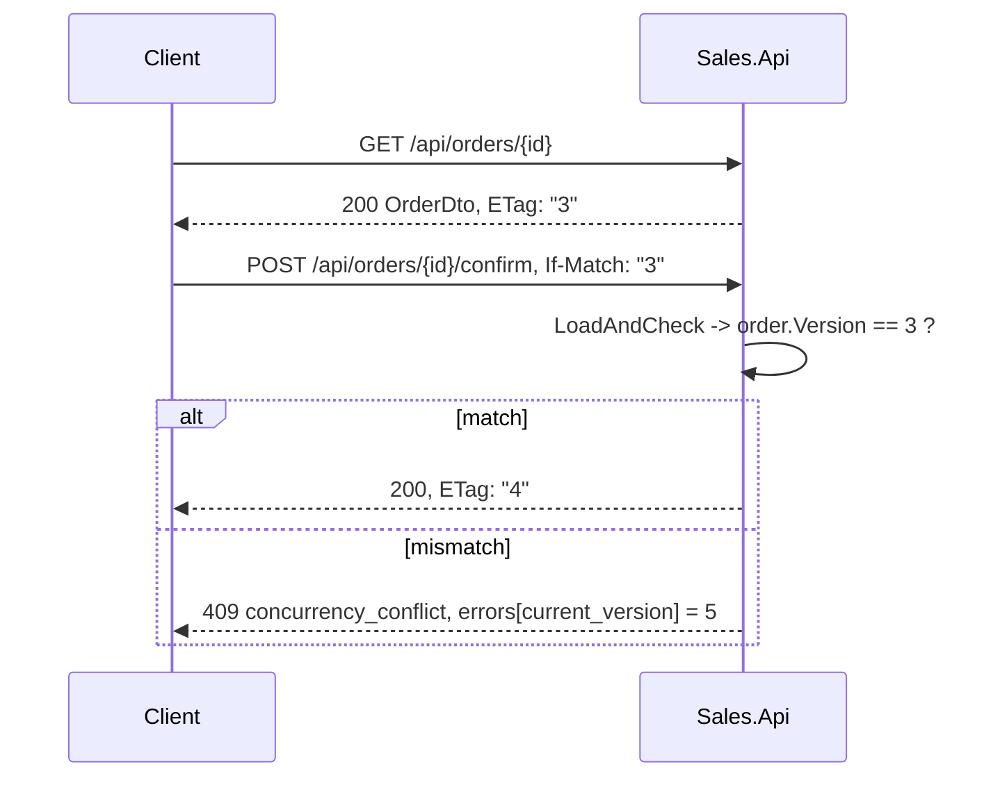

# Concurrency, Idempotency & Correlation

## Optimistic concurrency (HTTP)

- `AggregateRoot.Version` starts at 1 and is incremented by `Touch()` on every mutation.
- It is mapped as the EF concurrency token, so a lost update also fails at the database level.
- `ControllerEtagExtensions.SetEtag` writes it as the `ETag`; `RequireVersion()` reads `If-Match` and throws `BadHttpRequestException(428)` when it is missing or non-numeric.
- `OrderCommandSupport.LoadAndCheck` compares and throws `ConflictException(currentVersion)`.
- Clients must reload on 409. Never auto-retry with a stale ETag.

Currently enforced on the four mutating order endpoints. Product, customer, and category DTOs carry `Version` and set an `ETag`, but their write endpoints do not require `If-Match` — see [discrepancies.md](discrepancies.md).

## Pessimistic / serializable concurrency (Inventory)

Every Inventory command runs in `IsolationLevel.Serializable` (`InventoryTransactionManager`). Two concurrent reservations for the same item cannot both observe the same `Available`; the loser gets a Postgres serialization failure, classified as `409 concurrency_conflict` with `retryable=True`. Two concurrent adjustments for a not-yet-existing item collide on the primary key and produce `409 unique_violation` with `retryable=False`.

## Message idempotency

The inbox table's primary key **is** the idempotency mechanism.

| Side | Barrier |
|---|---|
| Sales | insert the inbox row inside the same explicit transaction as the order transition; a unique violation means "already applied" |
| Inventory | cheap `HasBeenProcessedAsync` pre-check, then the authoritative `TryRecordAsync` insert inside the serializable transaction |

A duplicate returns the command's `DuplicateResponse` and mutates nothing, counting `<service>.inbox.duplicate`.

Audit writes are idempotent through a different mechanism: MongoDB upserts keyed on the unique `AuditId`.

## Out-of-order delivery

Ordering is guaranteed only *within* a partition, and the confirmation and undo flows travel on **different topics**. `Reservation.LastOrderVersion` + `IsStale(orderVersion)` is the guard:

- a reserve carrying a version ≤ the last applied version is ignored
- a release for a reservation that does not exist writes a `Released` tombstone carrying its version, so a delayed older reserve is rejected while a genuinely newer confirmation can still reactivate

This is a version comparison, never a timestamp comparison. Clock skew is not a factor.

## Distributed coordination

| Need | Mechanism |
|---|---|
| One publisher instance per outbox row | lease columns `LockId` + `LockedUntil` (30 s), claimed with `ExecuteUpdateAsync` |
| One Sales cleanup run | Redis `SET NX PX` + Lua compare-and-delete release |
| One Inventory cleanup run | `pg_try_advisory_xact_lock` inside the cleanup transaction |
| Unique business codes across instances | Postgres sequence `nextval` |

Locks are optimisations. Every operation under one is safe to run twice.

## Correlation and causation

| Id | Meaning | Source |
|---|---|---|
| `TraceId` | W3C trace, per hop | `Activity.Current.TraceId` |
| `CorrelationId` | business workflow, constant across hops | `X-Correlation-Id` header, else the trace id |
| `CausationId` | the event that caused this one | the triggering `EventId` |
| `EventId` | this event | `EventEnvelopeFactory` |
| `AuditId` | this audit record | `EfCoreAuditEntryFactory` |

- HTTP: `RequestObservabilityMiddleware` pushes trace/correlation onto the log context and the request summary.
- Kafka: `CorrelationId` and `CausationId` ride inside the `EventEnvelope`; `traceparent`/`tracestate` ride in headers so the consume span continues the producer's trace.
- Inventory replies set `CausationId = request.EventId`, giving a causal chain from the HTTP request through confirmation to the reply.
- `HttpExecutionContext.CorrelationId` parses the trace id as a GUID and falls back to a new GUID when it does not parse — a 32-hex trace id does parse, so this normally carries the trace.

## Realtime consistency

SignalR notifications are best-effort and always sent **after** the transaction commits (`NotifyOrderStatusChangedAfterCommit`, `NotifyOrderCancelledAfterSave`). A failed notification logs a warning and never fails the operation. Clients treat a notification as a hint to re-read, not as data.

## Related

- [outbox-inbox-schema.md](outbox-inbox-schema.md)
- [business/inventory-lifecycle.md](business/inventory-lifecycle.md)
- [reliability-tests.md](reliability-tests.md)
