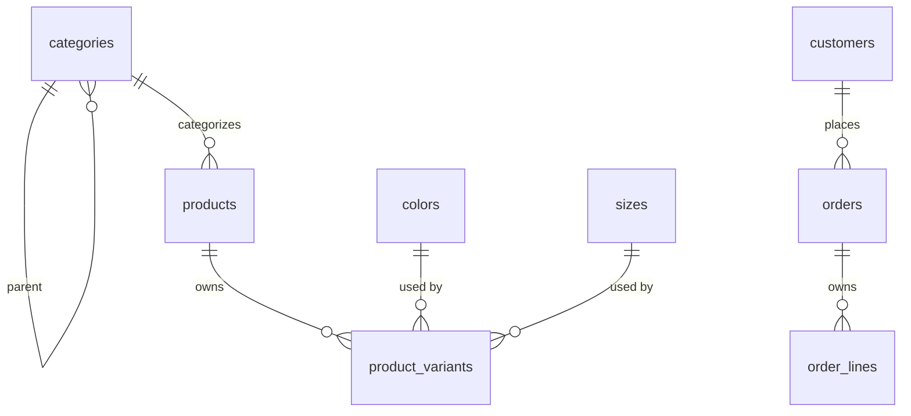
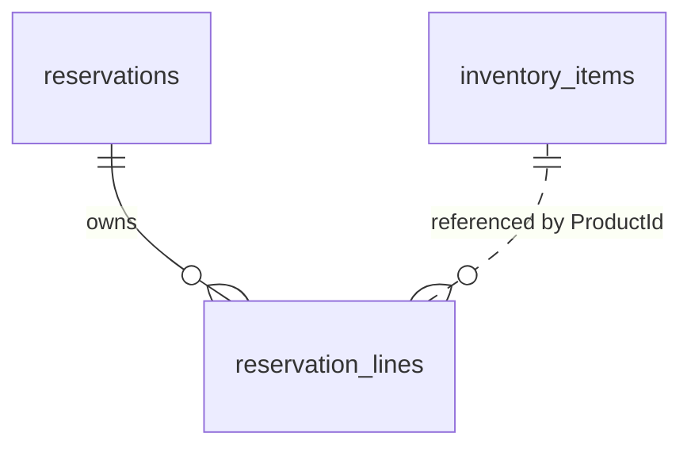

# Database Schema

Logical model of the two relational stores. Column lists are the domain-meaningful ones; audit/soft-delete columns are summarised.

## Sales

### `categories`
`Id` PK · `CategoryCode` · `Name` · `Description?` · `ParentCategoryId?` · `SortOrder` · `Status` · `CreatedAt` · `CreatedBy?` · `UpdatedBy?` · `Version` · `UpdatedAt` · soft-delete set

### `products`
`Id` PK · `ProductCode` · `Name` · `Description?` · `CategoryId` FK · `Status` · `CreatedAt` · audit columns · `Version` · `UpdatedAt` · soft-delete set

### `product_variants`
`Id` PK (never generated by the DB) · `ProductId` FK · `ColorId` FK · `SizeId` FK · `Sku` · `Price numeric(18,0)` · `Status` · `CreatedAt` · `UpdatedAt` · `Version` · soft-delete set

### `colors`
`Id` PK · `ColorCode` · `Name` · `HexCode?` — 5 seeded rows

### `sizes`
`Id` PK · `Code` · `Name` · `SortOrder` — 8 seeded rows

### `customers`
`Id` PK · `CustomerCode` · `Name` · `Phone` · `NormalizedPhone` · `ReversedPhone` · `Email?` · `Address?` · `Status` · `CreatedAt` · audit columns · `Version` · `UpdatedAt` · soft-delete set

### `orders`
`Id` PK · `CustomerId` · `CustomerName` · `CustomerPhone` · `CreatedAt` · `Status` · `RejectionReason?` · `Version` · `UpdatedAt`

`CustomerId` is **not** a foreign key — the customer identity is a snapshot, deliberately decoupled.

### `order_lines`
`Id` PK · `OrderId` FK cascade · `ProductId` · `ProductVariantId` · `ProductCode` · `Sku` · `ProductName` · `ColorCode` · `ColorName` · `SizeCode` · `IsSellThroughDiscontinued` · `UnitPrice numeric(18,0)` · `Quantity` · `DiscountPercent`

No foreign key to `product_variants` — the line is a point-in-time snapshot.

### `refresh_tokens`
`Id` PK · `UserId` · `TokenHash` (unique, SHA-256 hex) · `ExpiresAt` · `RevokedAt?`

### Identity tables
Standard `IdentityDbContext<ApplicationUser, IdentityRole<Guid>, Guid>` set: `AspNetUsers`, `AspNetRoles`, `AspNetUserRoles`, `AspNetUserClaims`, `AspNetUserLogins`, `AspNetUserTokens`, `AspNetRoleClaims`. Roles seeded: `Admin`, `Sales`, `Warehouse`.

### Messaging tables
`outbox_messages`, `inbox_messages` — see [outbox-inbox-schema.md](outbox-inbox-schema.md).

### Sequences
`customer_code_seq`, `product_code_seq`, `category_code_seq` — start at 1, increment by 1.

## Inventory

### `inventory_items`
`ProductId` PK (the Sales **product variant** id) · `Sku` unique · `Available` · `Reserved` · `CreatedAt` · `UpdatedAt` · `Version`

### `reservations`
`Id` PK · `OrderId` unique · `Status` · `CreatedAt` · `UpdatedAt` · `LastOrderVersion` · `Version`

### `reservation_lines`
`Id` PK · `ReservationId` FK · `ProductId` · `Sku` · `Quantity`

No cross-database foreign keys exist. Inventory knows Sales ids as opaque values.

## MongoDB `audit.events`

| Field | Notes |
|---|---|
| `_id` | ObjectId |
| `AuditId` | GUID, unique index, the upsert key |
| `EventId`, `AggregateId` | from the envelope |
| `ServiceName`, `EventType`, `EntityType`, `EntityId`, `Action` | audit identity |
| `Description?` | added by an enricher |
| `Version` | envelope version (0 for audit events) |
| `CorrelationId?`, `CausationId?`, `TraceId?` | correlation |
| `OccurredAt`, `ReceivedAt` | timestamps |
| `ActorId?`, `ActorName?`, `Actor` | actor (`Actor` is the envelope's legacy field) |
| `SchemaVersion` | must be 1 |
| `Changes[]` | `{ PropertyPath, OldValue, NewValue }` |
| `Metadata` | e.g. `truncatedChanges` |
| `Payload` | raw JSON of `envelope.Data` |
| `Topic`, `Partition`, `Offset` | Kafka provenance |

## Related

- [database-conventions.md](database-conventions.md)
- [audit-logging.md](audit-logging.md)
