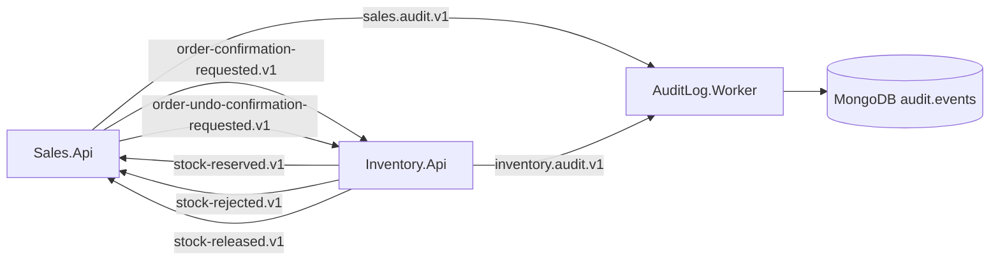

# Kafka Topics, Groups & Event Schemas

## Topics

Declared once in `src/Shared/BuildingBlocks.Contracts/Messaging/KafkaTopics.cs`. `docker/kafka-init-topics.sh` parses that file with `sed` and creates each topic with 3 partitions / replication factor 1. Auto-creation is disabled on the broker, so a topic missing from that file does not exist at runtime.

| Topic | Producer | Consumer | Payload |
|---|---|---|---|
| `sales.order-confirmation-requested.v1` | Sales | Inventory | `OrderConfirmationRequested` |
| `sales.order-undo-confirmation-requested.v1` | Sales | Inventory | `OrderCancellationRequested` |
| `inventory.stock-reserved.v1` | Inventory | Sales | `StockReserved` |
| `inventory.stock-rejected.v1` | Inventory | Sales | `StockRejected` |
| `inventory.stock-released.v1` | Inventory | Sales | `StockReleased` |
| `sales.audit.v1` | Sales | AuditLog | `AuditLogEvent` |
| `inventory.audit.v1` | Inventory | AuditLog | `AuditLogEvent` |

Note the asymmetry: the topic named `order-undo-confirmation-requested` carries an `OrderCancellationRequested` payload. The topic name reflects the Sales-side trigger; the payload name reflects what Inventory does. Consumers switch on `EventType`, so the mismatch is harmless but surprising — see [discrepancies.md](discrepancies.md).

## Consumer groups

`BuildingBlocks.Contracts/Messaging/KafkaConsumerGroups.cs`.

| Group | Host | Topics | Buffer / workers |
|---|---|---|---|
| `inventory-orders-v1` | Inventory.Api | the two `sales.order-*` topics | 100 / 4 |
| `sales-inventory-results-v1` | Sales.Api | the three `inventory.stock-*` topics | 100 / 4 |
| `audit-mongodb-v3` | AuditLog.Worker | `sales.audit.v1`, `inventory.audit.v1` | 200 / 4 |

All consumers use `AutoOffsetReset.Earliest`. Producers are named `sales-outbox` and `inventory-outbox`.

## Envelope

Every message body is an `EventEnvelope` (`IntegrationEvents/Common/EventEnvelope.cs`):

| Field | Type | Meaning |
|---|---|---|
| `EventId` | `Guid` | unique per event; the inbox deduplication key |
| `EventType` | `string` | runtime type name of `Data`; consumers switch on it |
| `AggregateId` | `Guid` | Kafka message key — guarantees per-aggregate ordering |
| `Version` | `long` | source aggregate version; used for staleness checks (0 for audit events) |
| `CorrelationId` | `Guid` | workflow correlation across services |
| `CausationId` | `Guid?` | id of the event that caused this one |
| `OccurredAt` | `DateTimeOffset` | UTC |
| `Actor` | `string` | user or `"system"` |
| `Data` | `JsonElement` | the serialized payload |

Built by `EventEnvelopeFactory.Create(...)`, serialized by `KafkaFlow.Serializer.JsonCore`.

## Headers

`BuildingBlocks.Contracts/Messaging/MessageHeaders.cs`: `contract-version`, `correlation-id`, `causation-id`, `event-id`, `event-type`, `occurred-at`, `traceparent`, `tracestate`.

Today `KafkaOutboxPublisher` writes `traceparent` and `tracestate` only; the other constants exist for consumers and future use. Correlation is carried inside the envelope. See [discrepancies.md](discrepancies.md).

## Payload schemas

### `OrderConfirmationRequested`

```json
{ "OrderId": "guid",
  "Lines": [ { "ProductId": "guid", "Sku": "PRD001-BLK-M", "Quantity": 2 } ] }
```

`ProductId` carries the Sales **product variant** id; the name is kept for v1 compatibility (documented on `OrderLineIntegration`).

### `OrderCancellationRequested`

```json
{ "OrderId": "guid" }
```

### `StockReserved` / `StockReleased`

```json
{ "OrderId": "guid" }
```

### `StockRejected`

```json
{ "OrderId": "guid", "Reason": "Insufficient stock for PRD001-BLK-M." }
```

### `AuditLogEvent`

```json
{ "AuditId": "guid", "ServiceName": "Sales", "EventType": "OrderConfirmed",
  "EntityType": "Order", "EntityId": "guid", "Action": "Updated",
  "Description": "…", "ActorId": "…", "ActorName": "…",
  "CorrelationId": "…", "CausationId": null, "TraceId": "…",
  "OccurredAt": "2026-07-21T…Z", "SchemaVersion": 1,
  "Changes": [ { "PropertyPath": "Status", "OldValue": "Draft", "NewValue": "PendingInventory" } ],
  "Metadata": { } }
```

`AuditId` is the Mongo upsert key. `SchemaVersion` must be 1; `MongoAuditWriter` throws `NotSupportedException` for anything else.

## Versioning policy

- `ContractVersions.V1` is the only version.
- A breaking payload change ships as a new topic with a `.v2` suffix and a new `KafkaTopics` constant, never as a mutated `.v1` payload.
- Adding an optional field to an existing payload is allowed within `.v1`.
- Renaming an event type or a field within a published version is forbidden — consumers switch on `EventType` and deserialize by property name.

## Flows



## Related

- [messaging-conventions.md](messaging-conventions.md)
- [outbox-inbox-schema.md](outbox-inbox-schema.md)
- Deep dive: [../guides/kafka-usage-guide.md](../guides/kafka-usage-guide.md)
