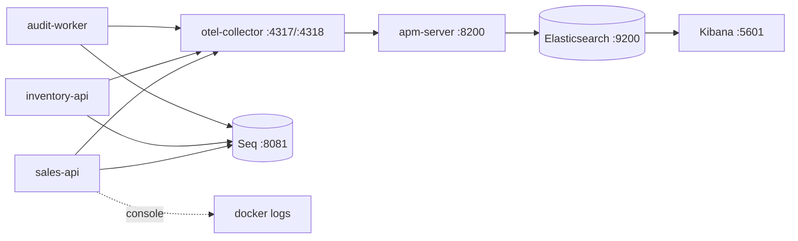

# Logging & Observability Strategy

## What exists

Three signals, one pipeline, shared by all three hosts through `BuildingBlocks.Observability`.

## Logging

`SerilogBootstrap.ConfigureSharedSinks` defines one sink policy for every service: **Console** (container logs), **Seq** (human triage), **OTLP gRPC** (so logs join the same trace in Kibana). Enrichers: `FromLogContext`, `Service`, `Environment`.

Wired with `builder.AddBuildingBlocksLogging("<service-name>")`. Levels come from the `Serilog` section of `appsettings.json`; EF SQL is suppressed with the `Microsoft.EntityFrameworkCore.Database.Command: Warning` override.

### One failure, one log

Each execution path logs its own failure exactly once, at its own boundary: `ApiExceptionHandler` (HTTP), `IntegrationEventHandler` (Kafka), `OutboxPublisherService` / `InboxRedriveService` (messaging cycles), the job class (Hangfire). `LoggingBehavior` stays at `Debug` deliberately — re-logging there would double every failure in Seq and break error-rate counting.

### HTTP request logging

`RequestObservabilityMiddleware` owns everything the single Serilog completion event needs. It pushes `RequestId` and `CorrelationId` onto `LogContext` (so nested logs inherit them) and sets `RequestId`, `CorrelationId`, `TraceId`, `UserId`, `ClientIp`, `Url`, `Route`, `UserAgent` on `IDiagnosticContext`.

Request/response bodies are captured **only** when `Debug` is enabled, capped at `HttpLogging:MaxBodyBytes` (8192), with `Authorization`/`Cookie`/`Set-Cookie` headers and the configured JSON fields masked to `***`.

`RequestLoggingDefaults` drops `/health` and `/hangfire` to `Debug` so uptime polling does not drown the signal, and raises anything with an exception or 5xx to `Error`.

### Message logging

`IMessageLogContext.Push(EventEnvelopeLogContext.From(envelope, activity))` puts `EventId`, `EventType`, `CorrelationId`, `TraceId` on every log written while a Kafka message is processed. Consume logs carry topic, group, partition, offset, message id, outcome, and elapsed ms.

## Tracing

`AddBuildingBlocksObservability(serviceName, configureTracing, configureMetrics)` sets up the base pipeline: OTLP exporter for traces and metrics, runtime instrumentation for metrics.

`AddBuildingBlocksWebObservability` layers the API-host instrumentation on top: ASP.NET Core, HttpClient (both with `RecordException = true`), and Entity Framework Core, plus the service's own activity source.

| Host | ActivitySource | Meter |
|---|---|---|
| sales-api | `Sales.Infrastructure.Kafka` | `Sales.Infrastructure` |
| inventory-api | `Inventory.Infrastructure.Kafka` | `Inventory.Infrastructure` |
| audit-worker | `AuditLog.Infrastructure.Kafka` | (runtime only) |

### Trace propagation through Kafka

`KafkaOutboxPublisher` opens `kafka.publish <topic>` (`ActivityKind.Producer`) and writes `traceparent`/`tracestate`. `KafkaConsumerActivity.Start` parses them and opens `kafka.consume <topic>` (`ActivityKind.Consumer`) as a child, tagged with `messaging.system`, `messaging.destination.name`, `messaging.kafka.consumer.group`. One trace therefore spans Sales → Kafka → Inventory → Kafka → Sales → Mongo.

### CorrelationId vs traceparent

`traceparent` is the technical W3C trace id, regenerated per hop. `CorrelationId` is the business identifier that stays constant across the whole workflow and lives inside the `EventEnvelope`. Both are logged. Do not use one to mean the other.

## Metrics

Shared instrument groups (`BuildingBlocks.Infrastructure/Observability/Metrics/`) constructed per service with a name prefix:

| Instrument | Type |
|---|---|
| `<svc>.outbox.published` / `.failed` / `.deadlettered` | counter |
| `<svc>.outbox.backlog` / `.deadletters` | observable gauge |
| `<svc>.inbox.duplicate` / `.processed` / `.retried` / `.dead_lettered` | counter |

Service-specific:

| Instrument | Type |
|---|---|
| `sales.orders.expiration.scanned` / `.cancelled` / `.skipped` / `.failed` | counter |
| `sales.orders.expiration.duration` | histogram (ms) |
| `inventory.reservation.reserved` / `.rejected` | counter |

Plus ASP.NET Core, HttpClient, and .NET runtime instrumentation.

## Standard property names

`TraceId`, `CorrelationId`, `RequestId`, `UserId`, `ClientIp`, `EventId`, `EventType`, `AggregateId`, `OrderId`, `Topic`, `GroupId`, `Partition`, `Offset`, `MessageId`, `ElapsedMs`, `ErrorCode`, `StatusCode`, `Attempts`, `DeadLettered`. Reuse these; do not invent a synonym.

## Configuration

| Variable | Purpose |
|---|---|
| `OTEL_SERVICE_NAME` | resource service name; also the Serilog `Service` property |
| `OTEL_EXPORTER_OTLP_ENDPOINT` | collector endpoint, default `http://otel-collector:4317` |
| `Seq:Url` | default `http://seq:5341` |
| `HttpLogging:*` | body capture toggles, size cap, sensitive header/field lists |

## Related

- [monitoring-demo.md](monitoring-demo.md) — how to run the demo
- [audit-logging.md](audit-logging.md) — the separate business audit trail
- Deep dives: [../guides/Seqlog-usage-guide.md](../guides/Seqlog-usage-guide.md), [../guides/open-telemetry-usage-guide.md](../guides/open-telemetry-usage-guide.md), [../guides/Elastic-usage-guide.md](../guides/Elastic-usage-guide.md)
- Rules: [../project/backend/logging-rule.md](../project/backend/logging-rule.md)
