# Bản đồ yêu cầu

Tài liệu này đối chiếu từng yêu cầu bài thực hành với code hiện có. Mỗi mục có trạng thái, vị trí code chính, cách hoạt động và quy tắc cần nhớ khi mở rộng.

## 1. Danh mục sản phẩm và search tên sản phẩm

Trạng thái: đã đáp ứng.

Code chính:

- Domain aggregate: `src/Services/Sales/Sales.Domain/Aggregates/Product.cs`
- Command tạo/sửa/xóa: `src/Services/Sales/Sales.Application/Features/Products/Commands/`
- Query search/get: `src/Services/Sales/Sales.Application/Features/Products/Queries/`
- Read service search: `src/Services/Sales/Sales.Infrastructure/Persistence/ReadServices/ProductReadService.cs`
- Cache decorator: `src/Services/Sales/Sales.Infrastructure/Persistence/ReadServices/CachedProductReadService.cs`
- API controller: `src/Services/Sales/Sales.Api/Controllers/ProductsController.cs`
- EF mapping: `src/Services/Sales/Sales.Infrastructure/Persistence/Configurations/ProductConfiguration.cs`

Cách hoạt động:

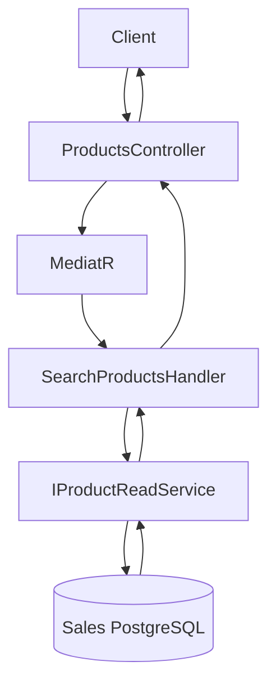

- API gọi MediatR command/query.
- Command handler load aggregate qua repository, gọi hành vi domain, rồi commit bằng Unit of Work.
- Query handler gọi `IProductReadService`.
- Search tên sản phẩm dùng `EF.Functions.ILike`.
- Get product có cache-aside bằng Redis qua `CachedProductReadService`.

Cache-aside khi get product:

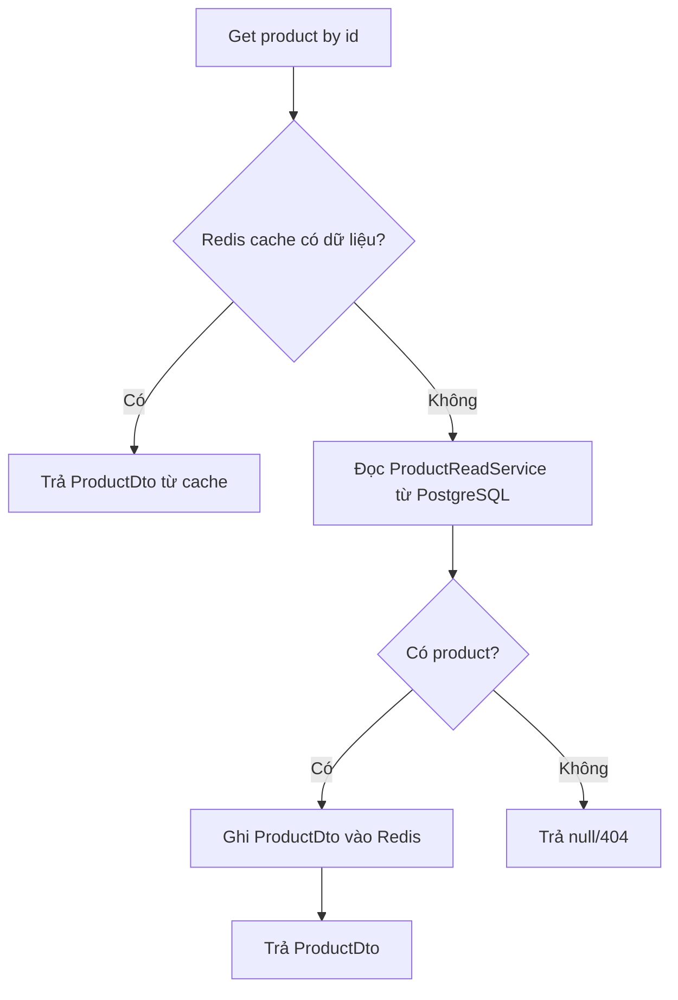

Quy tắc:

- Business rule của sản phẩm đặt trong `Product`.
- Command mới đặt trong `Sales.Application/Features/Products/Commands/`.
- Query mới đặt trong `Sales.Application/Features/Products/Queries/`.
- Không query EF Core trực tiếp trong controller.
- Nếu sửa dữ liệu product, cần remove hoặc update cache liên quan.

## 2. Khách hàng và search phone đầu/đuôi, tên khách hàng

Trạng thái: đã đáp ứng.

Code chính:

- Domain aggregate: `src/Services/Sales/Sales.Domain/Aggregates/Customer.cs`
- Command tạo/sửa/xóa: `src/Services/Sales/Sales.Application/Features/Customers/Commands/`
- Query search/get: `src/Services/Sales/Sales.Application/Features/Customers/Queries/`
- Enum phone match: `src/Services/Sales/Sales.Application/Features/Customers/Enums/PhoneMatch.cs`
- Read service: `src/Services/Sales/Sales.Infrastructure/Persistence/ReadServices/CustomerReadService.cs`
- API controller: `src/Services/Sales/Sales.Api/Controllers/CustomersController.cs`
- EF mapping: `src/Services/Sales/Sales.Infrastructure/Persistence/Configurations/CustomerConfiguration.cs`

Cách hoạt động:

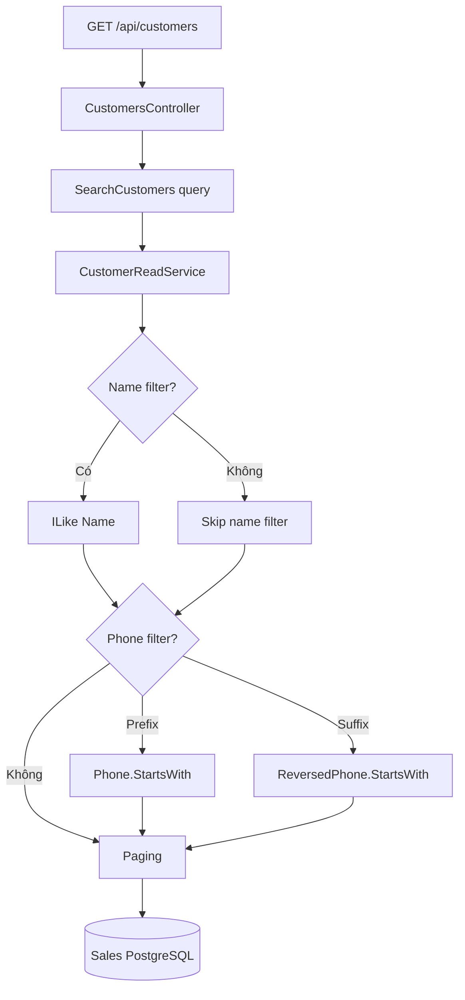

- Search tên dùng `ILike`.
- Search phone đầu số dùng `Phone.StartsWith(normalized)`.
- Search phone đuôi số dùng cột `ReversedPhone` và `StartsWith` trên chuỗi phone đảo ngược.
- Phone được normalize về chữ số.

Quy tắc:

- Filter search mới nên thêm vào query record trước, rồi update read service.
- Filter cần EF-specific function thì đặt logic trong Infrastructure, không đặt trong Domain.
- Controller không được gọi `DbContext` trực tiếp cho use case nghiệp vụ.

## 3. Đơn hàng, tổng số lượng, tổng tiền, chi tiết đơn

Trạng thái: đã đáp ứng.

Code chính:

- Aggregate root: `src/Services/Sales/Sales.Domain/Aggregates/Order.cs`
- Entity line: `src/Services/Sales/Sales.Domain/Entities/OrderLine.cs`
- Value objects: `src/Services/Sales/Sales.Domain/ValueObjects/`
- DTO order: `src/Services/Sales/Sales.Application/Features/Orders/DTOs/`
- Mapping DTO: `src/Services/Sales/Sales.Application/Features/Orders/Mapping/OrderMappingRegister.cs`
- API controller: `src/Services/Sales/Sales.Api/Controllers/OrdersController.cs`
- EF mapping order/line: `src/Services/Sales/Sales.Infrastructure/Persistence/Configurations/`

Cách hoạt động:

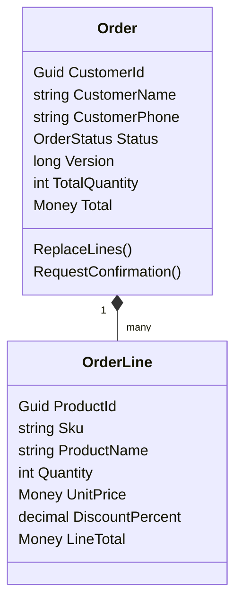

- `Order` giữ snapshot khách hàng: `CustomerId`, `CustomerName`, `CustomerPhone`.
- `Order.TotalQuantity` tính tổng số lượng từ lines.
- `Order.Total` tính tổng tiền từ `OrderLine.LineTotal`.
- `OrderLine` có product, quantity, unit price, discount percent.
- DTO trả về order gồm thông tin khách hàng, status, total quantity, total, version và lines.

Quy tắc:

- Rule nghiệp vụ của đơn hàng đặt trong `Order`.
- Chỉ `Order` được điều khiển danh sách `OrderLine`.
- Nếu thêm trạng thái đơn hàng, cần update `OrderStatus`, domain methods, validators, mapping và tests.

## 4. Search đơn hàng theo ngày tạo, tên/số điện thoại khách hàng

Trạng thái: đã đáp ứng.

Code chính:

- Query record: `src/Services/Sales/Sales.Application/Features/Orders/Queries/SearchOrders.cs`
- Query handler: `src/Services/Sales/Sales.Application/Features/Orders/Queries/SearchOrdersHandler.cs`
- Read service: `src/Services/Sales/Sales.Infrastructure/Persistence/ReadServices/OrderReadService.cs`
- Specification base: `src/Services/Sales/Sales.Domain/Services/Specifications/`
- Specification EF-specific: `src/Services/Sales/Sales.Infrastructure/Persistence/Specifications/`
- API endpoint: `GET /api/orders` trong `OrdersController`

Cách hoạt động:

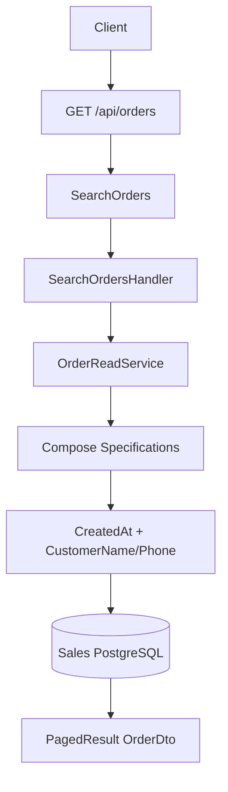

- Filter `from` và `to` theo `CreatedAt`.
- Filter `customer` match tên hoặc phone khách hàng.
- Infrastructure compose specification rồi apply vào EF query.

Quy tắc:

- Specification trong Domain chỉ chứa expression thuần C#.
- Specification cần `EF.Functions` đặt trong Infrastructure.
- Luôn paging query để tránh trả về quá nhiều dữ liệu.

## 5. Hai người cùng sửa đơn hàng

Trạng thái: đã đáp ứng bằng optimistic concurrency.

Code chính:

- Aggregate version: `src/Shared/BuildingBlocks.Domain/Abstractions/AggregateRoot.cs`
- EF concurrency token: `src/Services/Sales/Sales.Infrastructure/Persistence/Configurations/OrderConfiguration.cs`
- ETag helper: `src/Services/Sales/Sales.Api/Extensions/ControllerEtagExtensions.cs`
- Controller dùng `If-Match`: `src/Services/Sales/Sales.Api/Controllers/OrdersController.cs`
- Conflict exception: `src/Services/Sales/Sales.Application/Common/Exceptions/ConflictException.cs`
- Exception mapping 409: `src/Shared/BuildingBlocks.Web/ExceptionHandling/ApiExceptionHandler.cs` + Sales `AddApiExceptionHandling(...)` configuration in `src/Services/Sales/Sales.Api/Extensions/ServiceCollectionExtensions.cs`
- Test: `tests/Sales.Infrastructure.Tests/ConfirmOrderConcurrencyTests.cs`

Cách hoạt động:

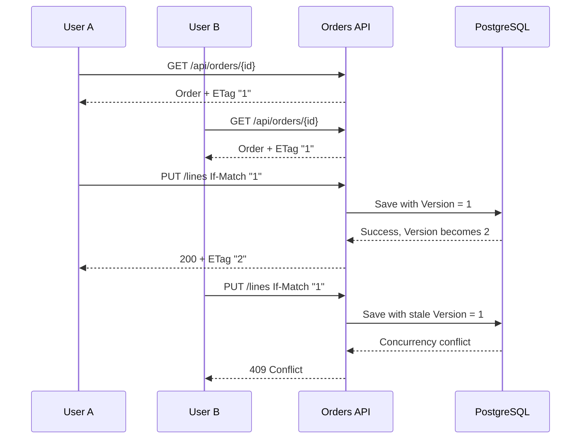

- Mỗi aggregate có `Version`.
- Khi sửa order, client phải gửi header `If-Match` chứa version đang có.
- Handler load order và check `ExpectedVersion`.
- EF Core cũng dùng `Version` làm concurrency token.
- Nếu version cũ, API trả 409 Conflict.

Quy tắc:

- Endpoint sửa order phải đọc `Request.RequireVersion()`.
- Command phải có `ExpectedVersion`.
- Handler phải dùng `orders.LoadAndCheck(...)`.
- Response sau khi sửa phải set ETag mới bằng `Response.SetEtag(order)`.

## 6. AuditLog dùng MongoDB và Kafka

Trạng thái: đã đáp ứng theo kiến trúc hybrid.

Code chính:

- Audit contracts: `src/Shared/BuildingBlocks.Contracts/Auditing/`
- Audit infrastructure: `src/Shared/BuildingBlocks.Infrastructure/Auditing/`
- Sales audit config/resolver/enricher: `src/Services/Sales/Sales.Infrastructure/Auditing/`
- Inventory audit config/resolver/enricher: `src/Services/Inventory/Inventory.Infrastructure/Auditing/`
- Worker entry: `src/Services/AuditLog/AuditLog.Worker/Program.cs`
- Worker DI: `src/Services/AuditLog/AuditLog.Worker/DependencyInjection.cs`
- Kafka handler: `src/Services/AuditLog/AuditLog.Infrastructure/Mongo/AuditEventHandler.cs`
- Mongo writer: `src/Services/AuditLog/AuditLog.Infrastructure/Mongo/MongoAuditWriter.cs`
- Mongo document: `src/Services/AuditLog/AuditLog.Infrastructure/Mongo/AuditDocument.cs`
- Mongo startup/index: `src/Services/AuditLog/AuditLog.Worker/Hosting/MongoStartupService.cs`
- Docker MongoDB: `docker/docker-compose.yml`

Cách hoạt động:

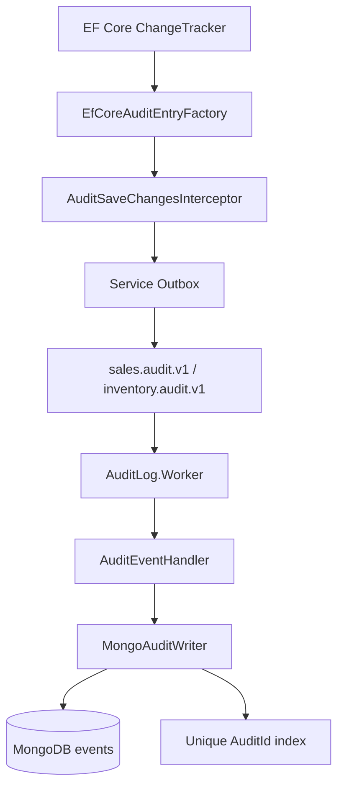

- CRUD audit thông thường được tạo tự động từ `ChangeTracker`.
- Audit nghiệp vụ đặc biệt dùng `IAuditEnricher` hoặc explicit `AuditLogEvent`.
- Audit event được ghi vào Outbox cùng transaction với dữ liệu nghiệp vụ.
- AuditLog.Worker chỉ consume audit topics (`sales.audit.v1`, `inventory.audit.v1`).
- Mỗi Kafka message vẫn là `EventEnvelope`, payload là `AuditLogEvent`.
- `MongoAuditWriter` validate `SchemaVersion`, normalize values và upsert theo `AuditId`.
- Mongo có unique index trên `AuditId` để tránh duplicate.

Quy tắc:

- Payload audit dùng contract `AuditLogEvent`.
- Topic phải khai báo trong `KafkaTopics`.
- Service mới muốn audit thì đăng ký `AddAuditing(...)`, cấu hình service name/topic và DbContext interceptor.
- Worker chỉ cần consume audit topic mới nếu service đó dùng topic riêng.
- AuditLog không được reference trực tiếp Sales.Domain hoặc Inventory.Domain.
- Không tạo mapper CRUD riêng cho Product/Customer/Order; chỉ tạo resolver/enricher khi có business meaning hoặc cần gom entity con vào aggregate.

## 7. Inventory service riêng, bảng riêng, mục tiêu không miss event

Trạng thái: đã refactor qua CQRS/MediatR và đã xử lý rủi ro event lệch thứ tự được phát hiện trong review.

Code chính:

- Inventory API: `src/Services/Inventory/Inventory.Api/`
- Inventory DbContext: `src/Services/Inventory/Inventory.Infrastructure/Persistence/DbContexts/InventoryDbContext.cs`
- Inventory item: `src/Services/Inventory/Inventory.Domain/Entities/InventoryItem.cs`
- Reservation aggregate: `src/Services/Inventory/Inventory.Domain/Aggregates/Reservation.cs`
- Kafka consumer: `src/Services/Inventory/Inventory.Infrastructure/Kafka/InventoryEventHandler.cs`
- Event adapter: `src/Services/Inventory/Inventory.Infrastructure/Kafka/InventoryIntegrationEventProcessor.cs`
- Reserve command: `src/Services/Inventory/Inventory.Application/Commands/ReserveStock/`
- Release command: `src/Services/Inventory/Inventory.Application/Commands/ReleaseStock/`
- Inbox entity (dùng chung): `src/Shared/BuildingBlocks.Infrastructure/Inbox/InboxMessage.cs`
- Inbox adapter Inventory: `src/Services/Inventory/Inventory.Infrastructure/Persistence/InventoryInbox.cs`
- Outbox publisher: `src/Services/Inventory/Inventory.Infrastructure/Kafka/InventoryOutboxPublisher.cs`

Cách hoạt động:

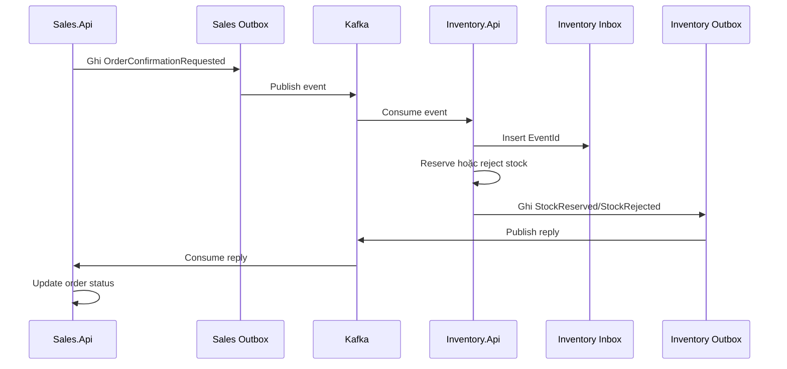

- Sales confirm order rồi publish event qua Sales Outbox.
- Inventory Kafka adapter map envelope thành `ReserveStockCommand` hoặc `ReleaseStockCommand`.
- `InventoryTransactionBehavior` pre-check Inbox (`HasBeenProcessedAsync`) trước khi mở serializable transaction: mỗi first-delivery tốn thêm một query tồn tại nhẹ, đổi lại event trùng/redelivery đã commit inbox sẽ return sớm, bỏ qua transaction + insert + rollback. Có lợi chủ yếu khi Kafka retry/redelivery nhiều. Insert Inbox trong transaction (`TryRecordAsync` + unique constraint) vẫn là hàng rào correctness cuối cho race hai delivery cùng vượt pre-check.
- Application handler reserve/release stock trong transaction qua domain methods.
- Inventory enqueue kết quả vào Inventory Outbox.
- Inventory Outbox publish `StockReserved`, `StockRejected`, `StockReleased`.

Cần lưu ý:

- Hệ thống có Outbox/Inbox và retry, tốt cho mục tiêu không miss event.
- Pre-check Inbox không thay đổi correctness: atomicity giữa Inbox insert, domain mutation và Outbox vẫn nằm trong một serializable transaction, và `TryRecordAsync` + unique constraint vẫn là barrier trùng lặp có thẩm quyền. Test: `tests/Inventory.Tests/InventoryTransactionBehaviorTests.cs` (fast-path duplicate + race backstop).
- Case confirmation event mới đến trước release event cũ đã có xử lý delta và test trong `tests/Inventory.Tests/ReserveStockHandlerTests.cs`.
- Reliability tests: các guarantee (Outbox retry, dead-letter sau `MaxAttempts`, Inbox idempotency, stale event, audit idempotency theo `AuditId`, optimistic concurrency) được kiểm chứng và mô tả trong `docs/tech/reliability-tests.md`. Test cần database thật gắn `[Trait("Category", "Reliability")]`, gate bằng `RUN_RELIABILITY_TESTS=true`; hai kịch bản cần live Kafka (consumer offset failure, process restart) hiện là thủ tục manual.
- CI: workflow `.github/workflows/ci.yml` tách `fast-checks` (mọi push/PR) và `reliability-tests` (push `main` hoặc `workflow_dispatch`, có Postgres + Mongo service container, upload trx/log khi fail).

## 8. CQRS và MediatR

Trạng thái: Sales và Inventory đều đã đáp ứng bằng CQRS/MediatR cho các use case hiện hữu.

Code chính:

- CQRS marker: `src/Shared/BuildingBlocks.Application/Abstractions/Messaging/`
- MediatR behaviors: `src/Shared/BuildingBlocks.Application/Behaviors/`
- Sales commands: `src/Services/Sales/Sales.Application/Features/<Aggregate>/Commands/`
- Sales queries: `src/Services/Sales/Sales.Application/Features/<Aggregate>/Queries/`
- MediatR registration: `src/Services/Sales/Sales.Api/Extensions/ServiceCollectionExtensions.cs`
- Inventory commands: `src/Services/Inventory/Inventory.Application/Commands/`
- Inventory queries: `src/Services/Inventory/Inventory.Application/Queries/`
- Inventory transaction behavior: `src/Services/Inventory/Inventory.Application/Services/Behaviors/InventoryTransactionBehavior.cs`
- Inventory MediatR registration: `src/Services/Inventory/Inventory.Api/Extensions/ServiceCollectionExtensions.cs`

Inventory hiện tại:

- `Inventory.Api` nhận HTTP request và dispatch qua `ISender.Send(...)`.
- `Inventory.Infrastructure/Kafka/InventoryIntegrationEventProcessor.cs` là adapter kỹ thuật: map integration event sang `ReserveStockCommand` hoặc `ReleaseStockCommand`, rồi dispatch qua MediatR.
- Command/query handlers nằm trong `Inventory.Application`, điều phối use case qua repository/read-service ports và `IUnitOfWork`.
- `InventoryTransactionBehavior` mở transaction cho idempotent commands; shared validation/logging behaviors đến từ `BuildingBlocks.Application`.
- `Inventory.Infrastructure` giữ EF Core persistence, Kafka, Inbox/Outbox, metrics và adapter kỹ thuật; business workflow không nằm trong Kafka handler.

Mô hình:

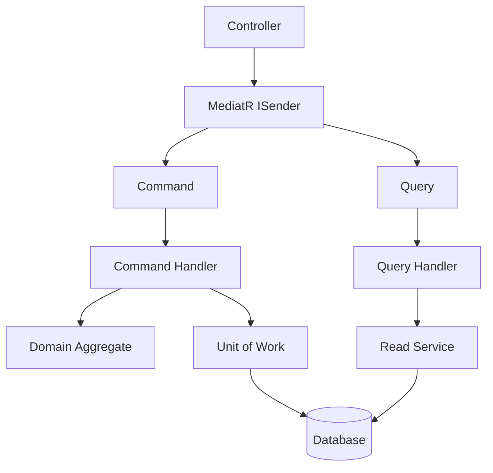

Quy tắc:

- Command làm thay đổi dữ liệu.
- Query chỉ đọc dữ liệu.
- Handler không chứa logic HTTP.
- Controller chỉ parse request và gọi `ISender.Send`.

## 9. Factory Method

Trạng thái: đã đáp ứng theo dạng static factory method cho object có rule.

Code chính:

- Domain factory: `Product.Create`, `Customer.Create`, `Order.Create`
- Line factory: `OrderLine.Create`
- Reservation factory: `Reservation.Create`
- Event envelope factory: `src/Shared/BuildingBlocks.Infrastructure/Events/EventEnvelopeFactory.cs`
- Domain event mapper: `src/Services/Sales/Sales.Infrastructure/Kafka/DomainEventMapper.cs`

Quy tắc:

- Nếu tạo aggregate/entity cần enforce invariant, dùng static factory method thay vì public constructor.
- Factory domain không gọi database, Kafka, Redis.
- Factory tạo event envelope nằm ở Infrastructure vì liên quan serialize/transport.

## 10. Redis cache và distributed lock

Trạng thái: đã đáp ứng.

Code chính:

- Redis registration: `src/Services/Sales/Sales.Infrastructure/DependencyInjection.cs`
- Cache abstraction: `src/Services/Sales/Sales.Application/Common/Interfaces/ICacheService.cs`
- Cache base: `src/Services/Sales/Sales.Infrastructure/ExternalServices/CacheService.cs`
- Product cache: `src/Services/Sales/Sales.Infrastructure/ExternalServices/ProductCache.cs`
- Cache usage: `src/Services/Sales/Sales.Infrastructure/Persistence/ReadServices/CachedProductReadService.cs`
- Distributed lock: `src/Services/Sales/Sales.Infrastructure/Hangfire/Jobs/MaintenanceCleanupJob.cs`
- Docker Redis: `docker/docker-compose.yml`

Quy tắc:

- Cache dùng cho read model, không dùng làm nguồn sự thật.
- Cache miss thì đọc DB, sau đó set cache.
- Khi data thay đổi, cần remove/update cache liên quan.
- Distributed lock chỉ để tránh nhiều instance chạy job trùng nhau, không thay thế transaction DB.

## 11. Repository và Unit of Work

Trạng thái: đã đáp ứng trong Sales.

Code chính:

- Repository interface chung: `src/Services/Sales/Sales.Domain/Repositories/IRepository.cs`
- Repository đặc thù: `IProductRepository`, `IOrderRepository`
- Repository implementation: `src/Services/Sales/Sales.Infrastructure/Repositories/`
- Unit of Work interface: `src/Shared/BuildingBlocks.Application/Persistence/IUnitOfWork.cs`
- Unit of Work implementation: `src/Services/Sales/Sales.Infrastructure/UnitOfWork/UnitOfWork.cs`
- DbContext enqueue outbox khi save: `src/Services/Sales/Sales.Infrastructure/Persistence/DbContexts/SalesDbContext.cs`

Quy tắc:

- Repository chỉ dùng cho command-side aggregate.
- Read/search nên dùng read service riêng.
- Handler gọi domain behavior rồi `uow.SaveChangesAsync`.
- `SaveChangesAsync` commit state; domain integration events và audit outbox rows đều được ghi trước commit. CRUD audit thường đi qua `AuditSaveChangesInterceptor`, không đi qua `DomainEventMapper`.

## 12. Mapster

Trạng thái: đã đáp ứng trong Sales.Application.

Code chính:

- Package Mapster: `src/Services/Sales/Sales.Application/Sales.Application.csproj`
- Mapping register theo feature: `src/Services/Sales/Sales.Application/Features/Products/Mapping/ProductMappingRegister.cs`, `Features/Customers/Mapping/CustomerMappingRegister.cs`, `Features/Orders/Mapping/OrderMappingRegister.cs`
- Đăng ký mapping dùng chung: `src/Shared/BuildingBlocks.Application/Mapping/MappingRegistrationExtensions.cs`

Cách hoạt động:

- Mỗi feature khai báo mapping riêng trong `*MappingRegister` của feature đó.
- Product/Customer map bằng Mapster.
- Order map tay vì có nested lines, value object Money và calculated fields.

Quy tắc:

- Mapping đơn giản có thể dùng Mapster.
- Mapping phức tạp nên map tay để dễ đọc.
- Mapping không được query database.

## 13. Hangfire queue

Trạng thái: đã đáp ứng.

Code chính:

- Hangfire registration: `src/Services/Sales/Sales.Api/Extensions/ServiceCollectionExtensions.cs`
- Dashboard: `src/Services/Sales/Sales.Api/Extensions/ApplicationBuilderExtensions.cs`
- Job: `src/Services/Sales/Sales.Infrastructure/Hangfire/Jobs/MaintenanceCleanupJob.cs`
- Definition: `src/Services/Sales/Sales.Infrastructure/Hangfire/Definitions/MaintenanceCleanupJobDefinition.cs`
- Options: `src/Services/Sales/Sales.Infrastructure/Hangfire/Options/SalesRecurringJobsOptions.cs`
- Job ID: `src/Services/Sales/Sales.Infrastructure/Hangfire/SalesRecurringJobIds.cs`
- DI: `src/Services/Sales/Sales.Infrastructure/Hangfire/SalesRecurringJobsExtensions.cs`
- Startup recurring job: `src/Services/Sales/Sales.Api/Extensions/StartupTaskExtensions.cs`
- Operator recovery (không phải recurring job): `src/Services/Sales/Sales.Infrastructure/Maintenance/SalesMaintenanceService.cs`
- Inventory cleanup worker: `src/Services/Inventory/Inventory.Infrastructure/Maintenance/InventoryMaintenanceWorker.cs`
- Inventory cleanup service: `src/Services/Inventory/Inventory.Infrastructure/Maintenance/InventoryMaintenanceService.cs`

Cách hoạt động:

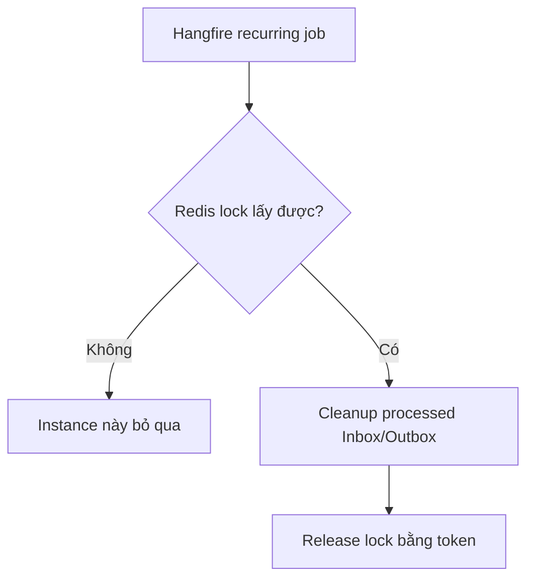

- Hangfire dùng PostgreSQL storage.
- Server có queues: `critical`, `default`, `maintenance`.
- Sales cleanup chạy queue `maintenance`.
- Redis lock ngăn nhiều Sales instance cleanup cùng lúc.
- Inventory cleanup không dùng Hangfire; hosted worker dùng Postgres advisory transaction lock.

### Cấu hình recurring jobs

Toàn bộ Sales recurring jobs bind từ một section gốc `SalesRecurringJobs`
(`SalesRecurringJobsOptions.SectionName`), validate lúc startup bởi
`SalesRecurringJobsOptionsValidator`:

```json
{
  "SalesRecurringJobs": {
    "MaintenanceCleanup": {
      "Enabled": true,
      "Queue": "maintenance",
      "Cron": "0 0 * * *"
    },
    "CancelExpiredPendingOrders": {
      "Schedule": {
        "Enabled": true,
        "Queue": "critical",
        "Cron": "*/5 * * * *"
      },
      "ExpirationMinutes": 30,
      "BatchSize": 100
    }
  }
}
```

- `MaintenanceCleanup` không có tham số nghiệp vụ nên chỉ dùng `RecurringJobSettings`
  (`Enabled`/`Queue`/`Cron`). `CancelExpiredPendingOrders` **compose** `RecurringJobSettings`
  qua property `Schedule` rồi thêm tham số nghiệp vụ riêng — shared settings không bị mở
  rộng bởi thuộc tính nghiệp vụ.
- **Job ID không nằm trong configuration.** ID cố định trong `SalesRecurringJobIds`
  (`sales-cleanup`, `orders:cancel-expired`) để config không thể tạo thêm một recurring job
  thứ hai trong Hangfire storage.
- `Queue` **không có giá trị mặc định**: job `Enabled` mà thiếu `Queue` sẽ fail startup thay
  vì âm thầm chạy sang queue khác.
- Job `Enabled=false` sẽ được `RemoveIfExists` khỏi storage, không chỉ bỏ qua đăng ký.

### Business job: `CancelExpiredPendingOrders`

- **Business purpose**: tự động hủy các đơn hàng đang mở (`Draft`, `PendingInventory`) không đổi trạng thái quá `ExpirationMinutes` phút, để đơn không treo vô thời hạn. Cấu hình: `SalesRecurringJobs:CancelExpiredPendingOrders` (cron ở `Schedule:Cron` mặc định `*/5 * * * *`, `ExpirationMinutes=30`, `BatchSize=100`).
- **Queue/Schedule**: recurring trên queue `critical` (job nghiệp vụ ảnh hưởng reservation/stock, tách khỏi housekeeping ở `maintenance`), mỗi 5 phút.
- **Layering**: adapter mỏng `CancelExpiredPendingOrdersJob` (Infrastructure) chỉ dispatch MediatR command `CancelExpiredPendingOrders`; business workflow nằm ở `CancelExpiredPendingOrdersHandler` (Application) + domain method `Order.CancelDueToExpiration(...)`.
- **Batch**: handler query danh sách ID đủ điều kiện (giới hạn `BatchSize`), load từng aggregate trong scope riêng, một order lỗi không làm hỏng cả batch (đếm scanned/cancelled/skipped/failed).
- **Concurrency/idempotency**: `CancelDueToExpiration` kiểm tra lại state và `UpdatedAt` so với cutoff nên bỏ qua order đã bị người dùng đổi; optimistic concurrency (`Version`) chặn ghi đè; chạy lặp lại an toàn (order đã cancel → skip). Không thêm distributed lock riêng: overlap được xử lý bằng domain re-check + optimistic concurrency. Hủy đơn `PendingInventory` raise `OrderUndoComfirmedDomainEvent` → Inventory release stock qua Outbox.
- **Metrics** (meter `Sales.Infrastructure`, export OTel): `sales.orders.expiration.scanned`, `.cancelled`, `.skipped`, `.failed` (counter) và `.duration` (histogram, ms). Ghi tại adapter sau mỗi batch.
- **Test**: `tests/Sales.Domain.Tests/OrderTests.cs` (domain rule), `tests/Sales.Application.Tests/CancelExpiredPendingOrdersHandlerTests.cs` (batch/idempotency/concurrency), `tests/Sales.Api.Tests/CancelExpiredPendingOrdersJobTests.cs` (dispatch, rethrow-for-retry, metric emission), `tests/Sales.Infrastructure.Tests/SalesRecurringJobsTests.cs` (bind đúng cron/section, validate tham số).

## 14. Kafka topic, group, partition

Trạng thái: đã đáp ứng topic/group; topic local được khởi tạo chủ động với 3 partitions và replication factor 1.

Code chính:

- Topic constants: `src/Shared/BuildingBlocks.Contracts/Messaging/KafkaTopics.cs`
- Consumer group constants: `src/Shared/BuildingBlocks.Contracts/Messaging/KafkaConsumerGroups.cs`
- Topic init script: `docker/kafka-init-topics.sh`
- Docker init service: `docker/docker-compose.yml` service `kafka-init`
- Sales Kafka registration: `src/Services/Sales/Sales.Infrastructure/DependencyInjection.cs`
- Inventory Kafka registration: `src/Services/Inventory/Inventory.Infrastructure/DependencyInjection.cs`
- Audit Kafka registration: `src/Services/AuditLog/AuditLog.Worker/DependencyInjection.cs`
- Publisher: `src/Shared/BuildingBlocks.Infrastructure/Kafka/KafkaOutboxPublisher.cs`

Cách partition/order hoạt động:

- `KafkaOutboxPublisher` dùng `EventEnvelope.AggregateId` làm Kafka message key.
- Các event của cùng aggregate được route vào cùng partition khi topic có nhiều partition.
- Kafka chỉ đảm bảo ordering trong phạm vi một partition, không đảm bảo global ordering trên toàn topic.
- Consumer group quyết định load balancing: nhiều instance cùng group chia nhau partitions; group khác nhau nhận bản sao độc lập của cùng topic.
- Local Docker tạo các topic trong `KafkaTopics` với 3 partitions và replication factor 1 qua `kafka-init`. Script dùng `--if-not-exists` nên chạy lại compose không lỗi nếu topic đã tồn tại.

Quy tắc:

- Không hardcode tên topic trong handler.
- Topic mới phải thêm vào `KafkaTopics`.
- Consumer group mới phải thêm vào `KafkaConsumerGroups`.
- Producer nên publish thông qua Outbox.
- Docker init đọc topic từ `KafkaTopics.cs`; không thêm danh sách topic trùng lặp trong compose/script.

## 15. Database: PostgreSQL và MongoDB

Trạng thái: đã đáp ứng.

PostgreSQL:

- Sales DB: `SalesDbContext`
- Inventory DB: `InventoryDbContext`
- Hangfire DB/storage: connection string Hangfire
- Docker Postgres: `docker/docker-compose.yml`

MongoDB:

- Audit document: `AuditDocument`
- Mongo writer: `MongoAuditWriter`
- Docker Mongo: `docker/docker-compose.yml`

Quy tắc:

- EF migrations nằm trong `Persistence/Migrations/`.
- Không sửa migration generated bằng tay nếu không cần.
- Mongo index tạo trong startup service, không tạo lại mỗi message.
- Audit document unique theo `AuditId`; query index chính gồm entity/time, service/time và correlation id.

## 16. Docker, docker-compose

Trạng thái: đã đáp ứng.

Code chính:

- Compose: `docker/docker-compose.yml`
- Sales Dockerfile: `src/Services/Sales/Sales.Api/Dockerfile`
- Inventory Dockerfile: `src/Services/Inventory/Inventory.Api/Dockerfile`
- Audit worker Dockerfile: `src/Services/AuditLog/AuditLog.Worker/Dockerfile`

Services trong compose:

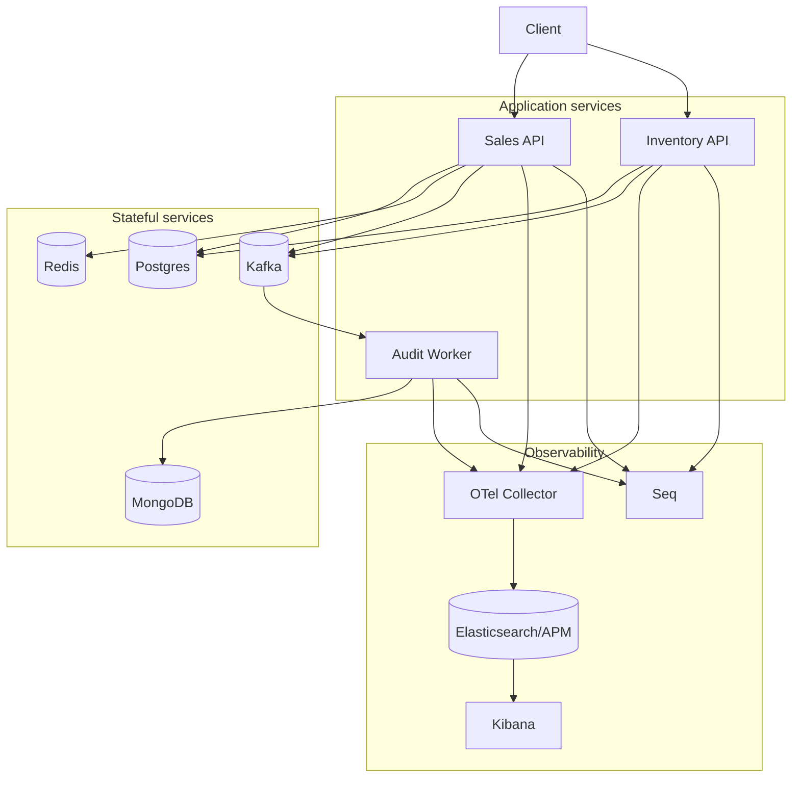

- postgres
- redis
- mongo
- kafka
- seq
- elasticsearch
- kibana
- apm-server
- otel-collector
- sales-api
- inventory-api
- audit-worker

## 17. Monitoring, logging, tracing, metrics

Trạng thái: đã đáp ứng phần chính; demo monitoring được mô tả trong [monitoring-demo.md](monitoring-demo.md).

- **Kibana dashboard export**: implemented — `docker/kibana/exports/sales-management-reliability.ndjson` (3 data view, 8 visualization, dashboard `Sales Management Reliability`).
- **Dashboard import script**: implemented — `docker/kibana/import-dashboards.sh` (idempotent, retry) + service one-shot `kibana-init` trong `docker/docker-compose.yml`. NDJSON soạn theo schema Kibana 9.1, cần xác nhận lại bằng một lần import thật.
- **Screenshot**: chưa thể tạo trong môi trường hiện tại (không chạy được Docker/Kibana). Vị trí + checklist ở `docs/images/monitoring/README.md`.
- **Trace demo guide**: implemented — hướng dẫn tìm trace xuyên service, log Seq, retry/dead-letter trong [monitoring-demo.md](monitoring-demo.md).

Code chính:

- Shared Serilog: `src/Shared/BuildingBlocks.Observability/SerilogBootstrap.cs`
- OpenTelemetry registration: `src/Shared/BuildingBlocks.Web/Observability/OpenTelemetryExtensions.cs`
- Request observability middleware: `src/Shared/BuildingBlocks.Web/RequestObservabilityMiddleware.cs`
- Sales metrics: `src/Services/Sales/Sales.Infrastructure/Observability/`
- Inventory metrics: `src/Services/Inventory/Inventory.Infrastructure/Observability/`
- Docker Seq/Elastic/Kibana/APM/OTel: `docker/docker-compose.yml`

Mô hình:

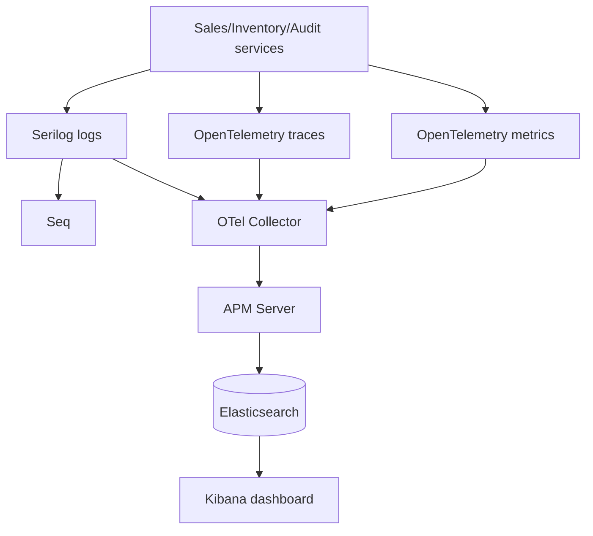

Quy tắc:

- Log nên có correlation/trace id.
- Kafka consume/publish nên tạo activity span.
- Metrics nên đo backlog, failed, processed, duplicate cho outbox/inbox.
- Dashboard là phần vận hành; code chỉ export telemetry.
